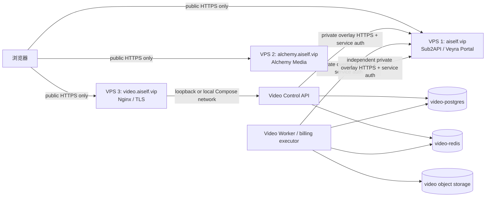
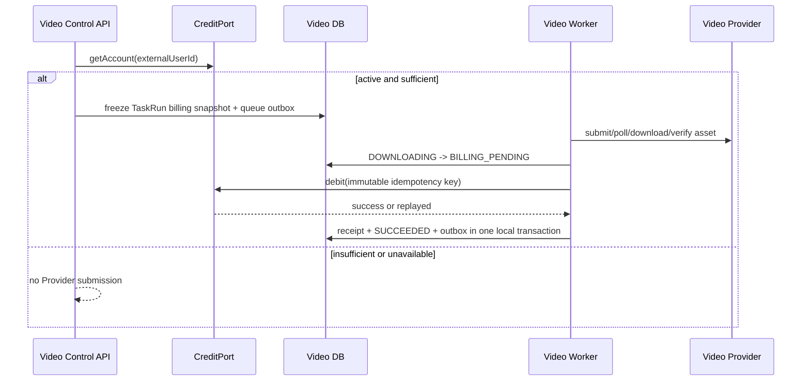

# AI企业内容生产平台：C09-B 三 VPS Veyra 联动设计

状态：`PENDING`（设计已归档，按 ADR-0039 后移至 C13-A）。本文只定义未来受控实现与部署的契约，不授权读取凭据、真实 HTTP、SSH/VPS、DNS、TLS、feature flag、Worker/API/Studio 接线或 Git 操作。

## 1. 目标与事实边界

系统由三个平级 VPS 组成：

| 系统 | 公共入口 | 职责 | 权威边界 |
| --- | --- | --- | --- |
| Sub2API / Veyra | `aiself.vip` | 用户身份、Portal、一次性 ticket、余额、并发、原子 debit 与 debit 幂等 | 唯一余额与扣费权威 |
| Alchemy Media | `alchemy.aiself.vip` | 独立图片/创意工作台 | 自己的项目、会话、媒体和 usage 视图 |
| Video OS | `video.aiself.vip` | 独立视频工作台、Control API、Worker、视频资产和本地审计 receipt | 自己的工作区、任务、资产、billing attempt 与 usage receipt |

Video OS 不属于 Alchemy 的子模块，也不向 Alchemy 的数据库、对象存储、队列、会话或进程内状态写入。三者共享的只有经版本化协议传递的 Veyra external user ID、一次性 ticket 和 debit 请求/结果语义。

Sub2API 当前 `intent.go` 只接受 `home`、`sub2api`、`alchemy`，Portal 前端也硬编码了 Alchemy targets。因此 `video` 不是现有事实，必须先由 Sub2API 增加 allowlist target 与 `PortalIntentVideo`，不能把 Video 伪装成 `alchemy`。

## 2. 网络、域名与信任边界



### 2.1 Public edge

- 每个 FQDN 由所属 VPS 的 Nginx 终止 TLS，并只公开 `80/443`。未来的证书、DNS 和反代配置是部署变更，C09-B 当前不执行。
- `video.aiself.vip` 只公开 Nuxt 页面和 `/api/v1/*`。`/internal/*`、PostgreSQL、Redis、MinIO Console、Provider Worker、billing worker 和健康细节不暴露给浏览器。
- 浏览器只能看到 Video Control API 的公开 DTO、SSE 投影和短时单对象 presigned URL。它不得得到 Veyra Token、外部 user ID、Sub2API 内部路径、Video 服务地址或 credit receipt。
- 三个站点使用 host-only cookie。不得设置 `.aiself.vip` Domain Cookie，避免一个站点的会话被另一个站点接收。

### 2.2 VPS 间服务调用

- 首选让三台 VPS 加入专门的 WireGuard 或等价私有 overlay；Video 到 Sub2API 的 Veyra internal API 使用该私有地址和 HTTPS。若上线前无法提供 overlay，必须在 ADR 中明确采用的替代物，并至少同时具备 TLS、mTLS 或等价服务身份、源 IP allowlist、短超时和专用 ingress。
- `X-Veyra-Internal-Token` 仅由 Video Control API 的 identity adapter 和 Video Worker 的 credit adapter 从各自的受管 secret 注入。它不得出现在浏览器、Nginx access log、任务 payload、事件、数据库普通字段、fixture 或错误消息。
- 现有 Sub2API `RoutesConfig` 只有单一 `InternalToken`。上线前应演进为可撤销、可轮换、带服务身份/范围的 Video 专用凭据；不得让 Video 复用 Alchemy 的服务 secret。
- Video 的 PostgreSQL、Redis、对象存储、Compose network 与数据卷仅供第三台 VPS 使用；Alchemy 和 Sub2API 不获得其网络访问权。Sub2API 的用户/余额/账本同理不向 Video 提供数据库访问。

## 3. Veyra Portal、ticket 与 Video 本地会话

### 3.1 Portal target 与单次 ticket

未来 Sub2API Portal 新增固定 allowlist：

```text
video          -> Video desktop handoff endpoint
video-mobile   -> Video mobile handoff endpoint
```

Portal 接受的是 target 枚举，不接受任意回调 URL。`intent.go`、Portal route table、Portal UI、target tests 和配置必须同步增加 `video`/`video-mobile`。ticket 的 TTL、随机性和单次原子消费仍以 Sub2API 为权威；Video 不签发、缓存、重放或持久化 ticket 原文。

AGENTS.md 禁止 ticket 出现在 URL query、localStorage、日志或错误响应。因此未来实现不得沿用旧补充方案的 `?ticket=` 示例。兼容当前 Portal 的最小安全 handoff 是：

1. 已登录的 Portal 以 `intent=video` 向 Sub2API 申请 ticket。
2. Portal 仅从其 HTTPS API 响应短暂取得 ticket，并向 Video 固定 callback 发起顶层 HTML `POST` form；ticket 只位于 POST body。
3. Video callback 不记录 request body，服务端用专用 Veyra service credential 交换 ticket，并要求返回的 `intent === "video"`。
4. 成功后 Video 写入本地 session Cookie 并用 `303` 导向无 query 的 `/`；失败页也不回显 ticket。callback、Portal 与 Nginx 均设置 `Referrer-Policy: no-referrer`。

该 POST handoff 是未来 Portal/Video 双方都需实现的新协议。若部署时选择不同交接机制，必须先以 ADR 证明它同样不把原始 ticket 放进 URL、浏览器持久化、日志或跨站 Cookie。

### 3.2 Identity mapping 与本地会话

Video Control API 的未来 `VeyraIdentityAdapter` 流程：

1. 交换成功只接受正整数 `user_id`、`intent=video` 和有效过期时间；任何其他 intent、重复/过期 ticket 或结构错误均拒绝。
2. 在创建 Video session 前，服务端通过 `CreditPort.getAccount` 取得当前账户状态；只有 `status=active` 才可登录。服务暂时不可用时 fail-closed，不为无法验证的外部身份颁发 session。
3. 事务内按 `(provider="veyra_sub2api", external_user_id)` upsert `external_identities`，再创建或查找平台 `User`、最小 Workspace 和 owner membership。`email_snapshot` 与 `role_snapshot` 只用于显示/审计，不作为本地授权权威。
4. 创建可撤销的 Video 本地 session 记录。浏览器仅取得随机、不透明的 `__Host-video_session` Cookie：`Secure`、`HttpOnly`、`SameSite=Lax`、`Path=/`、无 Domain 属性。数据库只保存 cookie token hash、local user/workspace、过期、撤销时间和 session version。
5. `/api/v1/me` 仅基于 Video 本地 session 与 workspace membership 返回公开身份。浏览器不保存或转发 Veyra ticket、Veyra Bearer Token、internal token 或 account raw response。

Alchemy 的自签 token、Cookie 名称、session secret、JSONL 使用记录和登录回调不可迁入。Video 使用独立 session secret、独立 session 表和独立 revoke/rotation 策略。

## 4. CreditPort、billing 与恢复设计

### 4.1 预检、提交与扣费时序

余额预检不是预授权，不能替代 debit。未来计费 profile 的生成命令采用下列受控顺序：



- Control API 只在启用的 billing rule 有非零金额时做账户预检；`CREDIT_INSUFFICIENT` 和 `CREDIT_UNAVAILABLE` 都不得创建可提交 Provider 的 TaskRun。预检成功后仍可能在最终 debit 时余额不足。
- 创建 TaskRun 时冻结 `credit_provider`、`billing_rule_key`、规则版本、金额、`source`、`external_user_id` 与 `billing_idempotency_key`。用户编辑分镜或规则变更必须创建新的 TaskRun；不得修改既有快照。
- Provider 成功后，Worker 必须先完成下载 HTTP 状态/MIME/长度、SHA-256、ffprobe、不可覆盖对象写入和 Video Asset 事务，再进入 `BILLING_PENDING`。产物未校验成功时不得 debit。
- future debit key 固定为 `billing_rule_key + ":" + task_run_id`；`source`、`reference_id`、金额和 external user ID 是同一不可变 fingerprint 的组成部分。retry、Worker restart 和结果补偿必须原样使用该 key，绝不重新提交 Provider。
- 远端 debit 成功后才在 Video 本地事务写 `usage_records`、`TaskRun=SUCCEEDED` 和 outbox 事实。Worker 在远端成功后、本地事务前崩溃时，恢复逻辑必须重发相同 debit；Sub2API 返回 `replayed=true` 后再补齐本地 receipt。

### 4.2 Billing attempt 与状态恢复

`usage_records` 只表示已确认 debit receipt，不能承担未完成 debit 的恢复事实。未来 C09-B 实现前必须经新 ADR/迁移新增工作区范围的 `billing_attempts`，至少持久化：

```text
id, workspace_id, task_run_id, credit_provider, external_user_id,
billing_rule_key, rule_version, amount, source, reference_id,
idempotency_key, status, attempt_count, next_attempt_at,
last_error_code, last_error_retryable, completed_at, created_at
```

约束为同一 `task_run_id + credit_provider` 只能有一个活跃 billing attempt；每次查询、领取、更新和恢复都必须带 `workspace_id`。不保存 ticket、internal token、provider payload、签名 URL 或 debit 原始响应。

| Veyra 结果 | TaskRun/attempt 行为 | 结果资产 | 自动动作 |
| --- | --- | --- | --- |
| success 或 `replayed=true` | receipt、`SUCCEEDED`、`usage.debited` 内部事件 | 发布授权下载 | 不再 debit |
| `402 CREDIT_INSUFFICIENT` | `BILLING_FAILED`，记录安全错误码 | 隔离，不返回下载 URL | 用户充值后的显式 billing retry，不能 submit 视频 |
| `409 CREDIT_CONFLICT` | `BILLING_FAILED`，高优先级审计 | 隔离 | 不自动重试；人工对账 |
| `401/403 AUTH_FORBIDDEN` | 保持可恢复 billing attempt，进入受控重试 | 隔离 | 仅重试 debit；告警服务凭据问题 |
| network/5xx `CREDIT_UNAVAILABLE` | 可恢复 billing attempt，按 backoff 调度 | 隔离 | 仅重试 debit；不能重新 submit/download |
| other 4xx `CREDIT_REJECTED` | `BILLING_FAILED` | 隔离 | 人工或显式修复后处理 |

状态机现有的 `BILLING_PENDING -> RETRY_SCHEDULED -> QUEUED` 只能由专用 billing message 使用。Worker 收到该类型恢复消息时必须识别已验证的 result asset 和 billing attempt，只调用 `CreditPort.debit`，绝不执行 Provider submit、poll 或下载。启动恢复扫描需要单独包含 billing states 并有持久化 lease；不得复用 C06 的视频执行扫描而产生重新生成。

### 4.3 Feature flags 与 fail-closed 规则

未来将身份与扣费分开控制：

| 配置 | 默认 | 作用 |
| --- | --- | --- |
| `LOCAL_AUTH_MODE` | `dev` | 本地开发身份，不与 Veyra 混用 |
| `VEYRA_AUTH_ENABLED` | `false` | 是否允许 ticket exchange、identity mapping 与 Video session |
| `VEYRA_CREDIT_ENABLED` | `false` | 是否允许账户预检与 debit；必须依赖已启用身份和 approved billing rule |
| `VIDEO_PROVIDER` | `mock` | Provider 选择；不因 Veyra 开启而变更 |

任一 Veyra flag 开启时，缺少 private endpoint、服务身份、session secret、规则 allowlist、审计 sink 或 workspace-bound persistence 都必须使对应 Control API/Worker readiness fail-closed。开关关闭后，不得存在隐式 `NoopCreditAdapter` 伪造成功的路径。

## 5. 可复用协议与禁止共享状态

| 可复用的协议语义 | 来源 | Video 的薄适配边界 |
| --- | --- | --- |
| ticket 的随机、TTL、单次 `Consume`、`intent` | Sub2API `ticket.go`、`intent.go`、`routes.go` | `VeyraIdentityAdapter` 只接收 exchange 结果；不持久化原 ticket |
| `data` envelope、account/debit path、header、402/409 语义 | Sub2API `routes.go`、`billing.go` | `VeyraHttpsTransport` + existing `CreditPort` mapper |
| `idempotency_key + user + amount + source + reference_id` fingerprint | Sub2API `debitFingerprint` | frozen billing plan、billing attempt 与 receipt replay |
| account preflight -> artifact success -> debit -> usage sequence | Alchemy `veyra_auth.py`、`generation.py` | Video 独立 Worker orchestration，不复制 Python client |

下列内容绝对不共享：

- Sub2API 的 users、balances、atomic debit ledger、ticket store 数据库、JWT/portal browser session 或 service secret。
- Alchemy 的 PostgreSQL/SQLite、`.v2_data/veyra_usage.jsonl`、图片历史、Cookie、session secret、Worker queue、媒体目录、bucket、进程内任务与固定图片费率。
- Video 的 Workspace、Project、Asset、TaskRun、ProviderAttempt、billing attempt、usage receipt、Redis key、MinIO object key、SSE/outbox、session 表、Compose volumes 与 service secret。

## 6. 分系统变更清单

### 6.1 Sub2API / Veyra VPS

1. 新增 `PortalIntentVideo`、`video`/`video-mobile` allowlist target、Portal UI route 和单元/集成测试；未知 target 仍回退或拒绝，不能自由跳转。
2. 提供不含 query ticket 的 Video POST handoff 支持，或提供经 ADR 批准的等价机制。
3. 确认 production TicketStore 是可重启、原子单次消费的持久化实现；MemoryTicketStore 仅是本机代码中的参考实现。
4. 为 Video 配置独立、可轮换、可撤销、最小权限的 service credential；验证 ticket exchange/account/debit 范围，逐步淘汰全局共享 internal token。
5. 保持 account、atomic debit 和 idempotency fingerprint 的权威性；补充 service audit、token rotation、client rate/concurrency limit 与 debit outcome metrics。

### 6.2 Alchemy VPS

1. 保持 Alchemy target、Cookie、session secret、JSONL 和 billing rule 不变；Portal 新增 Video target 不能改变 `alchemy`/`alchemy-mobile` 的既有回归结果。
2. 仅复用协议兼容测试与运维观察面板，不引入 Video 数据库、媒体、session、queue 或 secret。
3. 在 shared Portal 改动后验证 Alchemy login、account preflight、debit replay 和现有图片 usage 流不发生回归。

### 6.3 Video OS VPS

1. 新增 `VeyraIdentityAdapter`、私有 HTTPS transport、`external_identities`、local sessions 和 callback endpoint；公开 API 只暴露 Video local identity。
2. 新增 billing rule registry、`billing_attempts`、专用 billing queue/lease/recovery、CreditPort 运行时 composition 和 feature flag validation。
3. 在 Worker 产物验证后实现 debit/replay/receipt transaction；将 `usage.debited` 保持为内部事件，浏览器只看到安全 TaskRun 状态与可用性。
4. 新增 Video 的 Nginx vhost、TLS、private overlay peer、secret injection、per-service health/readiness、备份恢复和成本/告警配置。

## 7. 滚动发布、回滚与观测

### 7.1 发布顺序

1. 先完成离线 contract、migration、failure/recovery 与 secret-redaction 测试，所有 flag 仍为 false。
2. 在 Sub2API 发布 `video` intent/target 与 Video service credential，但不向普通用户显示入口。
3. 将 Video 部署为 flags=false，验证 TLS、private connectivity、readiness 和 callback body redaction；不发 ticket、不读 account、不 debit。
4. 仅对受授权测试用户启用 identity，验证 ticket exchange、intent、session cookie、logout/revoke 和 workspace mapping。
5. 再以一个 profile、一个冻结 billing rule、一个明确 debit 次数/额度上限启用 credit canary；验证 success、replay、conflict、402、temporary failure 和 crash recovery。
6. 所有验收通过且监控稳定后，逐步扩大 user/profile allowlist；Provider profile 与 Veyra credit flag 独立控制。

### 7.2 回滚

- 优先在 Video VPS 关闭 `VEYRA_CREDIT_ENABLED`，阻止新预检和 debit；已存在 billing attempt 保持可审计，不删除或伪造成功。
- 若身份路径异常，关闭 `VEYRA_AUTH_ENABLED` 并撤销/拒绝 Video session；不影响 Sub2API 或 Alchemy 的会话。
- Portal 仅移除 Video target，不改写 Alchemy target；Sub2API 余额账本从不由 Video 回滚。
- 数据库迁移只向前。Video 对远端 debit 的恢复始终使用既有 idempotency key，任何发布回滚不得触发第二次扣费或第二次 Provider submit。

### 7.3 观测指标

所有日志和指标使用 local request/trace IDs、hash 或聚合标签，不记录 ticket、token、Cookie、原始 provider/debit body、presigned URL 或对象 key。

| 范畴 | 指标/告警 |
| --- | --- |
| 身份 | ticket exchange success/expired/reused/intent mismatch、session issue/revoke、callback body-log scan |
| 账户 | account preflight latency/outcome、inactive user、insufficient balance、concurrency refusal |
| debit | success/replayed/402/409/401/403/5xx、idempotency conflict、billing pending age、receipt write lag |
| 恢复 | remote debit success without local receipt、billing lease reclaim、retry exhaustion、provider submit count after billing retry |
| 隔离 | cross-workspace lookup denial、forbidden public field scan、secret scan、unauthorized internal ingress |
| 运维 | overlay connectivity/TLS validity、secret age/rotation、queue depth、worker lag、object-storage verification failures |

## 8. 验收矩阵与外部验证前置项

| 验收项 | 证据 | 允许阶段 |
| --- | --- | --- |
| `video` target 只从 allowlist 签发，ticket 单次消费 | Sub2API unit/integration test；expired/reused/intent mismatch | C09-B identity authorization |
| Video callback 没有 query ticket，session 为 host-only/HttpOnly/Secure | browser + access-log redaction test | C09-B identity authorization |
| external identity 与 workspace 始终按 Video local DB scope 授权 | PostgreSQL/API tests | C09-B implementation |
| account preflight 不足或暂不可用时不入 Provider queue | Control API/Worker integration | C09-B credit authorization |
| debit success/replay 只生成一条 receipt | real bounded debit + PostgreSQL recovery test | C09-B credit authorization |
| 409/402/401/403/5xx 映射与恢复正确 | fake server first；受控 real verification second | C09-B credit authorization |
| Worker 在远端成功、本地写 receipt 前崩溃后只 replay debit | fault-injection/restart test | C09-B credit authorization |
| billing retry 不触发第二次 Provider submit 或结果替换 | provider/worker integration + audit trace | C09-B credit authorization |
| Portal/Alchemy 未回归，三 VPS 证书/overlay/readiness 正常 | smoke/rollout/rollback checklist | deployment authorization |

真实验证前用户必须一次性明确：测试用户范围、允许 identity ticket 次数、允许 debit 次数与总额度/货币、可用 profile 与素材、是否允许 private-network/VPS/DNS/TLS 变更、可接受维护窗口和失败后的资金处理人。没有这些参数时，任何真实 account、ticket exchange、debit、Secret 读取、SSH 或部署均保持禁止。

## 9. 当前不执行的事项

- 不读取或验证任何 Veyra/internal token、session secret、provider key、VPS 环境或本地 `.env.example`。
- 不调用 `aiself.vip`、`alchemy.aiself.vip`、Video Provider 或任何 VPS 地址；不使用 SSH。
- 不新增 `external_identities`、session、billing attempts、route、transport、feature flag、Worker 或 Studio 代码。
- 不改 DNS、Nginx、TLS、WireGuard、Compose、Sub2API Portal、Alchemy 或 Video 部署。

本设计只为 C09-B 的后续、显式授权的实现和真实验证提供审计边界；C09 仍是唯一 `IN_PROGRESS` 章节。
