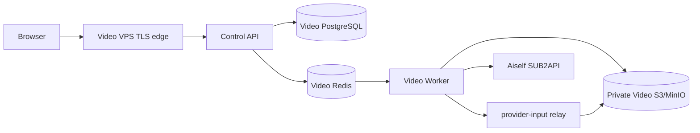

# AI 企业内容生产平台：C09-C 图生与多参考素材适配设计

状态：`IMPLEMENTED_AWAITING_AUDIT`

日期：2026-08-15

关联：ADR-0034、`AI企业内容生产平台_C09-C真实Provider运行时接入.md`、`AI企业内容生产平台_C09-B三VPS联动设计.md`

## 1. 目标与范围

本设计将用户提供的 `aiself-grok` 真实视频能力接入平台的图像输入链路。平台复用本地 `sub2api-video-mcp` 已验证的协议和能力证据，但不在生产运行时启动 MCP 进程，也不让浏览器调用 MCP、Provider、MinIO 管理端或 Veyra。

目标：

1. 支持单张“作为开场画面”的图生视频。
2. 支持一至七张“作为参考素材”的多参考视频生成。
3. 允许用户图片始终留在平台私有对象存储，由 Worker 在提交瞬间生成 Provider 可读取的短时 HTTPS 输入，而非暴露对象 key、MinIO 端口或浏览器预签名 URL。
4. 保留 TaskRun、ProviderAttempt、Outbox、重启恢复、下载校验和公开 DTO 脱敏边界。
5. 保持本地默认 `VIDEO_PROVIDER=mock`；本设计不授权真实提交、Veyra、VPS、DNS、TLS 或部署。

非目标：

- 不把本地 MCP 作为平台微服务、队列消费者或数据库事实来源。
- 不支持首帧与独立参考图混合、尾帧、视频参考、音频参考、编辑、延长或 Seedance。
- 不把 7 张协议上限误写为 7 张画质已验证；目前完成的独立参考端到端证据只有 2 张。
- 不设置平台侧 4096 UTF-8 字节硬拒绝。提示词长度可作为非阻断质量提示；若上游拒绝，归一为既有 `PROVIDER_REJECTED`，不重复提交。

## 2. 已知能力与证据边界

| 输入意图 | 平台模式 | Aiself 客户端字段 | 输入语义 | 已知边界 |
| --- | --- | --- | --- | --- |
| 无图片 | `TEXT` | 无 | 文生 | 沿用已存在真实 profile 证据 |
| 一张开场画面 | `FIRST_FRAME` | `image.image_url` | 图片是字面第 0 帧 | 已认证单图图生；它不能同时携带独立参考图 |
| 一至七张参考素材 | `REFERENCE_SET` | `reference_images[].url` | 身份、服装、物品、风格或场景参考，不是首帧 | 网关会转换为 Wokey `multipart image[]` 和 `mode=multimodal_reference`；协议最多 7 张，实测完成 2 张 |

当前 profile/model/route 为 `aiself-grok + grok-imagine-video-1.5 + aiself-wokey-video-v1`。能力必须继续以 `host + profile + model + api_contract + mode + date` 记录；不得把这份记录外推到直连 xAI、其他网关或 Seedance。

## 3. 面向用户的交互

Studio 不显示 Provider、模型、网关、对象 URL、队列或工程参数。图片上传后只提供两个直接可理解的选择：

- `作为开场画面`：只能选择一张图片，代表视频开始时的真实画面。
- `作为参考素材`：可按顺序选择一至七张图片，代表人物、服装、物品、风格或场景；不会承诺第一帧复现其中任意一张。

默认选择 `作为参考素材`，避免把身份或产品参考错误固定成开场画面。两种选择互斥；切换选择时，页面必须明确要求用户保留一种输入方式，不能静默丢弃图片或改成文生。最多 7 张是提交能力，不是“7 张都已通过质量验证”的产品承诺。

## 4. 领域与公开契约设计

现有 `ReferenceBinding.role` 已包含 `FIRST_FRAME`、`SUBJECT`、`STYLE` 和 `LAST_FRAME`。本阶段复用其中前三种，不新增数据库枚举：

| 平台模式 | 合法 Binding | 不合法 Binding |
| --- | --- | --- |
| `TEXT` | 无 | 任意图片 |
| `FIRST_FRAME` | 恰好 1 个 `FIRST_FRAME` | `SUBJECT`、`STYLE`、`LAST_FRAME` 或第二张图 |
| `REFERENCE_SET` | 1-7 个 `SUBJECT` 或 `STYLE`，按 `position` 固定顺序 | `FIRST_FRAME`、`LAST_FRAME` |

`LAST_FRAME` 保持现有枚举以兼容将来能力，但当前 profile 必须在创建 TaskRun 前拒绝它。每个引用资产必须属于同一 `workspace_id + project_id`，状态为 `READY`，类型为 `IMAGE`，并通过内容型 MIME/字节校验、大小和 SHA-256 校验。第一版白名单为 JPEG、PNG、WebP，单图最多 8 MiB；任何超限、损坏或无权限图片返回既有 `INVALID_REFERENCE`。

生成命令不应再把“无角色的 asset ID 数组”当作图像语义。目标公开 DTO 在兼容迁移后以分镜的 `reference_bindings` 表达角色和顺序；生成命令仅选择该分镜已保存的绑定。迁移期内已有 `reference_asset_ids` 只能映射为 Mock 的兼容行为，真实模式不得猜测它是首帧还是独立参考。

Control API 形成的不可变 `TaskRun.input_snapshot` 增加内部字段：

```ts
type VisualInputSnapshot =
  | { mode: "TEXT"; references: [] }
  | {
      mode: "FIRST_FRAME";
      references: [{ asset_id: string; sha256: string; mime_type: string; position: 0 }];
    }
  | {
      mode: "REFERENCE_SET";
      references: Array<{ asset_id: string; sha256: string; mime_type: string; position: number }>;
    };
```

该快照不保存对象 key、临时 URL、签名 query、Provider 请求体或密钥。公开 `TaskRun`、项目详情、SSE、错误和浏览器持久化状态继续不返回 `input_snapshot`。

## 5. Worker 与 Provider 端口

将当前含糊的可选 `referenceImageUrl` 替换为互斥的内部联合类型，防止调用方同时传首帧和多参考：

```ts
type ResolvedVisualInput =
  | { mode: "TEXT" }
  | { mode: "FIRST_FRAME"; url: string }
  | { mode: "REFERENCE_SET"; urls: readonly string[] };
```

`VideoProviderPort.submit()` 只接收已解析的 `ResolvedVisualInput`。Aiself adapter 的 mapper 精确映射如下：

```ts
FIRST_FRAME  -> { image: { image_url: url } }
REFERENCE_SET -> { reference_images: urls.map((url) => ({ url })) }
TEXT         -> no visual field
```

适配器不能知道 Asset、数据库、对象 key、浏览器或临时 URL 如何产生。未知 mode、混合输入、数量超过 7、非 HTTPS URL 或无效响应都在适配器或上游前失败，且不会泄露原始上游消息。

Worker 执行顺序固定为：

```text
读取 TaskRun 的不可变快照
  -> workspace/project scoped 验证每个 Asset
  -> ReferenceDeliveryPort 生成内存中的临时 HTTPS URL
  -> 创建/读取 ProviderAttempt
  -> 无 provider_request_id 时仅一次 submit
  -> 持久化 provider_request_id
  -> 仅 GET 轮询和下载恢复
  -> MIME/长度/SHA-256/ffprobe 验证
  -> 私有对象存储归档并发布公开成功状态
```

临时投递失败发生在 submit 前，可按既有可恢复错误处理；一旦 `provider_request_id` 被持久化，恢复路径绝不重新投递图片或重新 submit。

## 6. ReferenceDeliveryPort

`ReferenceDeliveryPort` 是新内部端口，归 Worker 所有：

```ts
interface ReferenceDeliveryPort {
  createVisualInput(input: {
    workspaceId: string;
    projectId: string;
    references: readonly { assetId: string; sha256: string; mimeType: string; position: number }[];
    mode: "FIRST_FRAME" | "REFERENCE_SET";
  }): Promise<ResolvedVisualInput>;
}
```

它不是浏览器下载接口，也不是 StoragePort 的无条件 `createDownloadUrl()` 透传。实现要求：

1. 只从工作区范围内读取私有对象；请求中没有任意用户 URL、路径或主机名，因此不存在由用户输入触发的 SSRF。
2. 生成 `https://video.aiself.vip/provider-input/<opaque-token>` 形式的短时读取入口。token 必须不可猜、包含到期和资产绑定签名，不含 object key、用户 ID 或 Provider 信息。
3. token、完整 URL、签名 query 和访问日志不得进入数据库、outbox、ProviderAttempt、浏览器、错误或普通 Nginx access log。该专用路径使用脱敏/最小日志策略。
4. 入口只允许 `GET`/`HEAD`、单资源、短 TTL、受控 MIME 和最大响应大小；服务端从私有 S3/MinIO 流式读取，不暴露 S3 管理端或 bucket 列表。
5. Provider 读取入口与浏览器预签名下载 URL 完全不同，使用独立签名密钥、域名策略和轮换周期。

本地 Mock 通过注入 fake `ReferenceDeliveryPort` 验证 URL 形状和输入顺序，不暴露本机 MinIO，也不要求 Internet。真实图生端到端验证只能在部署了 HTTPS relay 的 Video VPS 上进行。

## 7. VPS 目标拓扑



- Video VPS 独占 API、Worker、PostgreSQL、Redis、对象存储、relay 签名密钥和 `video.aiself.vip` TLS edge。
- Aiself/Sub2API VPS 仅保留 Provider API、未来 Veyra 权威与其自身数据；它不读取 Video 数据库、MinIO 凭据、relay 签名密钥或浏览器会话。
- Alchemy VPS 不参与图像投递或视频任务执行。
- Worker 才读取 `SUB2API_VIDEO_BASE_URL`、`SUB2API_VIDEO_API_KEY`。relay 进程只读取独立的 `REFERENCE_DELIVERY_SIGNING_KEY`、内部对象存储配置和公开 origin；它不读取视频 API Key。
- 已准备但尚未执行 Video VPS 的 Docker Compose、Nginx/ACME bootstrap、私有环境模板和审计手册；它们不包含真实 secret，未创建 VPS、DNS、Nginx、TLS、secret 或生产路由。上述拓扑仍是部署执行前的输入，而不是上线事实。

## 8. 测试与审计门

离线测试必须覆盖：

| 类别 | 必须证明 |
| --- | --- |
| 契约 | 三种模式互斥、`FIRST_FRAME` 恰好一张、`REFERENCE_SET` 接受 1-7 张并保序、`LAST_FRAME` 被拒绝 |
| Provider mapper | 单图仅出现 `image.image_url`；多图仅出现 `reference_images[].url`；无硬 4096 拦截；数量、HTTPS 和上游 4xx 归一化 |
| Reference delivery | workspace/project 隔离、内容型 MIME/大小/SHA-256、过期/篡改 token、无 object key 泄露、拒绝任意 URL 与内网目标 |
| Worker | 发出一次 submit 后重启只 GET；提交前 relay 临时失败不留下 request ID；多图顺序不变；下载校验与既有 C06 回归不退化 |
| UI/E2E | 中文“开场画面/参考素材”选择、最多 7 张、项目隔离、刷新恢复、Mock 成片播放、失败重试 |
| 边界扫描 | Web/Control API 无视频 Key，公开 DTO/SSE/日志/快照无 token、对象 key、URL query 或 Provider 原始 payload |

真实验收仍是独立受控动作：先在 Video VPS 用合成、无品牌、无人物隐私风险的图片分别做一次单图 I2V 与两图 R2V；每次记录 profile、调用次数、费用上限、素材范围和结果。七图能力的协议声明不授权七图真实压测。

## 9. 分阶段实施与回滚

1. 文档和 ADR：冻结模式、7 张边界、无硬 4096 策略、端口与部署边界。
2. 离线实现：contracts/domain、Provider mapper、ReferenceDeliveryPort fake、Worker 恢复和 Studio 交互测试；默认 Mock 不变。
3. 部署准备：Video VPS relay、私有对象存储与 TLS/日志策略的独立审计；不启用真实 profile。
4. 受控真实验收：通过 relay 做 I2V 和两图 R2V；只轮询同一 request ID，完成后做技术和语义验收。
5. 后续共享积分：仅在 C09-B 的 Veyra 设计和授权完成后接入，不能因图生能力直接开启扣费。

回滚顺序：先关闭 `VIDEO_PROVIDER=sub2api` 的 feature flag，再停止 relay 对新 token 的签发；保留已提交 TaskRun 的查询、下载和结果归档恢复，不删除 ProviderAttempt、TaskRun、资产或审计事实。

## 10. 当前设计审计结论

本设计通过以下静态审计条件后才可进入实现：不复制 MCP 进程/密钥配置；图片语义互斥且无静默降级；7 张上限和 2 张已验证证据分离；临时 URL 不进入持久化/公开面；VPS 边界不穿透到 Sub2API/Alchemy；默认 Mock 和真实调用门禁不改变。

2026-08-15 设计审计结论：通过。项目文档的 `git diff --check`、敏感值扫描、必备控制项检查和 ADR/总控交叉策略检查均通过。原 MCP 会话已完成自检；独立复跑 `python -m unittest -v test_server.py` 为 30/30 通过，验证 R2V 不再执行本地 prompt-byte 拒绝、1 至 7 张 HTTPS 参考图预检均为 ready、8 张仍拒绝、I2V/R2V 严格互斥、7 张协议上限与 2 张已验证样本数分离。随后进入离线实现和完整回归；真实 Provider、VPS 与部署仍不在本设计审计的授权范围内。

2026-08-15 实现审计结论：通过。Contracts 形成 `TEXT` / `FIRST_FRAME` / `REFERENCE_SET` 互斥内部快照；Control API 只从已保存的分镜绑定创建快照，并在真实图片任务缺少 relay signing key 时拒绝创建 TaskRun。`@alchemy-video/reference-delivery` 以加密、到期且 workspace/project/asset/SHA/MIME 绑定的 token 提供受控 `GET` / `HEAD /provider-input/:token`；Worker 在任何 ProviderAttempt 或 submit 前完成引用解析并对未配置 relay 安全失败。Aiself mapper 覆盖一张首帧及一至七张有序参考 URL，无本地 4096 字节 hard gate。Studio 以中文保存“作为开场画面”或“作为参考素材”绑定，生成命令为 `{}`，不携带提示词或素材地址。根 `pnpm typecheck`、根 `pnpm test`、根 `pnpm build`、C06 Mock 浏览器 E2E、认证工具 15/15、静态凭据/公开边界扫描和 `git diff --check` 均通过。C06 在默认 3031 CORS 来源验证两张图片上传、失败提示、显式重试、同一任务恢复及 160x90/1s 播放，并清理两个项目、三个对象、隔离队列、夹具和子服务。真实 I2V/R2V 仍等待 Video VPS relay 部署审计和新的有界付费调用授权。

## 11. 2026-08-16 实机诊断后的交互与编译修正

一次本机真实任务诊断证明：资产上传成功本身不等于已形成 `ReferenceBinding`。若页面仅显示“可选参考图”而未选中图片，生成快照必须是 `TEXT`，Worker 不会也不得把私有图片猜测为 Provider 输入。为避免非专业用户把“已上传”理解为“已使用”，Studio 的规则更新为：

1. 图片确认成功后立即默认选中该图片，输入模式固定为 `REFERENCE_SET`（“作为参考素材”）。
2. 已有分镜时，Studio 使用既有 `PATCH /api/v1/shots/:shot_id` 立即保存默认或用户修改后的绑定；无分镜时保留本页选择，并在首次保存想法或生成前写入分镜。
3. 已有但未绑定的 READY 用户图片在项目首次载入时默认选中，以修复旧页面留下的“已上传但未使用”状态。用户仍可显式取消选择或切换为单张开场画面；不得静默把已选图片降级为文生。
4. 页面必须显示本次会使用的图片数量；“未选择”只表示没有纳入本次视频，不能再表述为图片尚未上传。

本修正不改变公开生成命令 `{}`、`ReferenceBinding`、对象存储边界或 TaskRun 状态机。对已经失败的 TaskRun，`retry` 继续使用其冻结的 `input_snapshot`；改变参考图、想法或偏好必须走“调整后生成新版本”，创建新的 TaskRun。

同时新增一个狭义、确定性的 `VideoPromptCompiler`，它不是 C11 的脚本/分镜 Agent，也不调用外部文本模型。Control API 在创建 TaskRun 时用它校验并保留已保存的用户创作描述；它不追加英文模板、偏好片段或工程参数，也不从自然语言中猜测时长和清晰度。当前 Studio 已通过单独的受控 DTO 公开时长和清晰度选择，默认 `5s / 720p / 16:9`；用户写出的“15 秒”或“480p”仍仅是创作描述的一部分，不会悄悄改变 Provider 参数。编译器不设置 4096 字节本地硬上限，也不把上游内容政策判断伪装成平台判断。

## 12. 2026-08-16 异步失败诊断后的真实请求对齐

一次带两张 `REFERENCE_SET` 图片的本机真实任务已证明：平台在提交前生成两条有效的 HTTPS relay 输入，并按 Aiself/SUB2API 的 `reference_images[].url` 契约提交；网关返回 `202`，随后数次 `GET /videos/{id}` 均返回 `200`，任务才进入终态失败。因此该案例不是浏览器漏选参考图、私有对象无法读取或提交请求被同步拒绝。

该失败的上游终态只返回了泛化的 `Grok video query failed.`。当前 Aiself 网关没有持久化可供平台安全查询的终态原因，且任务绑定在短期会话窗口外无法再次查询；平台不得猜测为内容、图片读取或参数中的任一原因。与此同时，任务实际发送的 `15s / 480p` 和附加提示词，与本地 MCP 已验证的 `5s / 720p / 16:9` 原始描述请求并不相同。

本修正将真实运行时改为由用户明确选择、且与 MCP 契约一致的请求形状：

1. Studio 第三步以时长下拉菜单显示并保存 `1..15` 秒、以单选项显示清晰度 `480p|720p`，并显示固定画幅 `16:9`；默认值是已认证组合 `5s / 720p / 16:9`。
2. Control API 只从该受控设置读取 `duration` 和 `resolution`；自然语言中的数字不会再改写模型参数。`prompt` 只使用用户保存的创作描述（去首尾空白），不追加模板、翻译或隐含工程指令。
3. `REFERENCE_SET` 保持一至七张、按绑定顺序传入；relay URL 继续只存在于 Worker submit 的内存请求中。
4. `PROVIDER_REJECTED` 的中文反馈改为“已进入生成阶段但未完成”，不再错误指示用户再次检查已绑定的参考图。

规格值保存在已有 `Shot.generation_settings.video_settings`：

```ts
{
  video_settings: {
    duration_seconds: 1 | 2 | /* ... */ | 15;
    resolution: "480p" | "720p";
    ratio: "16:9";
  };
}
```

`ratio` 当前是公开可见但不可修改的 profile 能力，不接受浏览器提交其他比例。`5s / 720p / 16:9` 是当前独立参考素材实测组合；其余界面可选值是同一 profile 的已声明协议范围，不能被表述为已完成相同画质的真实验收。

这不是对已经失败的不可变 TaskRun 的重放。用户选择“调整后生成新版本”时才会形成新的冻结快照和一次新的 Provider submit；平台测试只使用 Mock/injected transport，不自动产生付费调用。
