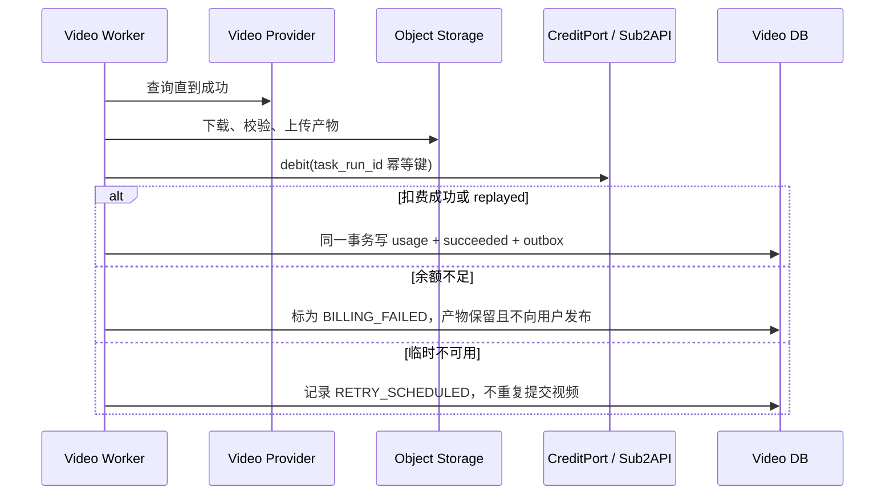

# AI企业内容生产平台：Sub2API 与 Alchemy 共享积分适配规范

> **2026-09-01 当前口径**：本轮只授权本机 Aiself Grok/Doubao 产物对照，不启用本文的 Veyra/共享积分路径。自动旁白不要求用户上传音频/样音；默认/CI 仍为 Mock，真实凭据不写入仓库。

## 1. 结论

视频平台必须**使用**现有 Sub2API 的共享余额，不能复制或迁移其账本，也不能在视频项目数据库里维护可扣减余额。视频平台只保存认证映射和已完成扣费的审计镜像；余额权威、并发扣减与幂等裁决永远留在 Sub2API。

该结论来自本地已有实现：

- [Sub2API Veyra 路由](D:/AI/SSH/sub2api/backend/internal/veyra/routes.go) 提供票据、账户和内部扣费接口。
- [Sub2API 扣费实现](D:/AI/SSH/sub2api/backend/internal/veyra/billing.go) 以原子余额服务优先，要求 `idempotency_key`，并对同键不同请求产生冲突。
- [Alchemy Veyra 客户端](<D:/AI/Alchemy Media Agent System/custom_media_agent_2_0/app/services/veyra_auth.py>) 是可复用的请求/响应映射参考。
- [Alchemy 生成服务](<D:/AI/Alchemy Media Agent System/custom_media_agent_2_0/app/services/generation.py>) 在产物成功后扣费，并以 `billing_rule.key:image:job_id` 构造幂等键。

本阶段只写 adapter 和测试，不开启真实请求。`VEYRA_AUTH_ENABLED=false` 时，系统强制走 `NoopCreditAdapter`。

## 2. 现有协议的精确映射

所有内部接口须携带 `X-Veyra-Internal-Token`，从服务器环境变量读取，不能出现在网页、浏览器请求、任务 payload、事件、日志或夹具。

| 用途 | Sub2API 路径 | 请求 | `data` 响应 | 视频平台适配 |
| --- | --- | --- | --- | --- |
| 换取登录身份 | `POST /api/veyra/internal/login-ticket/exchange` | `ticket` | `user_id`, `intent`, `expires_at` | `VeyraIdentityAdapter.exchangeTicket` |
| 查询账户 | `GET /api/veyra/internal/users/{user_id}/account` | 路径 `user_id` | `user_id`, `email`, `role`, `balance`, `status`, `concurrency` | `CreditPort.getAccount` |
| 原子扣费 | `POST /api/veyra/internal/billing/debit` | `user_id`, `amount`, `idempotency_key`, `source`, `reference_id` | `user_id`, `amount`, `balance_after`, `idempotency_key`, `source`, `reference_id`, `replayed` | `CreditPort.debit` |

`login-ticket` 的签发由 Sub2API 已登录用户调用 `POST /api/veyra/login-ticket` 完成；票据以 32 随机字节 hex 表示，仅能消费一次，默认 120 秒、上限 600 秒。视频系统只消费票据，不生成、缓存、重放或记录票据原文。

`intent` 在现有代码中只识别 `home`、`sub2api`、`alchemy`；未来视频平台须先在 Sub2API 增加 `video` 常量和门户路由后才启用 SSO。不得把 `video` 偷映射为 `alchemy`，否则审计和跳转语义会混淆。

## 3. 复用与不复用

### 3.1 直接复用的语义和字段

- 接口路径、`X-Veyra-Internal-Token`、响应外层 `data`。
- `user_id`、`amount`、`idempotency_key`、`source`、`reference_id`、`balance_after`、`replayed` 字段名。
- 余额不足为 HTTP `402`；同幂等键但请求指纹不同为 `409`；未授权为 `401/403`。
- 原子扣费优先而非“读余额再写余额”的实现策略。
- Alchemy 的“预检余额，结果成功后真实扣费，随后持久化 usage 审计”时序。

### 3.2 明确不复用的部分

- 不复用 Alchemy 的 `.v2_data/veyra_usage.jsonl` 文件存储；视频系统使用自己的 `usage_records` 事务表。
- 不复用 Alchemy 自签的会话 Token 及 Cookie 名称；未来视频 Web 由 `VeyraIdentityAdapter` 发放本系统 session，签名密钥独立。
- 不把 Alchemy 当前 `0.25` 的默认费率当成视频费率。视频费用必须由独立规则 `video:<profile>` 明确配置，初值为禁用和 `0`。
- 不复制 Sub2API 的用户、余额、扣费 ledger 表，也不在视频平台执行退款或改余额。

## 4. 视频平台端口

```ts
type CreditAccount = {
  externalUserId: number;
  email: string;
  role: string;
  balance: string;
  status: string;
  concurrency: number;
};

type CreditDebitInput = {
  externalUserId: number;
  amount: string;
  idempotencyKey: string;
  source: string;
  referenceId: string;
};

type CreditDebitResult = {
  externalUserId: number;
  amount: string;
  balanceAfter: string;
  idempotencyKey: string;
  replayed: boolean;
};

interface CreditPort {
  getAccount(input: { externalUserId: number }): Promise<CreditAccount>;
  debit(input: CreditDebitInput): Promise<CreditDebitResult>;
}
```

`VeyraSub2ApiCreditAdapter` 是唯一允许调用这些 HTTP 路径的模块，位于 `packages/credit-veyra`。它将本系统十进制字符串安全转换为上游数值，收到上游值后再转换回字符串；转换失败、超出安全 JSON number 范围或精度超过八位小数时拒绝发起请求。C09-A 只允许 injected fake transport，不提供默认 HTTP client，不读取环境或 Token。

业务层只引用 `CreditPort`。`VideoProviderPort` 完全不知道用户积分；反过来 credit adapter 也不知道 `prompt`、模型、资产 URL 或上游视频密钥。

## 5. 身份映射

`external_identities` 的最小表结构：

| 字段 | 规则 |
| --- | --- |
| `id` | 本系统 `ext_` ID |
| `user_id` | 指向本系统 `users.id` |
| `provider` | 固定 `veyra_sub2api` |
| `external_user_id` | Sub2API `user_id`，与 `provider` 联合唯一 |
| `email_snapshot`, `role_snapshot` | 仅显示缓存，不作为授权权威 |
| `last_verified_at` | 最近成功账户或换票时间 |

部署阶段的登录流程是：浏览器已登录门户 -> 请求一次性票据 -> 视频后端服务端换票 -> 验证 `intent=video` -> upsert 身份映射 -> 颁发本系统短会话。票据不能通过 URL query、localStorage、日志或错误响应传递。

本地开发保留 `DevIdentityAdapter`，固定映射 `usr_dev_owner`，不创建 `external_identities`。这样没有 Sub2API 时也能完整测试任务系统。

## 6. 扣费时序



推荐费率规则：

```json
{
  "key": "video:grok-imagine-video-1.5",
  "enabled": false,
  "charge_amount": "0.00000000",
  "source": "video:grok-imagine-video-1.5"
}
```

每个真实视频 profile 一条规则，不使用“全局每次生成价格”。费用由受版本管理的服务端配置读取；任务创建时把 `billing_rule_key` 与 `charge_amount` 快照写入 `TaskRun.input_snapshot`。规则变更不影响已经开始的任务。

扣费请求必须是：

```json
{
  "user_id": 42,
  "amount": 1.25000000,
  "idempotency_key": "video:grok-imagine-video-1.5:tsk_01J...",
  "source": "video:grok-imagine-video-1.5",
  "reference_id": "tsk_01J..."
}
```

同一 `task_run_id`、规则版本、金额、`source` 与 `reference_id` 是不可变集合。任何重试必须原样发送。变更时创建新 `TaskRun`，不能复用幂等键，否则 Sub2API 将按其请求指纹返回冲突。

## 7. 错误与恢复策略

| 上游情况 | 归一化错误 | `TaskRun` 处理 | 是否重试 credit | 是否重新提交视频 |
| --- | --- | --- | --- | --- |
| 200，`replayed=false/true` | 无 | 写 usage，成功 | 否 | 否 |
| 402 | `CREDIT_INSUFFICIENT` | `BILLING_FAILED`，产物隔离 7 天 | 用户充值后显式重试 | 否 |
| 409 | `CREDIT_CONFLICT` | `BILLING_FAILED`，高优先级审计 | 否，人工处理 | 否 |
| 401/403 | `AUTH_FORBIDDEN` | `RETRY_SCHEDULED` 后告警 | 有限重试 | 否 |
| 网络/5xx | `CREDIT_UNAVAILABLE` | `RETRY_SCHEDULED` 指数退避 | 是 | 否 |
| 4xx 其他 | `CREDIT_REJECTED` | `BILLING_FAILED` | 否 | 否 |

现有 Alchemy 的预检在认证服务暂时不可用时会继续执行；视频平台不采用这一点。视频成本远高于一般本地任务：当真实积分功能已启用而预检不可用，任务停在 `QUEUED` 并重试，禁止向视频提供方提交。预检仍不是预授权，因此最终扣费 `402` 仍须妥善处理。

产物在扣费失败时保留给运维恢复，不向普通用户生成下载 URL。平台不自动退款；若需要退款，必须由 Sub2API 新增显式、可审计的退款端点后再设计。

### 7.1 C09-A 离线边界

本子阶段只验证端口、HTTP 字段、错误映射、金额精度和 receipt 幂等性，不把 adapter 装配至 Worker、Control API 或 Studio，不触发 `BILLING_PENDING` 扣费流程。`NoopCreditAdapter` 必须显式返回本地计费禁用错误，不能返回伪造 debit 成功。真实 Token、HTTP transport、账户查询、票据交换和 debit 都留给独立授权的后续关卡。

## 8. 使用审计

`usage_records` 是接入侧 receipt，不是可聚合余额账本。唯一键为 `(credit_provider, idempotency_key)`，保存：

```json
{
  "id": "use_01J...",
  "credit_provider": "veyra_sub2api",
  "external_user_id": 42,
  "task_run_id": "tsk_01J...",
  "amount": "1.25000000",
  "balance_after": "8.75000000",
  "idempotency_key": "video:grok-imagine-video-1.5:tsk_01J...",
  "source": "video:grok-imagine-video-1.5",
  "reference_id": "tsk_01J...",
  "replayed": false,
  "created_at": "2026-08-12T00:00:00.000Z"
}
```

管理员报表可以展示 receipt，不得基于这些记录自行计算“剩余积分”。用户余额页面每次从 Sub2API 账户端点读取，允许短期缓存但显示“更新时间”。

## 9. 上线前验证清单

- 在本地 fake server 上测试所有三条现有路径、`data` 包装和内部 Token Header。
- 同键同请求获得 `replayed=true` 且本地只出现一条 usage record。
- 同键不同 `amount`/`source`/`reference_id` 得到 `409`，不创建第二条 receipt。
- `402` 不重复调用视频生成，也不提供下载 URL。
- 真实启用前，Sub2API 添加 `video` intent、目标入口与 token 权限范围；这是一项部署阶段的明确前置工作。
- 凭据扫描、日志测试、事件 snapshot 测试均证明没有泄露内部 Token、票据或视频 API Key。
