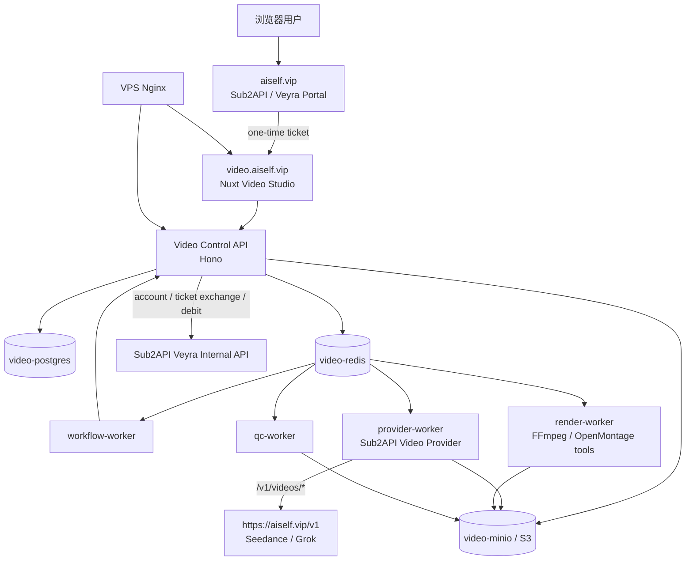

# AI 企业内容生产平台：VPS 与 SUB2API 视频接入补充方案

> **2026-09-01 当前口径**：自动旁白不要求用户上传音频/样音；本轮授权只覆盖本机 Aiself Grok/Doubao 对照，不能据此启动本文的 VPS、Veyra、共享积分、DNS、TLS 或部署步骤。默认/CI 仍为 Mock；本文其余部署设计保持后置/历史状态。

> 本文补充 `AI企业内容生产平台_代码实现与仓库整合详细方案.md`，将系统落实到 `video.aiself.vip`、现有 Aiself/Sub2API/Veyra 体系、Seedance/Grok 视频引擎和未来 Codex MCP 入口。本文按学习型项目编写，密钥不写入文档、仓库或浏览器。

## 1. 本次需要明确的结论

1. `video.aiself.vip` 是与 `alchemy.aiself.vip` 平级的独立视频工作台，不是 Alchemy 页面中临时添加的一个功能页。
2. 网页端不调用 Codex MCP。网页端通过自己的 Control API 和 Provider Worker 调用 Aiself/Sub2API 视频 API；MCP 仅是以后 Codex 本机使用同一个 Provider Core 的薄适配器。
3. SUB2API 视频请求采用已经在 `sub2api-video-mcp` 中实现的三段式协议：提交任务、查询状态、流式下载成品。视频完成后必须立即下载到平台对象存储，不能把上游 content URL 当成永久资产。
4. 第一版同时保留 Grok 和 Seedance 两个 Provider Profile，但只开放已经按实际 API 验证过的能力。未验证的多图、多视频、音频参考、首尾帧、扩展、编辑不能仅凭模型名称在 UI 中开放。
5. 账号、登录票据、余额和扣费仍由 Aiself/Sub2API Veyra 体系提供；Video 平台只消费一次性 ticket 和内部账户/扣费 API，不复制登录、充值或 API Key 管理功能。
6. 用户即将提供的 SUB2API 视频 Key 只部署在 VPS 的 Provider Worker 密钥环境中。前端、浏览器网络请求、任务日志、数据库普通字段、导出包和 Codex chat key 均不得包含该 Key。

## 2. 已核实的现有基础

### 2.1 SUB2API 视频 MCP 的实际协议

参考仓库 `meta-xucong/sub2api-video-mcp`，本次分析基线为 commit `3f2d885b79630f50b9cf4ae62251596cc37bbd18`。该 MCP 是本地 STDIO 客户端，不适合直接作为网站后端，但它已明确了 Aiself 视频网关的最小任务协议：

```text
POST https://aiself.vip/v1/videos/generations
GET  https://aiself.vip/v1/videos/{request_id}
GET  https://aiself.vip/v1/videos/{request_id}/content
```

其通用提交 body 为：

```json
{
  "model": "grok-imagine-video-1.5",
  "prompt": "...",
  "duration": 5,
  "resolution": "720p",
  "ratio": "16:9",
  "image": {
    "image_url": "https://..."
  }
}
```

已知规则：

- 创建接口返回可恢复的 `request_id` 或 `id`。
- 状态从 `status` 或 `state` 读取；成功状态包含 `completed`、`complete`、`succeeded`、`success`、`done`，失败状态包含 `failed`、`error`、`cancelled`、`canceled`、`rejected`。
- MCP 当前按 5 秒轮询，并将成功成品从 `/content` 流式下载到本地。
- MCP 文档明确指出视频内容代理不会在 VPS 上长期保存完成视频。因此平台 Worker 成功后必须立即拉取到 MinIO/S3，并生成平台自己的 `Asset(kind=VIDEO, origin=GENERATED)`。
- 该通用 MCP 当前只明确实现一个 `reference_image_url -> image.image_url`。这不是 Seedance 所有能力的完整证明。

### 2.2 已有 Alchemy/Aiself 登录与部署形态

本地现有 Alchemy 发布文档表明生产链路已经具备：

```text
aiself.vip (Sub2API / Veyra)
  -> 一次性 login ticket
  -> alchemy.aiself.vip 本地会话
  -> 账户查询、余额前置校验、幂等扣费
```

现有 Alchemy 生产结构为 Docker 承载的 V1 服务监听 `127.0.0.1:8017`，systemd 承载的 V2 API/Worker 监听 `127.0.0.1:8020`，Nginx 对外代理 `alchemy.aiself.vip`。Video 平台应与它并列部署，不改动或复用 Alchemy 的运行时目录、数据库文件、Cookie 名称、Worker 队列或媒体目录。

Veyra Portal 当前已有 `alchemy` 与 `alchemy-mobile` target，并通过：

```text
https://aiself.vip/_veyra/return?target=alchemy
https://aiself.vip/_veyra/return?target=alchemy-mobile
```

签发登录 ticket。Video 平台需要按同一模式新增 `video` 和 `video-mobile` 两个受控 target。

## 3. 最终部署拓扑



建议将 Video 平台作为独立的 Compose stack 部署到 `/opt/ai-enterprise-video`：

```text
video-web                 # Nuxt SSR/静态站，127.0.0.1:8031
video-control-api         # Hono，127.0.0.1:8032
video-workflow-worker     # 不暴露端口
video-provider-worker     # 不暴露端口，唯一读取视频 Key 的业务容器
video-render-worker       # 不暴露端口
video-qc-worker           # 不暴露端口
video-document-runtime    # 仅内部网络，必要时启用
video-media-runtime       # 仅内部网络，后期启用 OpenMontage 工具
video-postgres            # 仅 Compose 网络
video-redis               # 仅 Compose 网络
video-minio               # 仅 Compose 网络或改用外部 S3
```

端口 `8031`、`8032` 只是建议，实际部署前必须与 VPS 已监听端口核对。除 Nginx 的 `80/443` 外，不新增公网暴露端口。

### 3.1 Nginx 与域名

DNS 增加 `video.aiself.vip` 指向现有 VPS，证书由当前 Nginx/Certbot 策略管理。浏览器始终使用同源路径：

```text
https://video.aiself.vip/              # Nuxt 工作台
https://video.aiself.vip/api/v1/...    # Control API
https://video.aiself.vip/api/v1/events # SSE 任务流
```

Nginx 的职责只限于 HTTPS、同源反代、SSE 和上传限制；不得把 `/internal/*`、Redis、MinIO Console、Postgres 或 Provider Worker 暴露到公网。

示意配置：

```nginx
server {
    listen 80;
    server_name video.aiself.vip;
    return 301 https://$host$request_uri;
}

server {
    listen 443 ssl http2;
    server_name video.aiself.vip;

    ssl_certificate     /etc/letsencrypt/live/video.aiself.vip/fullchain.pem;
    ssl_certificate_key /etc/letsencrypt/live/video.aiself.vip/privkey.pem;
    client_max_body_size 500m;

    location /api/v1/events {
        proxy_pass http://127.0.0.1:8032;
        proxy_http_version 1.1;
        proxy_buffering off;
        proxy_cache off;
        proxy_read_timeout 3600s;
        proxy_set_header Connection "";
        proxy_set_header Host $host;
        proxy_set_header X-Real-IP $remote_addr;
        proxy_set_header X-Forwarded-For $proxy_add_x_forwarded_for;
        proxy_set_header X-Forwarded-Proto $scheme;
    }

    location /api/ {
        proxy_pass http://127.0.0.1:8032;
        proxy_http_version 1.1;
        proxy_read_timeout 120s;
        proxy_set_header Host $host;
        proxy_set_header X-Real-IP $remote_addr;
        proxy_set_header X-Forwarded-For $proxy_add_x_forwarded_for;
        proxy_set_header X-Forwarded-Proto $scheme;
    }

    location / {
        proxy_pass http://127.0.0.1:8031;
        proxy_http_version 1.1;
        proxy_set_header Host $host;
        proxy_set_header X-Real-IP $remote_addr;
        proxy_set_header X-Forwarded-For $proxy_add_x_forwarded_for;
        proxy_set_header X-Forwarded-Proto $scheme;
    }
}
```

大型资产不通过 `video-control-api` 的反代上传。浏览器先从 API 获取短期 presigned URL，再直传 MinIO/S3；API 只接收 `assetId/objectKey/checksum` 的确认请求。这样可避免长视频上传耗尽 Node 进程和 Nginx 缓冲。

## 4. SUB2API Video Provider 的代码落位

### 4.1 不直接把 MCP 当作网站服务

`sub2api-video-mcp/server.py` 的职责是 Codex STDIO Tool：`generate_video`、`get_video_status`、`wait_for_video`、`download_video`。它将成品下载到运行 Codex 的个人电脑，并且使用本地 `.env` 与本地文件路径。这与 VPS 网站的任务、对象存储、用户隔离完全不同。

应将 MCP 的纯 HTTP 客户端逻辑提取为一个不依赖 MCP 的包：

```text
packages/provider-adapters/sub2api/
├── profiles.ts
├── request.ts
├── status.ts
├── content-stream.ts
├── errors.ts
└── test/

workers/provider-worker/
├── providers/sub2api-video-provider.ts
└── consumers/execute-generation.ts

tools/sub2api-video-mcp/               # 后期 Codex 入口
└── server.py                           # 只调用同一协议，不承载网页业务
```

建议保留上游 MCP 中已经验证的命名和语义：

| MCP 代码 | 平台共用核心 |
| --- | --- |
| `VideoProfile` | `Sub2ApiVideoProfile` |
| `settings()` | `resolveVideoProfile()` |
| `api_headers()` | `authorizationHeaders()` |
| `task_path()` | `encodeTaskId()` |
| `request_json()` | `requestJson()` |
| `extract_request_id()` | `extractRequestId()` |
| `extract_status()` | `extractStatus()` |
| `TERMINAL_SUCCESS_STATES` / `TERMINAL_FAILURE_STATES` | `TaskStatusClassifier` |
| `download_video_file()` | `streamCompletedVideoToObjectStore()` |

唯一关键差异是最终下载目标：MCP 写本机文件，网页平台写对象存储并回写 `Asset(kind=VIDEO, origin=GENERATED)`。

### 4.2 Provider Profile 和密钥

Profile 只包含非敏感的路由信息，密钥始终由环境变量或 secret manager 注入：

```json
{
  "aiself-grok": {
    "baseUrl": "https://aiself.vip/v1",
    "apiKeyEnv": "SUB2API_VIDEO_API_KEY",
    "defaultModel": "grok-imagine-video-1.5",
    "capabilityId": "grok-video-v1"
  },
  "aiself-seedance": {
    "baseUrl": "https://aiself.vip/v1",
    "apiKeyEnv": "SUB2API_VIDEO_API_KEY",
    "defaultModelEnv": "SUB2API_SEEDANCE_MODEL",
    "capabilityId": "seedance-video-v1"
  }
}
```

`grok-imagine-video-1.5` 已在 MCP 示例中明确；Seedance 的真实 model ID、操作能力、参数取值必须以用户提供 Key 后的连通性测试为准，因此使用 `SUB2API_SEEDANCE_MODEL` 配置，不能在代码中猜一个名称。

第一版 Provider 配置放在 VPS 私有 `.env` 或 Docker Secret：

```env
SUB2API_VIDEO_BASE_URL=https://aiself.vip/v1
SUB2API_VIDEO_API_KEY=<用户提供，绝不提交>
SUB2API_GROK_MODEL=grok-imagine-video-1.5
SUB2API_SEEDANCE_MODEL=<待实际验证>

VIDEO_PROVIDER_POLL_INTERVAL_SECONDS=5
VIDEO_PROVIDER_MAX_WAIT_SECONDS=1800
VIDEO_PROVIDER_MAX_CONCURRENCY=1
VIDEO_PROVIDER_DOWNLOAD_TIMEOUT_SECONDS=600
```

如果以后为 Grok 和 Seedance 分配独立 scope Key，则仅替换 `apiKeyEnv`，上层 Model Router、任务和 UI 不需要改变。

### 4.3 平台 Provider 接口

沿用详细方案中的 `VideoProviderAdapter` 与 `VideoGenerationRecord`，增加以下平台方法：

```ts
export interface VideoProviderAdapter {
  provider: string
  capabilities(): Promise<ProviderCapability>
  create(record: VideoGenerationRecord): Promise<{ providerTaskId: string; status: string }>
  getStatus(providerTaskId: string): Promise<NormalizedVideoStatus>
  streamContent(providerTaskId: string, destination: Writable): Promise<DownloadedVideo>
  normalizeError(error: unknown): ProviderFailure
}
```

`Sub2ApiVideoProvider.create()` 的 MVP 映射严格如下：

```text
VideoGenerationRecord.model        -> body.model
VideoGenerationRecord.prompt       -> body.prompt
VideoGenerationRecord.duration     -> body.duration
VideoGenerationRecord.resolution   -> body.resolution
VideoGenerationRecord.aspectRatio  -> body.ratio
imageUrl                            -> body.image.image_url
```

MCP 参考中没有明确的字段不能静默伪造：

| 平台字段 | 当前策略 |
| --- | --- |
| `referenceImageUrls` 多张 | 仅当对应 profile 经实测支持时转换；否则在提交前返回 `provider_capability_unsupported` |
| `referenceVideoUrls` | 默认不支持，等待实际 API capability 验证 |
| `referenceAudioUrls` | 默认不支持，等待实际 API capability 验证 |
| `firstFrameUrl` / `lastFrameUrl` | 默认不支持，等待实际 API capability 验证 |
| `extend()` | 默认不支持，等待实际 API capability 验证 |
| `edit()` | 默认不支持，等待实际 API capability 验证 |
| 上游取消任务 | 当前参考接口未出现 cancel endpoint；“取消”只停止本平台轮询并标记 `abandoned`，不承诺停止上游计费 |

这意味着 Seedance-2.5 Skill 可完整保留为 Prompt/Reference Ownership 知识，但 UI 只显示该 SUB2API Profile 已验证的操作。高级 Skill 输出可以保存在 Prompt Package 中，待该 API 开通对应字段后再由 Adapter 映射执行。

## 5. 任务状态、下载与重试

### 5.1 Durable Task 而非浏览器轮询

浏览器点击“生成”后的状态流：

```text
CREATED
  -> QUEUED
  -> RUNNING
  -> PROVIDER_PROCESSING      # 已得到 provider_request_id
  -> DOWNLOADING              # GET /videos/{id}/content
  -> BILLING_PENDING          # 产物已验证；本地无计费时直接成功
  -> SUCCEEDED
  -> BILLING_FAILED           # 余额不足/幂等冲突；重试只扣费

任何一步 -> RETRY_SCHEDULED | FAILED | ABANDONED
```

状态只由 Provider Worker 写入 Control API，前端只通过 SSE 和任务查询读取。用户刷新、关闭浏览器、重启 Nuxt 或断开 SSE 均不影响任务。

### 5.2 每次尝试必须保存的数据

`provider_attempts` 至少存储：

```text
task_run_id
attempt_number
provider_profile
provider
model
operation
provider_request_id
request_payload_redacted
submitted_at
last_polled_at
upstream_status
normalized_status
next_poll_at
error_code
error_summary
download_object_key
sha256
duration_ms
estimated_cost
actual_cost
correlation_id
```

`request_payload_redacted` 保留模型、时长、Prompt hash、引用 asset ID、非敏感参数；Authorization header、API Key、完整 presigned URL 的签名参数都不得写入。

### 5.3 立即归档与幂等下载

当 `GET /videos/{id}` 进入成功终态，Worker 获得 `taskRunId + providerTaskId` 的下载锁：

1. 只允许一个 Worker 调用 `/content`。
2. 内容流写入 `tmp/{taskRunId}.part`，同时计算 SHA-256 和大小。
3. 下载成功后原子移动到 `workspaces/{workspaceId}/projects/{projectId}/generated/{assetId}.mp4`。
4. 通过 `ffprobe` 获取时长、编码、分辨率，生成 poster/thumbnail。
5. 事务写入 `Asset(kind=VIDEO, origin=GENERATED)` 和 ProviderAttempt，才发布 `task_run.succeeded`。
6. `.part` 文件或无数据库引用的对象由定时任务清理。

如果 Worker 在下载中断，下一次只要上游仍可提供 `/content`，便基于原 `providerTaskId` 重新下载；不得再次调用 `/generations`。如果上游内容已失效，任务终态应为 `FAILED`，原因是 `upstream_content_unavailable`，并由用户明确选择重生成。

### 5.4 并发与重试限制

初始值应保守：

```text
提交并发：1
每 Profile 在途任务：1
轮询间隔：5 秒
一次 ProviderAttempt 最大等待：30 分钟
网络/429/5xx：指数退避，最多 3 次 HTTP 重试
上游审核拒绝/参数错误：不重试
相同 Prompt 的随机 reroll：最多 2 次
同类错误两次：转 rewrite 或人工处理
```

视频模型与视频下载均可能占用大量带宽和磁盘。并发上限必须是 Worker 配置，不允许前端在多个标签页绕开限制。

## 6. Seedance 与 Grok 的产品路由

### 6.1 第一版操作矩阵

在提交 Key 后，先执行最小连通性验证，生成可版本化的 capability snapshot。初始界面建议显示如下状态，而非把所有功能直接点亮：

| 能力 | Grok Profile | Seedance Profile | MVP 行为 |
| --- | --- | --- | --- |
| 文生视频 | 待 Key 验证 | 待 Key 验证 | 通过后开放 |
| 单图生视频 | MCP 协议已定义，仍需 Key 验证 | 待 Key 验证 | 独立测试后开放 |
| 多图参考 | 未由当前协议证明 | 未由当前协议证明 | 关闭 |
| 视频/音频参考 | 未由当前协议证明 | 未由当前协议证明 | 关闭 |
| 首尾帧 | 未由当前协议证明 | 未由当前协议证明 | 关闭 |
| 续写/延长 | 未由当前协议证明 | 未由当前协议证明 | 关闭 |
| 局部编辑 | 未由当前协议证明 | 未由当前协议证明 | 关闭 |
| 成品下载 | 已定义 | 复用同一协议后可用 | 通过后开放 |

“待 Key 验证”不代表 API 不支持，而是平台不在没有实际契约时伪造表单或请求字段。

### 6.2 路由原则

第一阶段支持用户明确选择 Grok 或 Seedance，并记录选择的 Profile/model。自动路由只做保守建议：

```text
用户锁定 Provider             -> 必须按所选 Profile 提交或给出 capability 错误
镜头要求高级 Seedance 工作流   -> 优先 Seedance；能力未验证则进入待处理，不降级为错误语义
普通单图/文生短镜头            -> Grok 或 Seedance 中已验证且有预算的 Profile
局部修复                       -> 先进入后期 FFmpeg/Remotion；不能假设上游 video edit
成片字幕/Logo/BGM              -> Render Worker，不依赖视频模型精确生成文字
```

Model Router 输出必须包含 `reason`、`capabilitySnapshotId` 与 `fallbacks`，让用户理解为什么某个镜头被路由到一个 Provider。

### 6.3 Seedance Skill 与 API Capability 的边界

Seedance-2.5 Skill 继续负责：Prompt 四层结构、Reference Ownership、时间轴、长视频结构、编辑/修复策略、权利和事实约束。SUB2API Provider 只负责已验证 API 字段的传输。

例如，分镜可能要求“产品图控制身份，工厂视频只控制运镜”。Skill 应产生这个 Reference Map；若当前 Seedance API Profile 仅验证一张图，则提交前给出明确的 `blocked_by_provider_capability`，同时建议：

```text
方案 A：仅使用产品身份图生成该镜头，工厂氛围改用文字描述。
方案 B：等待 Seedance 多参考 API capability 验证后再运行。
方案 C：改用已有真实工厂素材，由 Render Worker 合成。
```

不允许静默把工厂视频丢弃后仍显示“已按参考视频生成”。

## 7. video.aiself.vip 的认证、账户与扣费

### 7.1 新增 Veyra target

在 `sub2api-adapted` 的 Veyra Portal 中增加固定目标：

```text
video          -> https://video.aiself.vip/?ticket=<one-time-ticket>
video-mobile   -> https://video.aiself.vip/m?ticket=<one-time-ticket>
```

对应登录入口：

```text
https://aiself.vip/_veyra/return?target=video
https://aiself.vip/_veyra/return?target=video-mobile
```

改动位置沿用现有 Alchemy 实现：

```text
extensions/veyra/portal/app.js
extensions/veyra/portal/index.html
extensions/veyra/portal/mobile.html
backend/internal/veyra/intent.go
backend/internal/veyra/portal.go
backend/internal/veyra/*_test.go
```

`target` 必须是 allowlist 中的枚举值，不接受完整外部 URL。Portal 和 Video 前端均要覆盖“伪造 ticket、过期 ticket、重复消费 ticket”场景，失败时停在当前页并提示登录失败，不能重新跳转造成循环。

### 7.2 Video 本地会话

Video Control API 调用 Sub2API 内部接口：

```text
POST /api/veyra/internal/login-ticket/exchange
Header: X-Veyra-Internal-Token
Body: { ticket }
```

交换成功后，在 `video.aiself.vip` 写入独立的 host-only、安全 Cookie：

```text
name: video_veyra_session
Secure: true
HttpOnly: true
SameSite: Lax
Domain: 不设置
Path: /
```

Video 平台使用独立的 `VIDEO_VEYRA_SESSION_SECRET`；不要复用 Alchemy 的 `VEYRA_SESSION_SECRET`。两站共享的是上游 user ID 和一次性 ticket，不是 Browser Cookie 或服务会话密钥。

前端初始化顺序：

```text
检测 URL ticket
  -> POST /api/v1/auth/veyra/login
  -> 写 host-only video session
  -> 从 URL 清理 ticket
  -> GET /api/v1/me
  -> 无会话时跳 https://aiself.vip/_veyra/return?target=video
```

### 7.3 余额与计费

建议第一版直接沿用 Veyra 的账户查询、余额前置校验、成功后幂等扣费模式，而不是把共享视频 Key 当作无限免费资源：

```text
创建 generation task
  -> 查询 Veyra account
  -> 计算该 Profile/model/duration/resolution 的规则金额
  -> 余额不足：不向 SUB2API 提交
  -> SUB2API 成功且视频已落到对象存储
  -> 使用 idempotencyKey 调 Veyra debit
  -> 写 usage 与 provider_attempt
```

新扣费 source 使用 `video`，reference ID 使用平台 `taskRunId` 或 `providerAttemptId`。建议账单规则键区分：

```text
video:grok:<model>:<resolution>:<duration-bucket>
video:seedance:<model>:<operation>:<resolution>:<duration-bucket>
```

需要在真正上线前确认的一点：SUB2API 对“提交成功、成品失败、下载失效、内容审核拒绝”分别如何计费。只有明确这一点，平台才能决定成功后扣费是否完全覆盖成本；在未确认前，应把任务标记为“费用待对账”，不对用户做错误的免费/扣费承诺。

## 8. 网页工作台的 MVP 形态

`video.aiself.vip` 前端应有 Alchemy 类似的直接可操作工作台，但信息架构服务于视频生产：

```text
第一视图：项目工作台

左侧：工作空间、项目、企业资料、素材、成片版本
主区：项目概览 / 脚本 / 分镜 / 生成 / 审核
右侧：账户余额、Provider/Profile、任务队列、成本、审批动作
底部或抽屉：当前镜头的 Prompt、Reference Map、尝试记录、QC 结果
```

MVP 必须具备的网页操作：

1. 从 Veyra 登录进入 Video 平台，显示当前账号和余额。
2. 创建项目并上传图片、视频、通用/兼容音频资产、文档、Logo；自动旁白不以用户上传音频为前置条件。
3. 选择 Grok 或 Seedance Profile，创建一个单镜头文生/单图生视频任务。
4. 显示提交、排队、上游处理中、下载、完成、失败等实时状态。
5. 展示但不暴露 API Key 的模型、分辨率、比例、时长、Prompt、引用资产和成本。
6. 播放已归档的 MP4，重新生成、接受镜头、删除项目可见记录。
7. 用户只能看到自己的 Workspace、资产、任务、成片和账单记录。

企业资料、脚本、分镜、Seedance Prompt Compiler、OpenMontage QC/渲染按照主方案分阶段加入。不要等待全套 Agent 完成才验证 SUB2API 视频链路。

## 9. 后期 Codex MCP 接入

Codex 入口不在第一阶段开发，但现在必须预留相同的核心协议，避免日后有两套视频实现。

目标形态：

```text
Codex MCP tool
  -> Sub2ApiVideoClient
  -> https://aiself.vip/v1/videos/*
  -> 本机指定输出目录

网页 Provider Worker
  -> Sub2ApiVideoClient
  -> https://aiself.vip/v1/videos/*
  -> video.aiself.vip 对象存储
```

差异只在身份和产物落点：

| 项目 | Web Worker | Codex MCP |
| --- | --- | --- |
| 身份 | Video 服务的 VPS secret | 本机独立视频 scope Key |
| 任务记录 | Postgres `task_runs/provider_attempts` | Codex task 上下文 + 用户传回的 `request_id` |
| 成品 | MinIO/S3 + 项目 Asset | 本机 `Videos/Codex` 或用户指定目录 |
| 用户操作 | 浏览器 UI / SSE | `generate_video`、`get_video_status`、`wait_for_video`、`download_video` |
| 业务编排 | Workflow Worker | Codex 对话和工具调用 |

MCP 不应访问 `video.aiself.vip` 的数据库、内部 API、对象存储私钥或 Veyra 内部 token。未来如果需要把 Codex 成品导入项目，应提供一个用户授权的 `POST /api/v1/imports` 上传接口，而不是让 MCP 绕过资产边界写库。

## 10. 实施顺序

### Phase A：先验证视频 API，不做完整平台

1. 用户提供专用 SUB2API 视频 Key 后，仅写入 VPS secret/env。
2. 以 `sub2api-video-mcp` 的请求协议做非生产 smoke test：Grok 文生、单图生、状态查询、下载。
3. 确认 Seedance 的真实 `model`、文本/图像输入字段、允许时长、比例、分辨率、成功/失败状态和计费语义。
4. 将结果写为 `ProviderCapabilitySnapshot`，并以 fixture 覆盖 Adapter。

完成标准：不依赖 UI，能从一个 Worker 以 Key 创建任务、断点后恢复查询、把成品写入对象存储。

### Phase B：video.aiself.vip 基础设施和账号桥

1. 新建 Video Compose stack、Postgres、Redis、MinIO/S3 bucket 和 Nginx vhost。
2. 在 Veyra Portal 增加 `video/video-mobile` target 和测试。
3. 实现 ticket exchange、独立 `video_veyra_session`、`/api/v1/me`、账户查询和登录失败保护。
4. 完成对象存储直传和用户资产隔离。

完成标准：登录用户能进入 Video Studio 并上传/查看自己的资产；匿名用户不能访问项目、任务、资产和对象 URL。

### Phase C：单镜头网页生成闭环

1. 迁入并改造 SUB2API MCP 的 HTTP 客户端逻辑。
2. 实现 `Sub2ApiVideoProvider`、队列、Durable task、SSE、立即下载归档和 poster。
3. 在 UI 提供 Grok/Seedance Profile 选择和已验证参数表单。
4. 接入余额预检、成功后幂等 debit、使用记录和失败不重复提交。

完成标准：网页提交一个短视频，刷新页面后仍可看到状态，完成后可播放已归档 MP4；失败时可以查看明确的失败类别。

### Phase D：接入主方案的企业内容生产链

1. 加入 MarkItDown、企业画像、Asset/DAM、脚本与分镜 Artifact。
2. 接入 Seedance Prompt Package、Reference Ownership 校验和 Capability-aware Router。
3. 引入 Render/QC Worker、FFmpeg/OpenMontage 受控工具和版本化成片。
4. 仅在 API 契约验证后逐项开放 Seedance 高级能力与第二 Provider 自动路由。

## 11. 上线前必须确认的清单

以下项目不能由代码猜测，获取视频 Key 时一并确认并写入环境/Capability Snapshot：

1. Seedance 的准确 model ID，以及是否和 Grok 共用该视频 scope Key。
2. 每个模型实际支持的 `duration`、`ratio`、`resolution`、单图/多图/视频/音频参考、首尾帧、编辑、延长字段。
3. `/v1/videos/generations` 的请求格式是否对 Seedance 与 Grok 完全一致；如果不同，分别实现 Adapter，不在 Router 中加 if/else 拼请求。
4. 成功、失败、审核拒绝、超时、content 下载失效分别是否计费；Video 账单规则和 SUB2API 上游成本的映射。
5. 上游是否提供 cancel endpoint；未提供时前端文案必须是“停止等待/放弃任务”，不能显示“已取消上游生成”。
6. 该 VPS 的剩余 CPU、内存、磁盘和带宽是否允许新增视频下载、ffprobe、FFmpeg 合成与对象存储；不足时先将 MinIO/S3 或 Render Worker 外置。
7. `video.aiself.vip` DNS、证书、Nginx vhost 和 Veyra Portal target 的上线顺序。
8. 个人学习阶段是否只允许 owner 账号使用共享 Key；若开放给多个 Veyra 用户，必须先启用余额、额度、审计和并发控制。

## 12. 验收标准

VPS 部署和前端第一阶段的验收不是“页面打开”，而是下面的闭环：

```text
1. 未登录访问 video.aiself.vip -> 跳到 aiself.vip 的 target=video。
2. 登录成功 -> 一次性 ticket 换取独立 video session，URL 中 ticket 被清除。
3. 用户上传一张图片并创建 Grok 或 Seedance 的已验证单镜头任务。
4. Provider Worker 调用 /v1/videos/generations，持久化 request_id。
5. 刷新浏览器或重启前端后，任务仍持续轮询且不会重复提交。
6. 成功后从 /content 立即下载至对象存储，平台能播放自己的 MP4。
7. 视频、Prompt、资产、任务和账单只对创建用户可见。
8. Provider API Key、Veyra internal token、对象存储 root key 不出现于网页、响应、日志和数据库普通字段。
9. 如果上游参数不支持或任务失败，UI 显示原因；不会假装调用了 Seedance 高级模式，也不会重复扣费。
```

这份补充方案将 `video.aiself.vip` 定义为企业视频生产平台的正式产品入口，而 SUB2API 视频 MCP 只作为同一 Provider 协议的 Codex 适配参考。这样既可以先用 VPS 网页端验证 Seedance/Grok 视频生产闭环，也能在后续无重构地把同一视频能力提供给 Codex。
