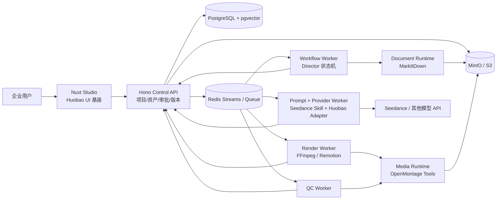

# AI 企业内容生产平台：代码实现与仓库整合详细方案

> 文档目的：在 `AI企业内容生产平台_完整开发方案.md` 的业务目标基础上，给出可落地的代码整合方案。本文按学习型项目处理，重点是最大化复用四个参考仓库的源码、类型、变量语义与工程结构，同时保证各能力通过内部 API/事件契约交互，而不是成为相互穿透的巨型应用。

> **底层复用硬规则**：只移植参考仓库固定 commit 中已经存在的代码、字段、参数、校验和流程；平台只做必要的输入/输出、权限、workspace、对象存储、错误映射、幂等和脱敏薄壳适配。不得在来源能力之上另写平行算法、阈值、协议、自动改写或静默回退。所有修改和删减必须以原仓库具体文件/符号/测试为参照并登记原因；来源没有安全对应实现时保持禁用或 fail-closed。平台自身的领域模型、Control API、队列和审计边界可以保留，但不得改变来源媒体/内容逻辑的含义。

现行音频输入补充（2026-09-01）：当前自动旁白不以用户上传音频或样音为前提；服务端按固定来源选择 native Provider 或显式 TTS，并在人工审批后登记正式资产。通用参考图片、资料、Logo、MUSIC 上传仍是平台资产能力；Huobao `reference_audio` 只在其 provider-specific 适配器语义内保留，不能未经映射成为 Grok 旁白输入。细化的 owner、样音、TimelinePlan 和实际对照顺序以《AI企业内容生产平台_自动生成音频与视频匹配正式使用开发文档.md》为准。

现行真实模式补充（2026-09-01）：用户已授权本机 `VIDEO_PROVIDER=sub2api` 的 Aiself Grok native 音频优先，以及显式 Doubao `seed-tts-2.0`/`zh_female_meilinvyou_uranus_bigtts` 替换对照。真实凭据只由未入库的进程环境读取；仓库/CI 默认 Mock 不变，且不因该授权增加用户上传音频入口或第二 Provider/TTS 协议。

## 1. 结论先行

不要新建一套 FastAPI + Next.js 的空壳后“参考”四个仓库。这样会丢掉已有项目中最有价值的工作台、Provider Adapter、任务处理和媒体工具代码。

推荐将系统实现为一个单仓库、四个可独立部署的运行面：

```text
Nuxt Studio + Hono Control API
        | HTTP / SSE
        v
Workflow Worker + Provider Worker
        | versioned commands / events
        +-------------------+---------------------+
        |                   |                     |
        v                   v                     v
Document Runtime       Media Runtime          Render Worker
(MarkItDown)         (OpenMontage)     (FFmpeg / Remotion)
```

其中，Huobao Drama 是控制面和工作台的代码基座；MarkItDown 是资料解析 Runtime；OpenMontage 是受控的媒体工具 Runtime；Seedance-2.5 是版本化的视频提示词与镜头修复知识包。平台自己的核心是项目、资产、企业知识、审批、长任务和版本这五类领域数据，而不是任何一个上游仓库的目录结构。

关键规则：

1. 前端、控制 API、Python Runtime、Worker 之间不得读取对方数据库表、工作目录或本地绝对路径。
2. 同步操作使用内部 HTTP API；耗时操作使用带版本的命令/事件消息；文件只传 `assetId` 和对象存储引用。
3. 上游项目保留其高价值的类型和变量语义；业务边界处再转换为平台领域对象。
4. 一个镜头的事实、引用职责、生成请求、重试原因、产物和 QC 结果必须可追踪，不能只存在于 Agent 对话文本中。

## 2. 目标边界和第一条生产链

第一版只完成下面这条确定性生产链：

```text
企业资料/素材上传
  -> 文件解析和资产分析
  -> 企业画像确认
  -> 创建企业宣传片项目
  -> 策略、脚本、分镜审批
  -> Seedance 镜头生成
  -> QC、必要的编辑或重生成
  -> 配音、字幕、Logo、FFmpeg 合成
  -> 可回放的成片版本
```

不把“万能 Agent”作为 MVP 目标。所有 Agent 输出都必须写入结构化 Artifact，用户可以在企业画像、脚本、分镜、成片四个节点暂停、修改和继续。

## 3. 四个仓库的精确分工

| 来源 | 当前代码事实 | 直接复用 | 不作为主干的部分 | 融合位置 |
| --- | --- | --- | --- | --- |
| `chatfire-AI/huobao-drama` | Nuxt 3/Vue 工作台、Hono、Drizzle、Mastra、Provider Adapter、`sysTask`、FFmpeg 合成 | `useApi`、`useMedia`、`useAgent`、`MentionTextarea`、`ModelSelect`、路由写法、`ImageProviderAdapter`、`VideoProviderAdapter`、`ProviderRequest`、`generation.ts`、媒体缩略图/海报、`ffmpeg-merge.ts` | 短剧特有的小说改写、`dramas/episodes` 的公开语义、进程内无限轮询、纯本地磁盘作为唯一存储、AI Key 明文配置页面 | `apps/studio-web`、`apps/control-api`、`workers/provider-worker`、`workers/render-worker` |
| `microsoft/markitdown` | Python 3.10+ 文档到 Markdown 库，公开 `MarkItDown`、`convert_local`、`convert_stream`、`StreamInfo`、converter 注册机制 | 按格式 converter、结果标准化、`convert_stream`、需要的 `pdf/docx/pptx/xlsx` optional dependencies | `convert()`/`convert_uri()` 对用户输入 URL 的直接访问、默认启用所有插件、将 Markdown 直接当知识库 | `services/document-runtime` |
| `calesthio/OpenMontage` | Python 工具运行框架，`BaseTool`、`ToolResult`、`ToolRegistry`、工具族、JSON Schema Artifact、YAML Pipeline、媒体分析/拼接/合成工具 | `ToolResult`、`BaseTool`、`ToolRegistry`、`tools/video`、`tools/analysis`、`tools/subtitle`、`schemas/artifacts`、`pipeline_defs/cinematic.yaml` 的阶段思想 | 由 LLM 自由读取本地目录并自主推进的全局编排、以 `projects/` 文件夹为唯一项目事实、Backlot 本地 board、一次性接入所有 Provider、直接读取 `.env` 的配置方式 | `services/media-runtime`，由平台 Worker 显式调用 |
| `allenGKC/Seedance-2.5` | Markdown Skill，重点是模式选择、Reference Ownership、提示词四层结构、长视频、编辑、修复 | `SKILL.md`、`capabilities.md`、`prompting.md`、`references.md`、`long-video.md`、`editing.md`、`troubleshooting.md`、`safety.md`、`validate.py` 的结构校验思路 | 安装脚本、面向个人助手的一问一答 UI 元数据、把即梦 Web 参数直接假设为任意 API 的参数 | `packages/seedance-skill` 与 `workers/prompt-worker` |

### 3.1 必须保留的上游变量和类型

最大化复用不等于保留错误的业务名词。保留的是已经证明有价值的请求形状、Adapter 协议和媒体处理变量；企业平台的公共接口统一使用 `workspaceId`、`projectId`、`shotId`。

| 来源变量/类型 | 平台中的处理方式 |
| --- | --- |
| `ImageProviderAdapter`、`VideoProviderAdapter`、`ProviderRequest`、`ImageGenResponse`、`VideoGenResponse`、`ImagePollResponse`、`VideoPollResponse` | 原样迁到 `packages/provider-adapters`；只增加 `cancel`、`normalizeError`、`capabilities`，不改已有字段含义 |
| `AIConfig` | 保留 `provider`、`baseUrl`、`apiKey`、`model`；运行时只取得解密后的短生命周期配置，永不返回给浏览器 |
| `VideoGenerationRecord` | 原样保留 `prompt`、`referenceMode`、`imageUrl`、`firstFrameUrl`、`lastFrameUrl`、`referenceImageUrls`、`referenceVideoUrls`、`referenceAudioUrls`、`generateAudio`、`duration`、`aspectRatio`、`resolution`；外围增加平台的 `workspaceId`、`projectId`、`shotId`、`attemptId` |
| `imageAdapters`、`videoAdapters`、`getImageAdapter`、`getVideoAdapter` | 保留注册模式，改为由 `ProviderRegistry` 在启动时加载，并以能力矩阵决定路由 |
| `POLL_PROFILES`、`processTask` 的状态推进逻辑 | 保留轮询间隔和 Adapter 调用顺序；从 Hono 主进程抽到可恢复的 `provider-worker`，每次状态变化通过内部 API 落库 |
| `storyboards`、`scenes`、`characters`、`props`、`assets`、`sysTask` | 保留为数据概念和迁移起点；外部产品语义改为 `shots`、`project_scenes`、`brand_subjects`、`brand_props`、`assets`、`task_runs`，用兼容映射完成首轮迁移 |
| `mergeEpisodeVideos` | 逻辑、ffmpeg 参数、文件存在性检查、海报提取直接复用；函数改为 `mergeProjectVideos(projectId, videoVersionId, shotIds)` |
| `MarkItDown`、`convert_stream`、`StreamInfo`、`register_converter` | 原样使用；由解析服务控制输入流、MIME 和扩展名，禁止业务层直接调用 `convert()` |
| `BaseTool`、`ToolResult`、`ToolRegistry` | 在 Media Runtime 内保留；平台仅接收转换后的 `RuntimeExecutionResult`，并保留原始 `ToolResult` 供审计 |
| `brief`、`script`、`scene_plan`、`asset_manifest`、`edit_decisions`、`render_report` Schema | 作为平台 Artifact 的起始 Schema；在 `metadata` 中补充 `workspace_id`、`project_id`、`artifact_id`、`revision`、`contract_version` |

`dramaId` 和 `episodeId` 不应泄露到新的 HTTP API。短剧项目的数据库迁移可在适配层保留临时别名，但领域层只认 `projectId` 和 `videoVersionId`。这是少量必要重命名，避免企业宣传片代码长期被短剧概念绑死。

## 4. 推荐仓库结构

> 正式开发目录以《AI企业内容生产平台_正式开发总控文档.md》第 3.1 节为准。本节仍保留长期架构分层；旧的 `apps/studio-web`、`apps/control-api`、`workers/provider-worker` 命名已被正式总控文档冻结，MVP 早期简称 `apps/web`、`apps/api`、`apps/worker` 不再作为真实路径。

```text
ai-enterprise-content-platform/
├── apps/
│   ├── studio-web/                 # 由 Huobao frontend 演进的 Nuxt 应用
│   └── control-api/                # 由 Huobao backend 演进的 Hono API
├── workers/
│   ├── workflow-worker/            # Director/Script/Storyboard 状态机
│   ├── provider-worker/            # 复用 generation.ts 和 Provider Adapter
│   ├── prompt-worker/              # Seedance Prompt Compiler
│   ├── render-worker/              # FFmpeg/Remotion 合成
│   └── qc-worker/                  # 结构、事实、视觉 QC
├── services/
│   ├── document-runtime/           # Python: MarkItDown FastAPI service
│   └── media-runtime/              # Python: 受控 OpenMontage service
├── packages/
│   ├── contracts/                  # OpenAPI, Zod DTO, JSON Schema, event envelope
│   ├── domain/                     # 纯领域类型、状态机和 ports
│   ├── provider-adapters/          # Huobao adapters 的直接迁移和扩展
│   ├── seedance-skill/             # 上游 Skill 原文 + 平台 manifest
│   ├── artifact-schemas/           # OpenMontage Schema 的平台扩展
│   ├── storage-client/             # S3/MinIO presigned URL、objectKey 规则
│   └── observability/              # correlationId、审计、成本、事件
├── infrastructure/
│   ├── postgres/                   # Drizzle migration 和 pgvector
│   ├── redis/                      # Streams/队列配置
│   ├── minio/
│   └── compose/
├── upstream/
│   ├── huobao-drama/               # 记录上游快照和变更说明
│   ├── markitdown/
│   ├── openmontage/
│   └── seedance-2.5/
├── docs/
│   ├── adr/
│   ├── contracts/
│   └── upstream/
└── pnpm-workspace.yaml
```

建议用 Git subtree 或固定 commit 的 vendored snapshot 管理 `upstream/`，不要手工复制后失去来源。每次同步上游后只允许在对应模块的 `UPSTREAM.md` 记录：上游 commit、迁入文件、补丁原因、回归测试命令。

本次分析的固定上游基线如下，后续更新以实际提交号重新做差异审查：

| 仓库 | 分析基线 commit |
| --- | --- |
| Huobao Drama | `f04d705603bd0257bcec6b8f44fd04ea3ea9b795` |
| MarkItDown | `fd239d5d2be43d9b68329730206b9312c7d5a388` |
| OpenMontage | `4eab34c5cfcccaa4f1970554928feccce73ee930` |
| Seedance-2.5 | `ebc68d3c19a62fba0f9ba9d2805af1f711a82aa7` |

## 5. 模块边界与部署单元

### 5.1 控制面：Studio Web 和 Control API

`apps/studio-web` 直接从 Huobao 的 Nuxt 前端开始，而不是重写 UI：保留 `layouts/studio.vue`、`useApi.ts`、`useMedia.ts`、`useAgent.ts`、`MentionTextarea.vue`、`ModelSelect.vue` 和紧凑工作台 CSS。替换页面实体：

```text
原短剧页面                    企业平台页面
drama list                -> workspace/projects
drama detail              -> project/overview
episode                   -> video version / production run
characters/scenes/props   -> brand subjects / scenes / props
storyboard                -> storyboard + shot detail
settings AI configs       -> provider connection (管理员页面)
```

`apps/control-api` 仍使用 Hono、Zod、Drizzle 和已有路由组织方式。它是唯一可写业务数据库的服务，职责是：认证与工作空间隔离、项目及资产 CRUD、Artifact 版本、审批、任务命令创建、任务状态查询、SSE 事件流、短期对象存储签名 URL。

控制 API 不执行视频生成、文档解析、LLM 编排或 FFmpeg。HTTP 请求只创建命令并返回 `202 Accepted + taskId`，避免把 Huobao 的 `processTask(...).catch(...)` 放在 Web 进程中。

### 5.2 Workflow Worker：平台自己的 Director

不要把 OpenMontage 的自由 Agent 直接作为平台总编排器。企业级流程需要可暂停、可恢复、可审计的状态机。`workflow-worker` 负责下面的显式步骤：

```text
PROFILE_PENDING
  -> PROFILE_GENERATING -> PROFILE_WAITING_APPROVAL
  -> SCRIPT_GENERATING  -> SCRIPT_WAITING_APPROVAL
  -> STORYBOARD_GENERATING -> STORYBOARD_WAITING_APPROVAL
  -> SHOTS_QUEUED -> GENERATING -> QC_RUNNING
  -> ASSEMBLING -> FINAL_WAITING_APPROVAL -> COMPLETED
```

每一个箭头都是一个命令；每一步生成 `artifactId` 和 `revision`；用户编辑或批准后发出下一条命令。Director、Strategy、Script、Storyboard 不是长期驻留的四个“人格进程”，而是四种可替换的 Prompt/Tool Policy，由同一个 Worker 按阶段调用。

### 5.3 Provider Worker：复用 Huobao 的生成代码

将 Huobao 的以下代码原样迁入后改造：

```text
services/adapters/types.ts
services/adapters/registry.ts
services/adapters/*.ts
services/generation.ts
utils/storage.ts
utils/video-poster.ts
utils/task-logger.ts
```

保留 Adapter 接口及 `VideoGenerationRecord` 字段，不让 Agent 直接访问上游 API。`provider-worker` 的职责是：加载 task DTO、规范化引用 URL、调用 Adapter、按 `POLL_PROFILES` 轮询、下载成品、产生 poster/thumbnail、写 `ProviderAttempt` 审计记录，并发送完成或失败事件。

必须替换的实现点：

1. `createTask()` 只由 Control API 在数据库事务中创建，并写入 outbox；Worker 不直接创建业务记录。
2. `processTask()` 改成幂等 Consumer。传入的 `taskId` 已完成时立即退出；重复消息不生成第二次视频。
3. `pollTask()` 每轮都保存 `providerTaskId`、下一次轮询时间、attempt 数和最后错误，进程重启后可续跑。
4. `downloadFile()` 产物写入 MinIO/S3，不写 `data/static`；前端播放通过签名 URL 或受控 CDN URL。
5. 取消和重试属于同一 `taskRun` 的不同 `attempt`，不能覆盖原提示词和原 Provider 响应。

### 5.4 Document Runtime：只做解析，不做知识库

文档服务用 Python/FastAPI 包装 MarkItDown，接口只接受服务端已验证的对象存储下载流：

```text
POST /internal/v1/document-conversions
{ assetId, objectKey, mimeType, filename, options }
  -> 202 { conversionId }

GET /internal/v1/document-conversions/{conversionId}
  -> { status, markdownArtifact, warnings, converter }
```

核心调用固定为 `MarkItDown(...).convert_stream(stream, stream_info=StreamInfo(...))`。这既复用 MarkItDown 的 converter 自动选择和结果标准化，又避免 `convert_uri()` 把用户输入变成服务端网络访问。

解析完成只产出 `DocumentMarkdownArtifact`：原文件 `assetId`、Markdown 对象引用、页/表格提示、解析器版本和告警。分块、Embedding、结构化企业画像由后续知识 Worker 处理，不能塞进解析服务。

### 5.5 Media Runtime：把 OpenMontage 变成受控工具箱

`services/media-runtime` 以 OpenMontage 的目录和 Python 类为基础，但只暴露很小的内部 API：

```text
POST /internal/v1/tool-executions
{
  executionId,
  tool: "video_stitch" | "subtitle_gen" | "visual_qa" | "video_analyzer",
  inputs: { ... },
  artifactRefs: [ ... ],
  correlationId
}
  -> 202 { executionId }

GET /internal/v1/tool-executions/{executionId}
  -> { status, toolResult, producedArtifacts, diagnostics }
```

内部仍可使用 `ToolRegistry` 发现工具、`BaseTool.execute()` 执行工具、`ToolResult` 表示结果、`ToolResult.artifacts` 记录中间文件。服务入口将 `ToolResult` 转换为平台 DTO 后再回调控制面。OpenMontage 的 `project_dir`、`events.jsonl`、Backlot 只能作为 Runtime 临时调试信息，不能成为平台项目数据库的事实来源。

优先迁入以下工具族：

```text
tools/analysis/frame_sampler.py
tools/analysis/scene_detect.py
tools/analysis/video_analyzer.py
tools/analysis/visual_qa.py
tools/video/video_stitch.py
tools/video/video_trimmer.py
tools/video/video_compose.py
tools/subtitle/subtitle_gen.py
lib/scoring.py
lib/shot_prompt_builder.py
schemas/artifacts/*.schema.json
```

暂不启用 OpenMontage 中所有公网素材搜索、未验证视频 Provider、GPU 本地模型和发布工具。它们注册到 `ToolRegistry` 不等于必须被平台路由到。

### 5.6 Seedance Skill：从“个人助手知识”变为“平台能力包”

把 `skill/seedance-25` 完整保留在 `packages/seedance-skill/upstream/`，新增少量平台文件：

```text
packages/seedance-skill/
├── upstream/                         # 原 SKILL.md 和 references 原文
├── skill.manifest.json               # 能力、版本、路由条件
├── reference-role.schema.json
├── prompt-output.schema.json
└── compiler.ts                       # 平台新增，不修改原文规则
```

`compiler.ts` 读取 Skill 内容，结合 `ShotSpec`、`ReferenceBinding`、Provider Capability，输出结构化 `SeedancePromptPackage`。它不是“直接把 SKILL.md 发给模型”这么简单，而是将 Skill 的几个关键原则变成可验证的数据：

```json
{
  "mode": "basic_generation",
  "duration": 8,
  "aspectRatio": "16:9",
  "resolution": "720p",
  "referenceMap": [
    {
      "assetId": "ast_product_001",
      "sourceTag": "@Image1",
      "role": "product_identity",
      "owns": ["identity", "material", "label"],
      "excludes": ["motion", "environment"]
    }
  ],
  "prompt": "...",
  "globalLocks": ["product identity unchanged", "no unapproved claims"],
  "repairPlan": null,
  "skillVersion": "seedance-25@<upstream-commit>"
}
```

Reference Ownership 的硬约束是：同一镜头的 `identity`、`motion`、`camera`、`environment`、`timing`、`voice`、`music`、`style` 每个维度只有一个 owner。编译器在调用 Provider 前校验冲突；冲突时返回可编辑错误，不把互相抢控制权的图片和视频盲目送往模型。

Seedance Skill 中的模式、时长、图片/视频/音频数量等能力不能写死在 UI。`skill.manifest.json` 和 Provider 的 `capabilities` 共同决定表单约束，外部 API 差异由 Provider Adapter 覆盖。

## 6. 领域数据与 Artifact 设计

### 6.1 业务实体

```text
Workspace
  -> BrandProfileRevision
  -> Asset
  -> Document / DocumentConversion / KnowledgeChunk
  -> Project
       -> CreativeBriefRevision
       -> ScriptRevision
       -> StoryboardRevision
            -> Shot
                 -> ReferenceBinding
                 -> GenerationTaskRun
                      -> ProviderAttempt
                      -> Asset(kind=VIDEO, origin=GENERATED)
                 -> QcReport
       -> VideoVersion
            -> RenderJob
            -> FinalQcReport
```

推荐 PostgreSQL + pgvector 为主库，MinIO/S3 仅保存原始文件和派生产物。仍可保留 Huobao 的 Drizzle ORM 和 `schema.ts` 组织方法，但要从 `mysqlTable` 移植到 `pgTable`；表字段的关系、`storyboards/scenes/characters/props/assets/sysTask` 的设计经验可最大化沿用。

### 6.2 最小核心表

| 表 | 核心字段 | 说明 |
| --- | --- | --- |
| `workspaces` | `id`, `name`, `status` | 企业隔离根节点 |
| `workspace_members` | `workspace_id`, `user_id`, `role` | 后续权限的扩展点 |
| `assets` | `id`, `workspace_id`, `object_key`, `mime_type`, `kind`, `origin`, `sha256`, `metadata` | 保留 Huobao `assets` 概念，文件不存 DB；`origin` 区分用户上传、生成和派生 |
| `documents` | `id`, `asset_id`, `status`, `source_type` | 原始资料和解析状态 |
| `document_conversions` | `id`, `document_id`, `markdown_asset_id`, `converter`, `warnings` | MarkItDown 输出可回溯 |
| `knowledge_chunks` | `id`, `workspace_id`, `document_id`, `content`, `embedding`, `citations` | 检索和事实来源 |
| `brand_profile_revisions` | `id`, `workspace_id`, `profile_json`, `source_refs`, `approved_at` | 企业画像必须可版本化 |
| `projects` | `id`, `workspace_id`, `name`, `brief_json`, `status` | 替代 `dramas` |
| `artifacts` | `id`, `project_id`, `type`, `schema_version`, `revision`, `payload`, `status` | script/scene plan/edit decision 的统一版本容器 |
| `shots` | `id`, `project_id`, `storyboard_artifact_id`, `sequence`, `spec_json`, `status` | 替代 storyboard row 的核心职责 |
| `reference_bindings` | `id`, `shot_id`, `asset_id`, `role`, `owns`, `excludes`, `priority` | Seedance Reference Ownership |
| `task_runs` | `id`, `workspace_id`, `project_id`, `kind`, `status`, `input_artifact_id`, `idempotency_key` | 由 `sysTask` 演进 |
| `provider_attempts` | `id`, `task_run_id`, `provider`, `model`, `request_json`, `provider_task_id`, `status`, `cost` | 每次生成、重试和编辑均留存 |
| `video_versions` | `id`, `project_id`, `source_storyboard_revision`, `asset_id`, `status` | 成片不是覆盖式更新 |
| `qc_reports` | `id`, `subject_type`, `subject_id`, `level`, `result_json`, `status` | 镜头、成片均可评估 |
| `outbox_events` | `id`, `event_type`, `payload`, `occurred_at`, `published_at` | 事务写入和可靠发布 |

所有有工作空间归属的表都必须有 `workspace_id` 或可通过 `project_id` 可验证地回溯到 `workspace_id`。SQL 查询封装在 Control API Repository 内，Worker 不得绕过 API 直连这些表。

### 6.3 Artifact 而非对话文本

OpenMontage 已有 `brief.schema.json`、`script.schema.json`、`scene_plan.schema.json`、`asset_manifest.schema.json`、`edit_decisions.schema.json`、`render_report.schema.json`。直接将它们迁入 `packages/artifact-schemas`，为每一份加一个外层 Envelope：

```json
{
  "artifactId": "art_01J...",
  "type": "script",
  "contractVersion": "1.0",
  "workspaceId": "ws_01J...",
  "projectId": "prj_01J...",
  "revision": 3,
  "status": "approved",
  "payload": { "version": "1.0", "title": "...", "sections": [] },
  "sourceRefs": ["knw_...", "ast_..."],
  "createdAt": "2026-08-12T...Z"
}
```

平台只允许下游消费已批准或明确标记为草稿可继续的 Artifact。修改脚本会新建 revision，不能原地覆盖；因此任何成片都能追溯它使用了哪一版企业画像、脚本、分镜、参考资产和 Prompt。

## 7. 内部 API 与异步事件契约

### 7.1 统一 Envelope

所有内部 HTTP 请求和 Redis Streams 消息都带同一组追踪字段。实现时使用平台 JSON 的 snake_case 形式；TypeScript 类型仍使用 camelCase。下方旧版接口示例中的字段名按正式契约序列化，不得直接照搬为另一套协议：

```ts
export interface InternalEnvelope<T> {
  contractVersion: '1.0'
  messageId: string
  correlationId: string
  causationId?: string
  idempotencyKey: string
  occurredAt: string
  producer: string
  workspaceId: string
  projectId?: string
  data: T
}

// Wire format: contract_version, message_id, correlation_id, causation_id,
// idempotency_key, occurred_at, workspace_id, project_id.
```

`correlationId` 贯穿一次“生成宣传片”请求；跨服务 wire format 序列化为 `correlation_id`。`causationId` 序列化为 `causation_id`，`idempotencyKey` 序列化为 `idempotency_key`。日志、Provider 请求、OpenMontage `ToolResult`、费用记录和 SSE 全部使用该 ID。

### 7.2 同步内部 HTTP API

| 调用方 | 被调用方 | 接口 | 用途 |
| --- | --- | --- | --- |
| Control API | Document Runtime | `POST /internal/v1/document-conversions` | 创建解析任务 |
| Workflow Worker | Control API | `GET/POST /internal/v1/artifacts` | 读取输入和写入结构化草稿 |
| Provider Worker | Control API | `GET/PATCH /internal/v1/task-runs/{id}` | 领取任务、持久化轮询状态和产物 |
| Render Worker | Media Runtime | `POST /internal/v1/tool-executions` | 调用 OpenMontage 受控工具 |
| QC Worker | Control API | `POST /internal/v1/qc-reports` | 写质量结果和修复建议 |
| Studio Web | Control API | `/api/v1/*` + `GET /events` | 用户操作和实时状态 |

内部 API 必须与浏览器 API 分开域名/路由和鉴权。浏览器永远不能调用 `/internal/*`，也不能获知 Provider Key、原始任务 URL、私有对象存储 key 或 OpenMontage 工作目录。

### 7.3 异步命令和事件

MVP 使用 Redis Streams 或 BullMQ；消息语义用 CloudEvents 风格的 Envelope，而不是直接把数据库 row JSON 扔进队列。

```text
command.project.generate.requested
command.document.convert.requested
command.prompt.compile.requested
command.generation.execute.requested
command.render.execute.requested
command.qc.execute.requested

event.document.converted
event.profile.generated
event.artifact.approval.changed
event.shot.prompt.compiled
task_run.progressed
task_run.succeeded
task_run.failed
event.render.completed
event.qc.completed
```

每个 Consumer 必须实现：去重、幂等写入、可重试错误分类、死信队列、可观测的 retry count。Provider 返回“审核拒绝/参数非法”是终态，不进行机械重试；网络超时、429、短暂 5xx 才按退避策略重试。

### 7.4 关键 DTO

```ts
export interface ReferenceBindingDto {
  assetId: string
  role:
    | 'product_identity'
    | 'person_identity'
    | 'environment_reference'
    | 'motion_reference'
    | 'camera_reference'
    | 'audio_rhythm_reference'
    | 'brand_identity'
  owns: Array<'identity' | 'motion' | 'camera' | 'environment' | 'timing' | 'voice' | 'music' | 'style'>
  excludes: string[]
  sourceOrder: number
}

export interface GenerateShotCommand {
  taskRunId: string
  shotId: string
  promptPackageArtifactId: string
  provider: string
  model: string
  request: VideoGenerationRecord
  references: ReferenceBindingDto[]
}
```

`GenerateShotCommand.request` 继续使用 Huobao 的 `VideoGenerationRecord`，不要另造一个几乎相同但难以适配的新对象。`references` 是平台额外的可审计层，Adapter 负责把它映射为该 Provider 实际要求的顺序和 URL。

## 8. 端到端执行细节

### 8.1 企业资料上传到企业画像

```text
1. Web 调用 Control API 创建 Asset，获得 presigned upload URL。
2. 浏览器直传 MinIO/S3，Control API 校验哈希、MIME、大小和归属。
3. API 创建 Document + taskRun，outbox 发布 convert command。
4. Document Runtime 下载受限对象流，调用 MarkItDown.convert_stream。
5. Markdown 作为新 Asset 保存，发送 event.document.converted。
6. Knowledge Worker 按标题/段落/表格切块，记录页码/文件引用并写 embedding。
7. Enterprise Analyst 仅从检索片段及引用生成 BrandProfileRevision。
8. 用户确认或修改画像；批准 revision 后才可用于项目生成。
```

企业画像必须区分“原始事实”“推断”“待确认信息”。生成脚本时，只允许事实和用户批准的推断进入营销文案；数值、资质、客户名称等每一条都保留 `sourceRefs`，避免模型编造宣传卖点。

### 8.2 项目需求到分镜

```text
1. 用户创建 Project，填写时长、渠道、受众、目标、风格和 CTA。
2. Workflow Worker 检索已批准 BrandProfileRevision、知识块和候选资产。
3. Strategy Policy 生成 CreativeBriefArtifact，用户可选择方向。
4. Script Policy 生成 ScriptArtifact，台词/旁白与事实引用绑定。
5. Storyboard Policy 生成 ScenePlanArtifact 和 ShotSpec。
6. Asset Policy 为每个 Shot 写 ReferenceBinding，而不是仅给出 asset URL 列表。
7. 用户可替换镜头、修改文案、调整参考职责；批准分镜后才生成镜头。
```

`ShotSpec` 最少包含：`sequence`、`durationSeconds`、`narrativePurpose`、`scene`、`action`、`camera`、`visualStyle`、`voiceover`、`soundPolicy`、`transitionIn`、`transitionOut`、`generationStrategy`、`referenceBindings`、`factRefs`。这与 Huobao 的 storyboard 拆分模式和 OpenMontage 的 `scene_plan` 均兼容。

### 8.3 镜头生成、修复和成片

```text
1. Prompt Worker 读取 ShotSpec 和 ReferenceBinding，调用 SeedancePromptCompiler。
2. 编译器确定 mode，生成 reference map、Prompt、global locks、参数和 repair policy。
3. Provider Worker 取到 GenerateShotCommand，复用 VideoProviderAdapter 发起请求和轮询。
4. 成功结果下载到对象存储，创建 `Asset(kind=VIDEO, origin=GENERATED)` 和 ProviderAttempt；生成 poster/thumbnail。
5. QC Worker 运行结构检查、事实/Logo/字幕检查、视觉检查，写 QcReport。
6. 失败分类为 keep、fix_in_post、edit、reroll、rewrite 五种之一。
7. edit/reroll/rewrite 都创建新的 ProviderAttempt；不得覆盖已接受素材。
8. 所有 Shot 接受后，Render Worker 生成 EditDecisions，调用 mergeProjectVideos 或 Media Runtime。
9. 成片创建 VideoVersion，运行 FinalQcReport，用户批准后标记为 completed。
```

Seedance-2.5 的修复规则应直接进入 Worker 策略：局部问题优先 Edit；来源可接受但随机失败可同 prompt 限次 reroll；同类错误两次后必须 rewrite；字幕、音量、裁切、Logo 等优先在后期修复。

## 9. Provider 和 Skill 路由

### 9.1 Provider Capability Registry

在 Huobao 的 `imageAdapters` 和 `videoAdapters` 上新增 Provider Capability，不把“模型选择”散落到页面和 Agent Prompt 中：

```ts
export interface ProviderCapability {
  provider: string
  model: string
  modalities: Array<'image' | 'video' | 'audio'>
  operations: Array<'generate' | 'extend' | 'edit' | 'first_last_frame'>
  referenceLimits: { images?: number; videos?: number; audio?: number }
  supportedAspectRatios: string[]
  supportedResolutions: string[]
  maxDurationSeconds?: number
  supportsAudioGeneration: boolean
  supportsPolling: boolean
}
```

`ModelRouter` 输入 `ShotSpec + ReferenceBinding + budget + capability registry`，输出一个确定的 `provider/model/operation`。第一版只允许 Seedance 通过；路由仍然存在，是为了第二个 Provider 加入时不重写分镜和 Agent。

### 9.2 Skill Registry

```text
SkillManifest
  id: seedance-25
  version: upstream commit + platform patch version
  appliesTo: provider/model/operation
  inputSchema: ShotSpec + ReferenceBinding
  outputSchema: PromptPackage
  references: Markdown knowledge files
  validation: reference owner + capability + prompt output checks
```

Skill 只是“如何使用一个模型”的知识与编译规则，绝不负责 HTTP 调用、任务状态或数据库写入。Provider Adapter 只负责“如何调用一个模型”。这两个边界必须保持分离，避免以后 Kling 或 Veo Skill 复制一套生成 Worker。

## 10. 前端工作台实现路线

保留 Huobao 的紧凑制作台交互，不照搬短剧产品的信息架构。首屏直接是可工作的项目工作台：

```text
左栏：企业资料 | 素材 | 项目 | 成片版本
中栏：当前阶段的 Profile / Script / Storyboard / Generation / Review
右栏：项目状态、成本、任务事件、审批动作
底部：选中镜头的参考资产、Prompt、生成尝试和 QC 结论
```

复用策略：

1. `MentionTextarea.vue` 保留 `@` 提及交互，数据源从角色/场景/道具改为 Asset 和 ReferenceBinding。
2. `ModelSelect.vue` 保留选择器外观，选项来自 `/api/v1/capabilities`，而不是硬编码供应商。
3. `useApi.ts` 继续统一错误、鉴权和请求行为；新增 `useTaskEvents.ts` 消费 SSE，不做前端轮询风暴。
4. `useMedia.ts` 保留图片/视频预览、缩略图和海报逻辑；所有 URL 改为 API 签发的短期访问 URL。
5. 原 `episode.vue` 的分镜卡片、任务抽屉和合成操作演进为 `projects/[id]/storyboard.vue`、`generation.vue`、`versions.vue`。

每个表单都只编辑领域数据或 Artifact revision；点击“生成”创建 task command，不直接调用视频 Provider。

## 11. 必须新增的开发工作

四个仓库叠加后仍缺少企业平台最关键的一层。下面是不能靠拼接代码解决、必须新增的模块。

| 新模块 | 必要性 | 最小实现 |
| --- | --- | --- |
| 工作空间与访问控制 | Huobao 单产品数据模型无法隔离多个企业 | `workspaceId` 全链路过滤、成员角色、服务间 token |
| 对象存储抽象 | 原项目依赖 `data/static`，Python/Node 容器不能共享本地路径 | MinIO/S3、object key、签名 URL、哈希去重、生命周期 |
| 事务 outbox 和可恢复 Worker | 原 `processTask` 属于进程内后台任务 | DB 事务 + outbox publisher + Redis Streams/BullMQ + 幂等 Consumer |
| Artifact/审批版本系统 | Agent 输出和用户改动需要可追踪 | JSON Schema 校验、revision、approved/draft、来源引用 |
| 企业知识层 | MarkItDown 只负责转换，Huobao 只解析短剧元素 | 文档切块、Embedding、检索、事实置信度、BrandProfileRevision |
| Reference Ownership | 上游 Skill 有规则，平台缺少可落库模型 | `reference_bindings`、owner 校验、Prompt compiler |
| Prompt Compiler | Skill Markdown 不能直接成为稳定 API | Skill manifest、结构化 PromptPackage、capability 校验 |
| QC 与 Repair Orchestrator | 生成成功不等于交付可用 | 三级 QC、失败分类、edit/reroll/rewrite 命令 |
| 成本和审计 | 多次生成必须可复盘 | request/response 摘要、token/时长/费用、correlationId |
| 配置与密钥边界 | 不能让前端或 OpenMontage `.env` 成为真相 | provider connection、加密存储、Worker 解密、日志脱敏 |

## 12. 测试和验收策略

### 12.1 合同测试

`packages/contracts` 是所有模块的唯一数据语言。对每个 DTO 和事件建立 JSON Schema/Zod 双向验证；服务端把接口生成 OpenAPI。至少覆盖：

```text
DocumentConversionRequested -> document.converted
ShotPromptCompileRequested -> shot.prompt.compiled
GenerateShotCommand -> task_run.succeeded / task_run.failed
RenderRequested -> render.completed
QcRequested -> qc.completed
```

### 12.2 上游回归测试

| 来源 | 必跑检查 |
| --- | --- |
| Huobao Drama | `backend` TypeScript typecheck、`frontend` build、Provider Adapter mock tests、FFmpeg merge fixture |
| MarkItDown | PDF/DOCX/PPTX/XLSX fixture 转换，`convert_stream` 不允许网络请求测试 |
| OpenMontage | 迁入工具的 `ToolResult` contract、ffprobe、frame sampler、video stitch fixture |
| Seedance-2.5 | 保留并运行 `scripts/validate.py`；ReferenceBinding 冲突、PromptPackage schema、修复策略测试 |

### 12.3 端到端验收夹具

准备一个脱敏企业夹具：10 份文档、20 张图、2 段视频、Logo、品牌色、3 个明确产品卖点。E2E 应验证：

1. 资料被解析为 Markdown，且每个企业画像字段能追溯文件来源。
2. 一份 60 秒脚本、一个分镜 Artifact 和至少 8 个 Shot 可被批准。
3. 每个镜头都有非冲突的 ReferenceBinding。
4. 生成中断后重启 Worker 能继续轮询，不产生重复 Provider 请求。
5. 成片可播放、时长合理、有 Logo/字幕/BGM，且原始镜头与最终版本均可回溯。
6. 用户修改第 3 个镜头后，只重生成受影响镜头并形成新 VideoVersion。

## 13. 实施阶段

### 阶段 0：代码落位和契约先行

1. 建立 pnpm workspace、Python `uv` workspace、Docker Compose。
2. 以固定 commit 导入四个 `upstream/` 快照，建立每个模块的 `UPSTREAM.md`。
3. 创建 `packages/contracts`、`packages/domain`、`packages/storage-client`。
4. 定义 Artifact Envelope、InternalEnvelope、task 状态和事件名；先写合同测试。

完成标准：空服务可以用同一 `correlationId` 创建、推进和查询假的 `taskRun`。

### 阶段 1：先让 Huobao 主骨架成为企业工作台

1. 从 Huobao 前后端直接迁入工作台、Hono 路由和 Drizzle schema 结构。
2. 将公开 `dramas/episodes` API 替换为 `workspaces/projects/video-versions`。
3. 保留 `storyboards/scenes/characters/props/assets/sysTask` 的内部迁移映射。
4. 接入 Postgres、Redis、MinIO；完成资产上传、缩略图、海报和项目列表。

完成标准：用户可以在一个 workspace 中创建项目、上传图/视频/文档、查看媒体，不涉及 AI。

### 阶段 2：接入 MarkItDown 和企业画像

1. 实现 Document Runtime，固定使用 `convert_stream`。
2. 完成 `documents/document_conversions/knowledge_chunks`、引用定位和检索。
3. 实现企业画像 Artifact 与人工审批。

完成标准：PDF、PPTX、DOCX、XLSX 能进入企业画像，画像字段可点击回到来源资料。

### 阶段 3：结构化创作链

1. 实现 Workflow Worker 的状态机和 Artifact revision。
2. 从 OpenMontage 的 `brief/script/scene_plan` Schema 建立企业宣传片策略、脚本、分镜模板。
3. 将 Huobao 的抽取/分镜页面和 Agent 交互迁到 Project Studio。

完成标准：用户能确认企业宣传片脚本与分镜，分镜包含事实引用和候选参考资产。

### 阶段 4：Seedance Prompt Package 和单 Provider

1. 原样迁入 Seedance Skill 文档，建立 manifest 和 compiler。
2. 落库 ReferenceBinding，校验 owner 冲突。
3. 迁入 Huobao `VideoProviderAdapter`、`generation.ts`，改为队列 Worker 和对象存储。
4. 先完成一种已验证的 Seedance API Adapter。

完成标准：单 Shot 从已批准分镜生成视频，页面可查看 prompt、引用映射、任务进度和尝试记录。

### 阶段 5：OpenMontage 媒体 Runtime、合成和 QC

1. 迁入 OpenMontage 的 video stitch、analysis、visual QA、subtitle 工具和 Artifact Schema。
2. 迁入 Huobao `ffmpeg-merge.ts`，改造为 `mergeProjectVideos`。
3. 实现结构 QC、事实 QC、视觉 QC 和修复分类。

完成标准：8-12 个镜头能合成为版本化 MP4，失败镜头不会阻塞其他可接受镜头。

### 阶段 6：第二 Provider 和真正的自动路由

只在 Seedance 单 Provider 的成本、重试、Reference Ownership 和 QC 数据稳定后，引入第二 Provider。新增 Provider 只能实现 Adapter + Capability + Skill，不能修改 Script、Storyboard 或前端领域模型。

## 14. 关键反模式

1. 不要把四套数据库 schema 拼在一个数据库里，再让每个进程随意查表。
2. 不要让前端根据 Provider 名称拼 API 请求，所有外部模型调用只能经过 Adapter。
3. 不要把全部资产直接塞进 Prompt。每个 Reference 必须有职责和排除项。
4. 不要把 Agent 对话当成项目记录。所有可继续执行的结果必须是已校验 Artifact。
5. 不要复用 Huobao 的进程内轮询来跑生产任务。容器重启会丢任务且重复计费。
6. 不要让 OpenMontage 的本地 `projects/` 或 Backlot `events.jsonl` 成为跨服务数据接口。
7. 不要在第一版接入 OpenMontage 注册表里的所有工具和 Provider。注册能力与产品承诺是两件事。
8. 不要在页面中硬编码 Seedance 时长、参考数量或 API 字段。能力来自 Skill manifest 和 Provider capability。

## 15. 最终架构图



这套实现不是把四个开源仓库并列部署，而是让它们分别贡献最擅长的层：Huobao 提供产品化控制面和 Provider 调用骨架，MarkItDown 提供资料入口，Seedance-2.5 提供专业镜头提示词策略，OpenMontage 提供受控媒体工具与 Artifact 规范。平台新增的内部契约、状态机、资产引用、知识、审批和审计层，将四者真正融合为可持续演进的企业内容生产系统。
