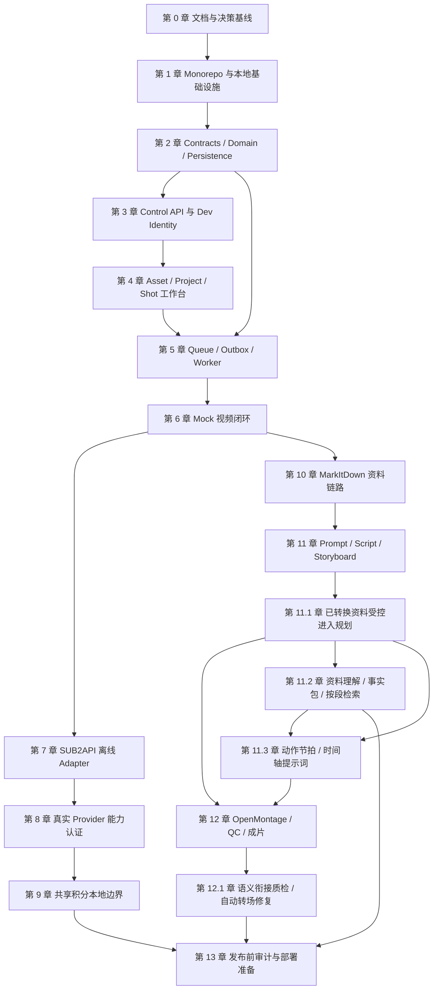

# AI 企业内容生产平台：正式开发总控文档

## 0. 文档状态

| 项目 | 内容 |
| --- | --- |
| 文档性质 | 开发基线、阶段门禁和审计总控文档 |
| 当前版本 | `0.4.0-real-local-r01-auto-audio` |
| 当前阶段 | C11.2 保持本地范围 `ACCEPTED`；C12.4/C12.5 总体仍为 `IMPLEMENTED_PENDING_AUDIT`；既有 E01–E11/E08 窄切片按历史审计状态保留；E12/R01 当前仍为 `BLOCKED`。本机实际操作模式已获用户授权并切换为 Aiself Grok 原生音频优先、明确选择时使用 Doubao；这不等于章节验收。source registry/rank、profile capability 认证、自动生成样音→审批→正式 NarrationAsset/TimelinePlan、approved section windows、完整 AudioPlan、Studio/字幕/长旁白和人工中文口音等硬门仍 `DEFERRED/BLOCKED`。付费 Kling/本地 Wav2Lip 口型同步按用户决定延期，不作为当前范围阻断。 |
| 当前允许范围 | 按最新《自动生成音频与视频匹配正式使用开发文档》执行：自动视频不要求用户上传旁白/样音；本机真实模式使用 `VIDEO_PROVIDER=sub2api` 的 Aiself Grok，优先保留 native 音频，操作者明确选择替换时使用 Doubao `seed-tts-2.0`/`zh_female_meilinvyou_uranus_bigtts`；继续做固定来源薄适配、定向测试和茅山历史项目同脚本对照。Doubao 不自动选择、不静默 fallback、不新增协议/算法/阈值 |
| 当前禁止范围 | E12/R01 完整 Exit Gate 为 `BLOCKED`，不得进入 R02；不得开启 Veyra、共享积分、VPS、SSH、DNS、TLS、生产部署、Git 写入或把 canary/ASR 结果冒充中文口音验收；不得擅自改写公共契约或旧 prompt owner 语义 |
| 当前执行方案 | `AI企业内容生产平台_自动生成音频与视频匹配正式使用开发文档.md`（覆盖语音专项旧口径）与 `AI企业内容生产平台_多源仓库逐项迁移矩阵与冲突审计开发方案.md`；以固定来源文件/符号为主键，先做多源冲突对账，再按授权切片薄适配和验收 |
| 语音路线专项参考 | `AI企业内容生产平台_原仓库语音路线与旁白质量迁移修复开发文档.md`；仅用于 native Provider/TTS owner、来源 selector、样音 gate、时长/混音/QC 的冲突裁定，不自动授权代码、状态或外部调用 |
| 唯一长期架构参考 | `AI企业内容生产平台_代码实现与仓库整合详细方案.md` |
| 当前阶段唯一执行参考 | `AI企业内容生产平台_本地MVP执行规格.md` |
| 契约唯一参考 | `AI企业内容生产平台_领域模型与API事件契约.md` |
| 审计记录 | `AI企业内容生产平台_章节审计记录.md` |

本文件把“系统要做什么”转化为“先做什么、做到什么算完成、凭什么允许进入下一章”。每次开发只能处于一个 `IN_PROGRESS` 章节；前一章节没有达到 Exit Gate，不得把后一章节标记为完成。

语音路线对账补充（2026-09-01）：凡旧 C12.4/C12.5 文档中把 Piper/`PLATFORM_NARRATION` 写成所有新任务的默认 spoken owner、或无条件静音 Provider dialogue 的内容，均由《AI企业内容生产平台_自动生成音频与视频匹配正式使用开发文档.md》覆盖；该覆盖只改变专项语义，不改变本文件状态账本、章节顺序、公共契约或本地 MVP 默认值。实际 owner 必须有固定来源和已认证 profile；证据不足继续 `BLOCKED`。用户上传旁白/样音不是当前自动生成流程前提，通用图片、资料、Logo、MUSIC 上传仍按既有契约保留。

现有 `DeliveryPlan.voice_mode: "PLATFORM_GENERIC"` 只作为历史兼容字段保留，不能当作平台旁白 owner、默认 Piper 或上传音频前置条件。owner 以已认证 Provider profile snapshot 为准：`NATIVE_PROVIDER` 保留 Grok 原生音轨，操作者明确选择时才使用 `DOUBAO_TTS`；缺少 profile/能力事实继续 `UNAVAILABLE`/`BLOCKED`。该对账不新增字段、协议、路由或状态。

### 0.0.1 本轮用户授权覆盖（2026-09-01）

用户明确要求“视频 Provider 原生音频优先，原生不可接受时显式切 Doubao TTS”，并授权本机实际使用已配置的 Aiself Grok 与 Doubao profile，不设置平台自造的用量/金额硬上限。自动旁白不要求用户上传音频或样音；样音和正式旁白由服务端生成，样音仍需人工试听/审批。该授权允许在茅山历史项目中按同一画面/脚本重复执行受控 native/Doubao 对照，但不改变仓库/CI 默认 `VIDEO_PROVIDER=mock`、不启用自动 fallback、不改变章节状态，也不授权 Veyra/共享积分/VPS/Git。原仓库 `GrokVideo.supports["native_audio"]` 与 `DoubaoTTS` 的请求/轮询/下载顺序仍是唯一来源；若要把结果写入正式 NarrationAsset/TimelinePlan，仍需独立资产事实与人工听感/审批。

## 0.1 当前唯一状态账本（2026-09-01 01:02）

以下表格是本轮实施和审计判断的唯一现行状态来源；本文后续较早章节段落中的状态、测试数量和“已完成”措辞均为历史快照，不能覆盖本账本，也不能作为重新开启章节或外部调用的授权。

| 章节/范围 | 当前状态 | 本轮含义 |
| --- | --- | --- |
| C11.2 | `ACCEPTED` | 仅表示已审计的本地资料理解/事实包范围；不开放真实外部系统 |
| C12.4/C12.5 | `IMPLEMENTED_PENDING_AUDIT` | S01/E02、E03/HB-STORYBOARD-TIMING 8–15 秒、E04/OpenMontage Piper、E05/OpenMontage `_full_mix` + ALCHMED8、E06 approved full narration 窗口与 cue-only 边界、E07 transition/xfade 与有效时长、E09 source-expressed checked transcript/subtitle/FFmpeg fallback、E10 approval/formal asset/TimelinePlan identity-window、E11/S08 measured-duration feedback、E08 segmented/HyperFrames timed-audio 均为来源可表达窄切片 `ACCEPTED`；E12/R01 的 native/Doubao canary 仅是已授权产物/连通性证据，仍不足以关闭 source registry/rank、profile certification、自动生成样音审批、正式旁白/TimelinePlan、section windows、中文口音和 Studio 硬门。用户上传旁白/样音不属于当前自动流程前提；完整 AudioPlan、混合转场、continuous narration 非 cut、REQUIRED 字幕、完整 E11 自动重规划及其它未映射能力继续 fail-closed；总体不得扩展第二套协议或平行逻辑 |
| E08 / OM-SEGMENTED-MUSIC + OM-HYPERFRAMES-AUDIO | `ACCEPTED`（窄切片） | 固定 OpenMontage segmented `[start,end]` 音乐窗口/fade 与 HyperFrames 独立音频 `data-start/data-duration` 已完成最小适配、fixture/受控媒体证据、纠察复核和独立验收；完整 renderer/其它硬门不随之关闭 |
| E12 / OM-TTS-PROFILES external certification | `BLOCKED`（native/Doubao canary 仅产物/连通性证据） | `seed-tts-2.0` / `zh_female_meilinvyou_uranus_bigtts` 的已授权真实 MP3 smoke 与 Grok native MP4 音轨证据不等于人工中文口音、正式 NarrationAsset/TimelinePlan 或完整 section-window 验收；仅按最新开发文档在茅山对照中复核，不自动升级 |
| R01 / 原仓库语音 owner 边界迁移 | `BLOCKED`（显式 Doubao 窄切片仅历史实现证据） | selector auto/unknown 的 fail-closed 与显式入口保留；native_audio owner、来源 registry/rank 正向映射、正式旁白时间线和旧 prompt owner 冲突仍未闭合，不进入 R02 |
| C11.3/C12.2/C12.3/C12.6/C12.7B | `NOT_ACTIVE_IN_THIS_SCOPE` | 既有文字保留为历史记录；本轮不得继续实施或将历史状态解释为当前授权 |
| 真实视频 Provider | `AUTHORIZED_LOCAL_OPERATIONAL` | 用户已授权本机 Aiself Grok/Sub2API 实际使用和茅山对照；产物仍需技术与人工复核，不据此宣称中文口音或完整旁白验收；默认 CI/Mock 不变 |
| Doubao TTS | `AUTHORIZED_LOCAL_OPERATIONAL` | 用户已授权本机显式 Doubao 实际使用/对照；profile 为 `seed-tts-2.0` + `zh_female_meilinvyou_uranus_bigtts`，只在操作者选择时调用，密钥仅来自未入库环境，不自动 fallback、不写入默认配置 |
| Veyra/共享积分/VPS/DNS/TLS/部署/Git | `DISABLED` | 本轮不启用、不扣费、不部署、不提交 |

E02/S01 最新 focused 验证账本（基础 `last_verified_at=2026-08-31T01:52:23+08:00`）：合并 Control API 命令 `23/23`（Pixabay client `6/6` + Control API `17/17`）；独立窄切片为 Control API Pixabay client `6/6`、OpenMontage Runtime source adapter `4/4`、Runtime handler `3/3`、Control API 角色/导入/幂等 `5/5`、capability BLOCKED `1/1`、loopback `1/1`、Studio explicit Pixabay/no-automatic-catalog `1/1`，均为 fixture/mock、0 skip；另有 `last_verified_at=2026-08-31T08:25:25+08:00` 的 Runtime finite supplemental fixture `1/1`，拒绝 `NaN`、`Infinity`、`-Infinity` duration。窄切片与合并命令覆盖重叠，不另行相加。该证据已通过独立审计，S01/E02 当前为 `ACCEPTED`（仅切片），C12.4/C12.5 仍 `IMPLEMENTED_PENDING_AUDIT`；E03/HB-STORYBOARD-TIMING 的 8–15 秒窄切片已完成 READY→ACCEPTED 独立审计流程，E04/Piper pace、E05、E06、E07、E08 和 E09 均已完成相应窄切片独立审计并 `ACCEPTED`。E12/R01 现有 native 与显式 Doubao canary 均仅为用户授权的产物/连通性证据；不替代正式资产、TimelinePlan、中文口音或人工质量验收，E12/R01 及 C12.4/C12.5 总体继续阻断/待审计。当前自动旁白不要求用户上传样音，样音由服务端生成并经人工审批。

## 1. 使用方式和优先级

每个章节都使用相同的开发记录结构：

1. 目标与非目标。
2. 前置条件。
3. 涉及模块和文件。
4. API、事件和数据变更。
5. 实现步骤。
6. 测试要求。
7. 验收标准。
8. 审计证据。
9. Exit Gate。

文档优先级：

1. 用户最新明确要求。
2. 根目录 `AGENTS.md`。
3. 本文件的阶段顺序和门禁。
4. `AI企业内容生产平台_领域模型与API事件契约.md` 的公共契约。
5. 当前章节引用的专项文档。
6. 长期方案和源仓库原始实现。

发生冲突时，先在“开发决策记录”中写明选择和原因，再修改受影响文档；不能只改代码绕过冲突。

C12.4/C12.5 的任何增量必须先通过《AI企业内容生产平台_多源仓库逐项迁移矩阵与冲突审计开发方案.md》的来源、冲突和范围检查。此前《AI企业内容生产平台_C12.4-C12.5最小化源仓库适配修改方案.md》已冻结为历史基线，只保留既有证据，不再作为当前能力清单或新增实现授权。新方案不能覆盖 `AGENTS.md`、领域/API 契约或本地 MVP 的更高优先级规则；不在方案中的扩展不得以“兼容”或“优化”名义进入当前切片。

## 2. 总体目标和范围

平台长期目标是让企业用户通过网页完成：企业资料导入、品牌上下文整理、脚本与分镜创作、参考资产绑定、AI 视频镜头生成、媒体处理、质量检查、审阅、版本化导出和用量审计。

所有视频创作能力统一遵循 `AI企业内容生产平台_通用叙事点与生成片段编排规范.md`：

```text
用户故事/素材
  -> NarrativeBeat（叙事点）
  -> MotionBeat（动作节拍与时间轴）
  -> GenerationSegment（实际生成片段）
  -> Video TaskRun
  -> Media Runtime 合成/QC
  -> VideoVersion（最终成片）
```

叙事点数量不等于真实 Provider 调用数量。一个生成片段才允许创建一个视频 TaskRun；多个叙事点可以在满足 Provider 时长、预算和连续性约束的前提下合并进一个生成片段。任何新题材、新 Provider、新前端入口或新媒体能力都必须沿用这条主链路，不能恢复“一个逻辑镜头一次真实调用”、字符切片或浏览器循环提交的旧模式。该规则由 ADR-0041 固化。

第一条可验证链路不是完整 Agent，而是：

```text
Dev Identity
  -> Workspace / Project
  -> Asset upload to MinIO
  -> Shot
  -> TaskRun
  -> BullMQ Worker
  -> MockVideoProvider
  -> validated MP4 Asset
  -> SSE + browser playback
```

长期能力分阶段加入：

| 阶段 | 能力 | 是否当前开工范围 |
| --- | --- | --- |
| A | 本地基础设施、契约、工作区、项目、资产 | 是 |
| B | TaskRun、Worker、Mock 视频闭环 | 是 |
| C | SUB2API 视频 adapter 离线契约 | A/B 通过后 |
| D | 真实 Grok/Seedance 能力认证 | 用户明确提供 Key 后 |
| E | 共享积分的本地端口、精度、幂等与离线契约 | Provider 认证后 |
| F | MarkItDown 企业资料 Runtime | MVP 稳定后 |
| G | Seedance Prompt Package、脚本、分镜 | 资料链路稳定后 |
| H | OpenMontage 媒体 Runtime、QC、成片 | 单镜头稳定后 |
| I | VPS、域名、真实 Veyra 联动、生产部署、Codex 入口 | 所有本地章节验收后 |

## 3. 统一工程基线

### 3.1 规范目录

编码时采用以下目录名；旧文档中的 `apps/web`、`apps/api`、`apps/worker` 视为早期简称，正式实现统一使用下面的名称。

```text
apps/
  studio-web/                 Nuxt 3 前端
  control-api/                Hono Control API，唯一业务数据库写入口
workers/
  workflow-worker/            后续 Director/Script/Storyboard 状态机
  provider-worker/            视频 Provider 提交、轮询、下载和恢复
  prompt-worker/              后续 Prompt Compiler
  render-worker/              后续媒体渲染
  qc-worker/                  后续质量检查
services/
  document-runtime/           后续 Python + MarkItDown
  media-runtime/              后续 Python + OpenMontage 工具箱
packages/
  contracts/                  Zod、OpenAPI、JSON Schema、事件
  domain/                     纯领域模型、状态机、Ports
  persistence/                Drizzle、迁移、Repository
  provider-adapters/          Huobao/SUB2API 等 Provider adapter
  seedance-skill/             Seedance Skill 原文、manifest、compiler
  artifact-schemas/           OpenMontage Artifact 的平台 schema
  storage-client/             S3/MinIO、object key、签名 URL
  credit-veyra/               Veyra CreditPort，后续启用
  observability/              trace、日志、outbox、审计
  test-fixtures/              Mock、契约和媒体 fixtures
upstream/                     固定 commit 的源仓库快照或 subtree
infrastructure/
  compose/                    本地 Compose
  postgres/
  redis/
  minio/
contracts/                    导出的 OpenAPI、AsyncAPI、JSON Schema
tests/
  unit/
  contract/
  integration/
  e2e/
doc/                          开发基线、专项规范和审计记录
```

### 3.2 命名层次

为兼顾 Huobao/Sub2API 的变量复用和平台自己的模块边界，采用四层命名规则：

| 层 | 规则 | 示例 |
| --- | --- | --- |
| TypeScript 变量/类型 | `camelCase` / `PascalCase` | `taskRunId`, `VideoGenerationRecord` |
| 平台 HTTP/Event JSON | `snake_case` | `task_run_id`, `provider_request_id` |
| PostgreSQL 列名 | `snake_case` | `workspace_id`, `created_at` |
| 外部 Provider payload | 保留上游原名 | `model`, `prompt`, `request_id`, `user_id` |

平台边界必须有显式 serializer/mapper，不能依靠散落在路由中的隐式重命名。Huobao 的 `VideoGenerationRecord` 保留为内部 Provider-compatible 类型，Control API 的公开 DTO 仍遵守平台 JSON 契约。

### 3.3 唯一控制面和通信方式

- Web 和未来 Codex CLI 只能调用 `/api/v1/*`。
- 服务间只能使用受保护的 `/internal/v1/*`、队列命令和 outbox 事件。
- Web 不得直连数据库、Redis、MinIO 管理 API、Provider 或 Veyra。
- Provider adapter 只实现 `VideoProviderPort`，不导入业务数据库和页面代码。
- Credit adapter 只实现 `CreditPort`，不接触 prompt、对象 URL 和视频 API Key。
- 模块不得通过另一个模块的数据库表、Redis key、文件目录或进程内变量通信。
- Control API 在事务内写业务数据和 outbox；Worker 通过持久化命令推进任务。

### 3.4 本地硬性默认值

```dotenv
LOCAL_AUTH_MODE=dev
VIDEO_PROVIDER=mock
VEYRA_AUTH_ENABLED=false
```

本地 MVP 无真实视频 API Key、Veyra Token、域名或 VPS 依赖。真实开关缺失或不完整时，系统应失败关闭，不能隐式回退到外部服务。

## 4. 章节总览和依赖图



章节状态只允许：`PENDING`、`IN_PROGRESS`、`BLOCKED`、`READY_FOR_AUDIT`、`ACCEPTED`。状态变更写入 `AI企业内容生产平台_章节审计记录.md`。

## 5. 第 0 章：文档、决策和来源基线

### 5.1 目标与非目标

目标是让开发者无需再次猜测范围、目录、命名、来源、测试和密钥边界。非目标是写更多宏观愿景或提前部署。

### 5.2 前置条件

- 已阅读 `AGENTS.md` 和 `doc/` 下相关文档。
- 当前工作区中的文档已纳入本项目 `doc/`。
- 确认当前为学习/本地开发用途，不因许可证审查阻塞编码。

### 5.3 需要创建或确认的文件

- `AGENTS.md`
- `doc/AI企业内容生产平台_正式开发总控文档.md`
- `doc/AI企业内容生产平台_开发决策记录.md`
- `doc/AI企业内容生产平台_安全与密钥规则.md`
- `doc/AI企业内容生产平台_测试与验收策略.md`
- `doc/AI企业内容生产平台_第三方来源与复用登记.md`
- `doc/AI企业内容生产平台_章节审计记录.md`
- `.gitignore`、`.env.example`、`README.md`

### 5.4 实现步骤

1. 固定本总控文档为开发基线。
2. 确认目录、命名、事件和状态机约定。
3. 登记源仓库 commit、迁入文件、复用点和改动点。
4. 写下当前不做事项和真实调用门禁。

### 5.5 测试和验收

- 文档链接和引用文件全部存在。
- 目录名、事件名、状态名在文档中无未解释冲突。
- `AGENTS.md` 与本总控文档的硬规则一致。

### 5.6 审计证据和 Exit Gate

证据：决策记录、来源登记、文档检查输出、审计记录初始条目。全部存在后将第 0 章置为 `ACCEPTED`，才可创建源码目录。

## 6. 第 1 章：Monorepo 与本地基础设施

### 6.1 目标与非目标

目标是建立可重复启动的 pnpm monorepo 和 PostgreSQL、Redis、MinIO 本地依赖。非目标是接 Provider、Veyra、Python Runtime 或部署 VPS。

### 6.2 前置条件

- 第 0 章 `ACCEPTED`。
- Node.js、pnpm、Docker Desktop 可用。

### 6.3 涉及模块和文件

```text
package.json
pnpm-workspace.yaml
tsconfig.base.json
apps/studio-web/
apps/control-api/
packages/contracts/
packages/domain/
packages/persistence/
packages/storage-client/
infrastructure/compose/docker-compose.local.yml
.env.example
```

### 6.4 实现步骤

1. 创建 workspace 和最小 package。
2. 启动 PostgreSQL 16、Redis 7、MinIO。
3. 固定本地宿主端口：PostgreSQL `15432`、Redis `6380`、MinIO API `9002`、Console `9003`。Docker 容器内端口仍为 PostgreSQL `5432`、Redis `6379`、MinIO API `9000`、Console `9001`；依据 ADR-0012，API `3032` 与 Web `3031` 不变。
4. 创建健康检查和根 README 的启动命令。
5. 把本地凭据写入 `.env.example`，不写真实凭据。

### 6.5 测试和验收

- `pnpm install --frozen-lockfile` 成功。
- `docker compose -f infrastructure/compose/docker-compose.local.yml config` 成功。
- PostgreSQL、Redis、MinIO healthcheck 均通过。
- API/Web package 可以被 workspace 识别，但可以暂时只提供 health endpoint。

### 6.6 审计证据和 Exit Gate

证据：Compose 文件、锁文件、启动日志、`README.md`、健康检查输出。所有本地服务可重复启动/停止后，第 1 章进入 `ACCEPTED`。

## 7. 第 2 章：Contracts、Domain 和 Persistence

### 7.1 目标与非目标

目标是把领域对象、状态机、HTTP DTO、事件、错误码和数据库迁移落成代码。非目标是编写页面和真实 Provider。

### 7.2 前置条件

- 第 1 章 `ACCEPTED`。
- 以 `AI企业内容生产平台_领域模型与API事件契约.md` 为唯一契约来源。

### 7.3 必须落地的模型

`users`、`workspaces`、`workspace_members`、`projects`、`assets`、`shots`、`reference_bindings`、`task_runs`、`provider_attempts`、`usage_records`、`outbox_events`、`command_deduplications`。

### 7.4 实现步骤

1. 在 `packages/contracts` 创建 Zod schema、错误码和事件类型。
2. 在 `packages/domain` 实现状态转换和不变量。
3. 在 `packages/persistence` 创建 Drizzle schema 和按章节迁移。
4. 为所有 workspace 资源加授权查询条件。
5. 创建 OpenAPI、AsyncAPI、JSON Schema 导出命令。
6. 写纯领域和契约测试。

### 7.5 测试和验收

- 所有状态迁移和非法迁移有测试。
- 同一个幂等键同请求可回放，不同请求体返回冲突。
- 金额使用十进制字符串/`numeric(18,8)`。
- 数据库迁移可从空库执行，表和索引符合契约。
- 导出的契约与 Zod schema 无漂移。

### 7.6 审计证据和 Exit Gate

证据：schema 文件、迁移 SQL、契约导出物、单测报告、数据库结构快照。没有未决字段和状态冲突时，第 2 章 `ACCEPTED`。

## 8. 第 3 章：Control API 与 Dev Identity

### 8.1 目标与非目标

目标是提供唯一控制面、开发身份和工作区权限。非目标是 SSO、登录票据和 Veyra。

### 8.2 API 范围

```text
GET  /api/v1/health
GET  /api/v1/me
GET  /api/v1/workspaces
GET  /api/v1/projects
POST /api/v1/projects
GET  /api/v1/projects/:projectId
PATCH /api/v1/projects/:projectId
```

### 8.3 实现步骤

1. 实现 Hono app、统一 response/error middleware 和 `request_id`。
2. 实现 `DevIdentityAdapter`，固定 `usr_dev_owner` / `ws_dev_default`。
3. 实现 workspace member authorization。
4. 实现项目 CRUD、输入校验和命令幂等。
5. 给 Web 提供最小 API client。

### 8.4 测试和验收

- 未授权 workspace 资源返回 `WORKSPACE_FORBIDDEN`。
- 项目创建重复提交不会产生重复项目。
- 健康检查可区分 API 进程与依赖服务状态。
- API 不直接调用 Provider、Veyra 或 MinIO 管理接口。

### 8.5 审计证据和 Exit Gate

证据：路由清单、API contract test、授权测试、请求日志脱敏样例。网页可以稳定读取开发身份和项目后，第 3 章 `ACCEPTED`。

## 9. 第 4 章：Asset、Project、Shot 工作台

### 9.1 目标与非目标

目标是让用户通过 Web 上传资产、创建分镜、编辑生成参数。非目标是生成视频和文档解析。

### 9.2 API 范围

```text
POST /api/v1/projects/:projectId/assets/upload-requests
POST /api/v1/assets/:assetId/confirm-upload
GET  /api/v1/assets/:assetId/download-url
POST /api/v1/projects/:projectId/shots
PATCH /api/v1/shots/:shotId
```

### 9.3 实现步骤

1. 用服务端规则生成 object key 和 presigned URL。
2. 浏览器直传 MinIO，API 确认对象、MIME、大小和 hash。
3. 用 `Asset(kind=IMAGE|VIDEO|AUDIO|DOCUMENT, origin=USER_UPLOAD|GENERATED|DERIVED)` 统一媒体资产。
4. 创建 `Shot`、`ReferenceBinding` 和生成参数 snapshot。
5. 复用 Huobao 的媒体预览和工作台交互，但替换其业务模型和本地磁盘路径。

### 9.4 测试和验收

- 图片上传、刷新和预览闭环通过。
- 不能读取其他 workspace 的资产。
- 任意浏览器提交的对象 key 被忽略或拒绝。
- 分镜编辑不触发任务；修改后生成必须产生新的 `TaskRun` 输入 snapshot。

### 9.5 审计证据和 Exit Gate

证据：Playwright 上传/预览截图、对象 metadata、授权测试、Shot API contract test。用户能够创建项目、上传图片、创建分镜后，第 4 章 `ACCEPTED`。

## 10. 第 5 章：Outbox、Queue 和可恢复 Worker

### 10.1 目标与非目标

目标是把长任务从 HTTP 进程中移出，支持至少一次投递、去重、重试、死信和 Worker 重启恢复。非目标是 Provider 业务本身。

### 10.2 实现步骤

1. 在 Control API 的应用层实现事务创建 `TaskRun`、`CommandDeduplication` 和 `task_run.queued` outbox 的能力；不得在 C05 注册 TaskRun/generation 公开 HTTP 路由。
2. Relay 将 outbox 投递到 BullMQ。
3. Worker 领取 `task_run.queued`，在事务内持久化 `QUEUED -> RUNNING`、消费去重和 `task_run.started` outbox；重复消息为成功 no-op。
4. Relay 和 Worker 实现 retry/backoff、dead-letter 与 stale lease 恢复；Redis/BullMQ 仅是传递层，PostgreSQL 是 outbox/消费事实来源。
5. 任务消息携带 `event_id`、`workspace_id`、`task_run_id`、`attempt_no`、`correlation_id` 和输入 snapshot；Worker 以消息中的 `workspace_id` 约束 event、TaskRun 和消费记录的后续读取/更新。`event_consumptions` 必须持久化 `workspace_id`，以 `(workspace_id, event_id, consumer_name)` 作为账本身份，并以复合外键或可验证的同工作区事务完整性关联 outbox；不能把全局 `event_id` 唯一性作为工作区范围的替代。
6. ProviderAttempt、`provider_request_id`、提交、轮询和下载移至 C06；C05 不导入或调用任何 Provider。

### 10.3 测试和验收

- 队列重复投递只产生一次业务推进。
- Relay/Worker 在投递或消费中断后，过期 lease 可恢复且不会重复推进 TaskRun。
- 队列 transient 错误遵循 retry/backoff；到达上限时持久化 dead-letter，不把 Worker 故障伪装成业务成功。
- C05 不创建 ProviderAttempt、不会有 Provider request ID，也不会执行 submit；这些验证属于 C06。
- SSE 能从 outbox/事件记录恢复，不依赖页面内存。

### 10.4 审计证据和 Exit Gate

证据：PostgreSQL outbox/消费记录、Redis/BullMQ retry/dead-letter、Worker 重启恢复测试、TaskRun `QUEUED -> RUNNING` 时间线、SSE Last-Event-ID 回放和公开字段脱敏扫描。任务在无人打开网页时仍能由持久化 relay/Worker 正确推进后，第 5 章 `ACCEPTED`。

## 11. 第 6 章：Mock 视频生成闭环

### 11.1 目标与非目标

目标是无外部 Key 生成可播放 MP4，并验证整个 TaskRun/Asset/SSE 闭环。非目标是真实模型效果。

### 11.2 Provider 合约

```ts
interface VideoProviderPort {
  submit(input: VideoGenerationInput): Promise<ProviderSubmission>;
  getStatus(input: { providerRequestId: string }): Promise<ProviderStatus>;
  download(input: { providerRequestId: string }): Promise<ProviderDownload>;
}

type ProviderDownload = {
  stream: ReadableStream<Uint8Array>;
  mimeType: string;
  contentLength?: number;
};
```

Mock 规则：submit 返回 `mock_{taskRunId}`；第一次状态查询为 `PROCESSING`，第二次为 `SUCCEEDED`；成功复制固定 MP4 fixture；`MOCK_VIDEO_OUTCOME=failed` 验证失败路径。

### 11.3 实现步骤

1. 实现 `MockVideoProvider`。
2. 实现 `POST /api/v1/shots/:shotId/generations`。
3. Worker 执行提交、轮询、下载、ffprobe、SHA-256 和 Asset 写入。
4. 发送 `provider_attempt.submitted`、`task_run.progressed`、`task_run.succeeded`/`task_run.failed`。
5. Web 展示任务状态、事件和 `<video>` 播放。

### 11.4 测试和验收

- 浏览器从上传到播放 MP4 全链路通过。
- 刷新页面、关闭 Web、重启 Worker 不影响任务。
- 失败可见且可显式 retry。
- 没有任何真实网络调用和真实 Key 读取。

### 11.5 审计证据和 Exit Gate

证据：E2E 视频、任务状态时间线、事件 snapshot、MP4 SHA-256、ffprobe 输出、无网络测试。Mock 闭环通过后，第 6 章 `ACCEPTED`，这是本地 MVP 的第一处主要里程碑。

## 12. 第 7 章：SUB2API 离线 Adapter

### 12.1 目标与非目标

目标是把 `sub2api-video-mcp` 的协议转换为平台 ProviderPort，并在无网络下完成契约测试。非目标是实测 API 和共享积分。

### 12.2 固定外部协议

```text
POST /videos/generations
GET  /videos/{id}
GET  /videos/{id}/content
```

保留 `model`、`prompt`、`duration`、`resolution`、`ratio`、`image.image_url` 等上游字段。`id`/`request_id` 和 `status`/`state` 在真实认证前只能由 mapper 兼容读取，不能把未验证字段写死为已认证能力。

### 12.3 实现步骤

1. 创建 `Sub2ApiVideoProvider` 和可注入的 HTTP transport；下载端口必须返回流、实际 MIME 与可用时的长度 metadata。
2. 创建 request/response mapper 和错误归一化；Provider 失败必须携带内部 `code`、`retryable` 与 `stage`，以便 Worker 不把不可重试拒绝降级为通用暂不可用。已提交 request 的轮询 `429/503` 必须由 C06 delivery 恢复查询且不得终态化或重提。
3. 迁入脱敏 fixtures，加入 `CONTRACT-001` 至 `CONTRACT-008`。
4. 确保 API Key 只由 Worker 读取。
5. 更新 capability registry，但默认 profile 为 disabled。

### 12.4 测试、审计和 Exit Gate

必须通过：提交、图生字段、处理中、成功下载、失败、轮询 `429/503` 恢复查询且单次 submit、非法响应、脱敏和 ffprobe 测试。证据是 fixtures、mapper 测试报告、capability snapshot 和凭据扫描。无网络 CI 通过后，第 7 章 `ACCEPTED`。

## 13. 第 8 章：真实 Provider 能力认证

### 13.1 进入条件

- 第 7 章 `ACCEPTED`。
- 用户或审计员已记录当前 profile、允许的调用次数、额度上限和测试素材；任何未获记录的 profile、图生或 Seedance 参数保持禁止。
- Key 存于本地未提交环境，命令显式 `--live`。

### 13.2 实施步骤

1. 当前受限授权仅用 Grok 最短文生视频验证提交、轮询和下载。
2. 当前不得验证图生；任何单图生测试必须先取得独立 profile、次数、额度和素材授权。
3. 验证进程中止、短暂 poll/download 故障后的 GET-only 恢复查询，不得重复提交。
4. Seedance 的 model ID、字段、时长、比例和分辨率属于另一轮受控认证，禁止猜值或借用本轮额度。
5. 生成 hash-only 脱敏认证报告；capability snapshot 在独立审计和后续受控变更前保持 disabled。

### 13.3 Exit Gate

只有提交、轮询、下载、MIME、SHA-256 和 ffprobe 全通过，profile 才能标记 `CERTIFIED`。真实认证报告不能进入普通 CI，也不能把真实 request ID、Key、票据和签名 URL 提交到仓库。

## 14. 第 9 章：共享积分本地边界

### 14.1 进入条件

- 第 8 章目标 Provider 已认证。
- 已完成 fake server 契约测试。

### 14.2 固定原则

Sub2API 是余额和原子扣费的唯一权威；视频平台不复制账本。未来真实联动沿用：

```text
POST /api/veyra/internal/login-ticket/exchange
GET  /api/veyra/internal/users/{user_id}/account
POST /api/veyra/internal/billing/debit
Header: X-Veyra-Internal-Token
```

余额预检不是预授权。未来真实模式中，视频成功下载并验证后进入 `BILLING_PENDING`，以 `billing_rule_key + task_run_id` 扣费。`402` 为 `CREDIT_INSUFFICIENT`，`409` 为 `CREDIT_CONFLICT`；充值重试只能扣费，不能再次 submit 视频。真实登录、账户、debit、feature flag、VPS 与跨系统联动移至 C13-A，不属于 C09 的本地 Exit Gate。

### 14.2.1 C09-A：离线基础范围

C09-A 只建立可替换的内部 `CreditPort`、`NoopCreditAdapter`、注入式 Veyra transport 契约、精确十进制 mapper 与 usage receipt 幂等准备。adapter 不提供默认 HTTP client，不读取环境变量、Token 或 URL；fake transport/fake server 只在测试进程中使用。

本子阶段不装配 Worker、Control API 或 Studio，不新开公开 DTO、浏览器路由、队列消息或真实扣费。失败 envelope 的结构不变；为完整表达内部 Veyra mapper 的其他拒绝，既有应用错误码枚举可向后兼容地增加 `CREDIT_REJECTED`，但 C09-A 不新增会从公开路由产生该错误的运行时路径。`NoopCreditAdapter` 只表达本地 mock 的“计费不可用”，不得把 debit 伪装为成功；TaskRun 的既有状态图不在 C09-A 改动。`usage_records` 只作为外部扣费 receipt，需按 `(credit_provider, idempotency_key)` 唯一，不能成为余额账本。

### 14.2.2 C09-B：三 VPS 联动设计归档

C09-B 只保留 `AI企业内容生产平台_C09-B三VPS联动设计.md` 与 ADR-0032 所定义的设计、来源和验收矩阵。Video OS 必须作为与 Sub2API/Veyra、Alchemy 平级的第三台 VPS；三方不得共享数据库、JSONL、Cookie/session、对象存储、队列、进程内状态或服务 secret。`video` intent/target、private overlay/service identity、无 query ticket POST handoff、local session、billing attempt/recovery、feature flags 和 rollout/rollback 均已归入 C13-A 的后期受控实现，不在 C09 写代码或调用外部系统。

在 C13-A 获得测试用户、ticket/debit 次数、额度上限、素材、网络/VPS/DNS/TLS 变更和维护窗口的明确授权前，禁止读取凭据、真实 ticket exchange/account/debit、Provider 调用、SSH、部署或任何 flag 启用。

### 14.2.3 C09-C：受控真实视频运行时接入

仅在用户明确要求将已认证的 SUB2API 视频 profile 接入产品运行时后，允许在不触碰 Veyra、VPS、DNS、TLS 和部署的前提下实现 Worker 内的 HTTPS transport、Provider factory、Control API 内部快照策略和 Studio 的公开命令收敛。密钥和 base URL 只能由 Worker 读取；Control API 可读取非敏感的运行模式，但浏览器不得接收 Provider、模型、地址、密钥或原始 Provider 数据。

默认仍必须为 `VIDEO_PROVIDER=mock`。真实 mode 只能使用经过 C08 认证并在 ADR 中列明的精确基础参数范围。ADR-0034 已离线实现公开单 Shot 的单张 `FIRST_FRAME` 与一至七张 `REFERENCE_SET` 输入契约；ADR-0037 将用户可见且可保存的时长限定为 `1..15` 秒、清晰度限定为 `480p|720p`、比例限定为 `16:9`，未受控或超出范围的规格、缺失或不完整的 relay 配置、未认证尾帧字段、模型和任何 Seedance 能力必须在创建任务前明确拒绝。C12 自动多段成片可以在内部使用“第 0 位交接帧 + 最多 6 张用户参考图”的有序 `REFERENCE_SET`，但不得把它暴露为浏览器手工模式，也不得宣称为 Provider 逐帧连续能力。运行时装配、离线回归和受控本地启动不等于真实付费调用；每次真实 POST 仍需单独记录 profile、调用次数、费用上限和素材范围，且不得启动 Veyra 或部署工作。

图生与多参考素材扩展以 ADR-0034 和 `AI企业内容生产平台_C09-C图生与多参考素材适配设计.md` 为设计准入：公开单 Shot 的首帧图生与独立参考图保持互斥；独立参考图按已声明契约可接受一至七张，且文档必须区分协议上限与已完成端到端验证的样本数。C12 的连续成片路径使用同一多参考通道承载交接帧和用户参考图，第 0 位固定为已验收 HandoffAsset。平台不以本地 4096 字节硬上限拒绝该路线，而由上游的安全归一化拒绝语义处理超长请求。已完成 `ReferenceDeliveryPort`、私有对象到短时 Provider HTTPS relay、公开 DTO 脱敏和 Worker 恢复的离线/Mock 验证；尚未部署公开 HTTPS relay，因此不能提前对用户图片发出真实 Provider 请求。

补充：真实 `aiself-grok / grok-imagine-video-1.5` profile 已实测返回“最多 4096 字节 UTF-8 文本”。因此平台不恢复前端 4096 硬拒绝，而是在该 profile 的内部能力配置中将 4,096 作为出站自动压缩上限；平台可调的 20,000 字节预算仍用于资料与执行 Prompt 保护，二者取较小值形成不可变 TaskRun 执行快照。

参考图角色不再按上传位置推断。确认图片后，若本地显式配置 `REFERENCE_VISION_BASE_URL`、`REFERENCE_VISION_API_KEY`、`REFERENCE_VISION_MODEL`，Control API 通过受控多模态视觉分析单元识别 `SUBJECT`、`SCENE` 或 `STYLE` 并仅保存置信度与安全摘要；用户在故事/想法输入框中的明确图片职责说明始终优先，其次是显式主体绑定，再其次是达到阈值的视觉分析。三者都无法确定时，任务进入可重试等待并提示用户，不静默猜测或回退到第几张图片。视觉服务密钥只由 Control API 服务端读取，不进入浏览器、公开 DTO、SSE、Provider 请求或日志。

### 14.3 C09 Exit Gate

C09 只要求本地 `CreditPort`、`NoopCreditAdapter`、注入式 Veyra transport/mapper、精确金额、usage receipt 幂等准备、公开边界和离线/Mock 回归通过。C09 不能读取真实 Veyra 凭据、访问真实账户、执行 debit、启用 feature flag、SSH、部署或变更 VPS。真实 Veyra 的成功扣费、同 key 回放/冲突、余额不足、Token 错误、服务暂不可用、Worker 崩溃恢复、usage 唯一性和生产 rollout/rollback 均属于 C13-A 的 Exit Gate。

## 15. 第 10 章：MarkItDown 企业资料链路

### 15.1 目标与边界

将 PDF、DOCX、PPTX、XLSX 等已上传资料转换为可追溯 Markdown Artifact。MarkItDown 只做格式转换，不做知识库、事实判断或品牌画像。

### 15.2 实现步骤

1. 创建 `document-runtime` Python/FastAPI 内部服务。
2. 只接收 Control API 传来的已授权对象流。
3. 调用 `MarkItDown(...).convert_stream(stream, stream_info=StreamInfo(...))`。
4. 保存转换结果、warnings、converter 和来源 Asset 引用。
5. 后续再实现切块、Embedding、事实引用和 BrandProfileRevision。

### 15.3 测试和 Exit Gate

PDF/DOCX/PPTX/XLSX fixture 转换通过；`convert_stream` 不允许任意网络访问；结果可追溯到原始 Asset；错误可重试且不污染源资产。证据齐全后第 10 章 `ACCEPTED`。

## 16. 第 11 章：Prompt、Script 和 Storyboard

### 16.1 目标和复用

复用 Seedance Skill 的时间轴提示词策略、Huobao storyboard 拆分思路和 OpenMontage Artifact schema，但使用平台自己的 revision、引用和审批模型。复用只进入明确的 planning/compiler 适配边界，不把上游 Agent、页面状态或自由文件工程带入平台。

### 16.2 实现步骤

1. 将 Skill 原文、manifest、capability 和 compiler 放入 `packages/seedance-skill`。
2. 定义 `PromptPackage`、`ScriptArtifact`、`ScenePlanArtifact` 版本 schema。
3. 实现 Workflow Worker 的显式状态机，而不是自由 Agent 直接推进数据库。
4. 让每个 Prompt/Script/Storyboard revision 绑定事实引用、参考资产和审批状态。
5. 输出可确认的 `ProductionRun` 计划；C12 的依赖调度器才可从已确认计划产生 `GenerateShotCommand` 并交给 Provider Worker。

长叙事采用 `AI企业内容生产平台_长叙事自动编排与连续成片设计.md` 的总览、`AI企业内容生产平台_长叙事后端领域与编排开发设计.md` 的后端边界，以及 `AI企业内容生产平台_长叙事前端项目工作台交互设计.md` 的页面边界。原文必须先成为 `CreativeBriefRevision`，再产生 `ScriptRevision` 与有序 `StoryboardRevision`；不得按字符数截断后直接循环创建视频任务。旧版 `ShotSpec` 继续作为兼容的生成片段记录；新 revision 在其上冻结 `MotionBeat` 动作时间轴，一个生成片段通常承载 2-4 个可观察动作。`ProductionRun` 记录整体计划和进度，但不取代单 Shot 的 `TaskRun`。

规划阶段只产生可审阅的结构化 Artifact，不能调用视频 Provider；C11 用户确认“开始制作完整视频”后只创建并冻结 `ProductionRun`，不创建或提交任何视频 TaskRun。C12 再按依赖图创建符合条件的 Shot 任务。长文规划需要独立、可认证的 `PlanningModelPort`，不能把视频 Provider 当作文本 Agent，也不能让自由 Agent 直接写数据库。当前 profile 仍无已认证尾帧字段或逐帧连续能力；后续片段必须使用已验收交接帧作为第 0 位视觉输入，并在可用时追加用户参考图，任何仍然存在的视觉连续性风险必须在计划和 QC 中可见。

### 16.3 Exit Gate

用户可以确认脚本和分镜；分镜包含事实引用和 ReferenceBinding；PromptPackage 可被 schema 验证；已确认 ProductionRun 能追溯画像、脚本、分镜和 prompt 版本。长叙事 fixture 必须生成有序计划而非字数切片；计划确认前后均为零次视频提交，确认结果幂等且可追溯。逐段幂等提交与前序镜头/交接帧依赖阻塞属于 C12 Exit Gate。

### 16.4 C11.1：已转换资料受控进入规划

C11.1 是 C11 已验收规划链路的本地增量，不重写已有 Script、Storyboard、ProductionRun 或 C12 事实。只有同工作区、同项目且 `DocumentConversion=SUCCEEDED` 的派生 Markdown Asset 可以进入新建 CreativeBriefRevision；原始 DOCUMENT Asset 在用户选择语义中保留，但必须冻结到 `document_id/conversion_id/markdown_asset_id/sha256` 的不可变私有引用。`CREATED`、`QUEUED`、`RUNNING`、`FAILED`、跨项目或不完整 Markdown 结果一律拒绝，不创建简报、outbox 或视频任务。

每次规划最多使用 4 份 Markdown、每份最多 5,000 字符、总计最多 18,000 字符。Workflow Worker 仅按冻结的结果 Asset 流式读取受限内容，以资料事实上下文进入本地 `PlanningModelPort` 和私有 PromptPackage；公开 Script/Storyboard 只能投影“已关联资料”的抽象一致性约束，不能逐句回显 Markdown。资料正文、object key、签名 URL、Runtime、PromptPackage 正文与内部哈希不得进入公开 DTO、SSE、日志或浏览器持久化状态。资料读取失败沿既有规划重试/失败语义处理，不能静默忽略资料继续规划。

#### C11.1 Exit Gate

契约、迁移和 Repository 能证明成功转换被唯一冻结，未完成/失败资料在前端和 Control API 都无法进入规划；Worker 的有界 Markdown fixture 能影响故事规划和私有 PromptPackage，而公开投影无正文、object key、签名 URL 或 prompt。C10/C11/Studio/Worker/Control API 回归和本地 schema 检查通过，且无真实 Provider、Veyra、VPS、SSH、DNS、部署、付费调用、`.env.local` 读取或 Git 写入。

### 16.5 C11.2：资料理解、事实包与按段检索

C11.2 是 C11.1 的后续本地子章节，状态为 `ACCEPTED`（本地实现、联调、黑盒和独立审计证据已完成），不得开启真实文本/视觉模型。它解决“转换后的长 Markdown 被开头截断并重复附到每个镜头 Prompt”的质量缺口：成功 Conversion 先形成不可变 `DocumentKnowledgeRevision`、结构段和可定位事实；新 CreativeBrief 冻结所选事实快照；每个 GenerationSegment 只接收少量相关事实和全局品牌/合规锁，不再接收原始 Markdown 正文。

资料理解、C11 Planning 和视频 Provider 必须保持三段分离。首版理解器仅使用本地确定性结构/文字规则；OCR、视觉资料理解和真实 `TextReasoningAdapter` 必须另立能力认证与授权。资料冲突、无法读取的图表和不具备来源定位的推断不能静默写入营销内容；历史 C11.1 Brief、TaskRun、ProductionRun 和 VideoVersion 不得被迁移或改写。详细后端设计以 `AI企业内容生产平台_C11.2资料理解与按段事实包后端开发设计.md` 为准，Studio 交互以 `AI企业内容生产平台_C11.2资料理解前端交互设计.md` 为准。

#### C11.2 Exit Gate

长 PPT/PDF/DOCX/XLSX 的后半段可被按创作需求选择；每条实际使用的营销事实都能追溯至同项目成功 Conversion 的章节/页定位；公开 DTO/SSE/日志没有 Markdown 正文、对象 key、Prompt 或模型信息；冲突、视觉缺失、重试、Worker 恢复、跨工作区隔离与历史 revision 不变均有回归。2026-08-30 收口复核以隔离 PostgreSQL/Redis/MinIO 实际跑通 conversion-success -> Outbox -> BullMQ -> Document Worker -> READY，并通过 Studio“整理 -> 理解 -> 可用于创作”浏览器 E2E、Drizzle 幂等/冲突/SHA/恢复/不可变仓储测试、Workflow Worker 15/15 和公开边界断言；初始根 `pnpm test` 为 426 passed、5 个明确环境门控 skipped、0 failed，后续 450/5/0 与 447/18/0 均为不同运行环境的历史快照，当前根回归以第 0.1 节和文末审计记录的 `447 passed / 18 explicit environment-gated skips / 0 failed` 为准，根 typecheck/build/diff check 通过。没有真实 Provider、Veyra、VPS、SSH、DNS、部署、付费调用或 Git 写入。以上证据已写入章节审计记录，并经独立审计确认，章节标记为 `ACCEPTED`；该结论仅覆盖 C11.2 本地范围，不代表平台长期目标或外部系统边界完成。

### 16.6 C11.3：动作节拍与时间轴提示词

本段记录 C11.3 曾有的 `READY_FOR_AUDIT` 本地实现快照（历史记录）；按第 0.1 节当前账本，C11.3 本轮 `NOT_ACTIVE_IN_THIS_SCOPE`，不得据此重新开启实施。它不重开已经 `ACCEPTED` 的 C11、C11.1、C11.2、C12 或 C12.1，更不修改历史 Storyboard、TaskRun、VideoVersion 或公开 DTO。详细设计以 `AI企业内容生产平台_C11.3动作节拍与时间轴提示词开发设计.md` 为准。

实现要求：在 Workflow Worker 内将 `NarrativeBeat` 结构化为私有 `MotionBeat` 时间轴，再按 Provider 能力和场景连续性编排 `GenerationSegment`；每个新片段冻结动作计划版本、哈希、起始/结束状态和连续性锁。素材角色说明与生成请求必须从剧情候选事件中剥离，但继续供参考图角色解析使用；文学解释与静态状态只能成为有限视觉锁，不能挤占动作节拍。`PromptPackage` 必须按参考图职责、全局锁、项目事实、动作时间轴、音频提示和禁止项的顺序编译；动作时间轴无重叠并覆盖完整时长，抽象情绪不得直接变成动作。评估器不可用时允许确定性兼容降级，但必须记录版本和原因，不能静默改变旧快照。

#### C11.3 Exit Gate

MotionBeat/GenerationSegmentMotionPlan 的 schema、时间轴校验、旧快照兼容编译、PromptPackage 私有字段和脱敏投影均有契约测试；素材角色说明不会被规划为剧情，静态状态和解释会在动作预算外转成有限视觉锁；长叙事 fixture 能证明多个叙事点先形成动作节拍，再按场景/能力形成生成片段，而不是按字数切片；Worker 重启、幂等、失败重试和跨工作区隔离不重复创建计划。默认 Mock 模式无网络、无真实 Key、无 Veyra 全量通过。`READY_FOR_AUDIT` 仅为历史快照；按第 0.1 节，C11.3 当前 `NOT_ACTIVE_IN_THIS_SCOPE`，不能以本段作为本轮授权或接受结论。

### 16.7 C11.7/C12.7A：交付与语音预检基础

C11.7/C12.7A 状态为 `ACCEPTED`。它是《源仓库全量能力迁入与冲突治理总实施设计》P0 的正式实施章节，只建立 Provider 提交前的交付、授权、能力、预算和质量门禁事实，不直接创建视频 Provider 任务、不启用云 TTS/Avatar、不读取 Veyra 或真实密钥、不改 VPS/DNS/部署。

实现范围：最小 `DeliveryPlanRevision`、`NarrationPlanRevision`、`CapabilityProfileRevision`、`VoiceAuthorization`、`PronunciationGlossaryRevision`、`BrandPolicyRevision`、`CreativeDecisionLog`、`BudgetReservation`、`OutputProfileRevision` 与 `QualityGateDecision` 契约、状态机、持久化 schema、事件和公开安全投影。默认采用用户已授权的保守策略：`FLEXIBLE` 时长、企业口播/品牌片/Avatar 样音必审、术语不自动猜测、Piper 仅作为显式选择的离线兼容预览（历史口径，不是当前自动旁白 owner），当前自动流程不要求用户上传旁白/样音，字幕由 Studio 在现有 `caption_policy` 中显式选择（当前默认 `OFF`；选择 `REQUIRED` 才要求已检查转写并烧录），真实人声/头像/Logo 默认禁止克隆或模仿、预算预留不等同 Veyra 扣费、输出变体必须显式选择。当前本机实际操作由 Aiself Grok native 优先、明确替换时使用 Doubao 执行；仓库/CI 默认仍为 Mock。

本章不重开 C11/C12 历史运行，不迁移或改写既有 CreativeBrief、Storyboard、TaskRun、ProductionRun、VideoVersion；历史没有 DeliveryPlan 的版本继续只读兼容。新的 preflight 状态不能占用 `production_runs_one_active_project_key`。本章的独立 preflight 命令对未批准、未授权、未认证能力和超预算 fail-closed；P1 已将 `delivery_plan_revision_id` 接入新的 Control API ProductionRun 命令、事务内计划消费、ProductionRun 确认事件和 C12 调度生成的 TaskRun 快照。旧的直接 Shot 生成端点仍按历史 C06 兼容路径处理，不被伪装成新的自动 ProductionRun 提交。

#### C11.7/C12.7A Exit Gate

新增实体均带 workspace/project 范围、状态字段、唯一约束、命令幂等设计和 outbox 事件；公开 DTO/SSE 只暴露安全摘要和可执行状态，不包含 Prompt、Provider、模型、对象 key、签名 URL、Veyra、内部评分或原生 payload。领域测试覆盖 Delivery/Narration 状态机、授权撤销、能力认证不可见、预算超额阻断和质量 action 路由；契约导出、schema 检查、Control API 预检回归、ProductionRun 计划消费、Worker 快照传递与默认 Mock 无网络测试通过。当前为 `ACCEPTED`；旁白质量闭环、字幕生成、Avatar/lip-sync、共享扣费和多输出导出仍属于后续章节。

## 17. 第 12 章：OpenMontage、QC 和成片

### 17.1 目标和边界

把 OpenMontage 作为受控 Media Runtime 工具箱，复用 `BaseTool`、`ToolResult`、`ToolRegistry`、媒体分析、拼接、字幕和 QC，不让自由 Agent 控制全局工程。

### 17.2 实现步骤

1. 迁移必要 Artifact schema 和工具。
2. 通过内部 API 接收明确工具名、输入 Asset 和参数。
3. 以 `ToolResult.artifacts` 转换为平台 Asset/Artifact DTO。
4. 实现视频抽帧、ffprobe、拼接、字幕和质量报告。
5. 支持 8-12 个镜头版本化合成，失败镜头可标记而不破坏全部工程。
6. C11.3 生效后，Scheduler 只接收已冻结的动作计划快照，并在单段技术 QC 与最终合成报告中保留动作时间轴版本和哈希；历史无动作计划的 TaskRun 继续按兼容字段处理。

对需要连续画面的长叙事，C12 从已接受镜头提取 `HandoffAsset`，在前序通过基础 QC 后才允许提交依赖它的后续镜头。后续镜头的视觉输入按“第 0 位交接帧 + 最多 6 张用户上传参考图”组织；派生交接帧不得回流为新的用户来源素材，也不得替代用户在前端的参考图勾选事实。当前 provider 仍不支持已认证尾帧字段或语义级逐帧 QC；因此视觉连续性必须通过交接帧、Prompt 约束、明确转场和最终合成逐层实现，不可描述为模型保证的逐帧连续。新的故事输入只能使用用户上传且已确认的素材。音频不再按“有来源音轨就无条件保留”处理，而按 C12.4 的 `AudioOwnership` 决定：统一平台旁白接管时移除不连续的 Provider dialogue，用户源音频、环境声和未被接管的来源音轨仍按策略保留。对尚无语义级首尾衔接验收的边界，必须使用有界的画面/音频淡变并保持规划总时长。任何局部重做只能重算受影响镜头和依赖它的后续镜头，不能覆盖既有接受版本。

### 17.3 Exit Gate

成片 MP4 具备完整来源链；当来源片段有音轨时最终成片也有可解码音轨；未验证衔接边界有可追溯的受控转场；工具执行可审计、可重试、无任意本地目录访问；QC 报告能关联到镜头、动作计划版本和成片版本；成片播放和下载通过。C11.3 生效的制作批次还必须证明动作时间轴已被快照化，不能在合成阶段重新推断动作。

### 17.4 C12.1：语义衔接质检与自动转场修复

C12.1 是 C12 已验收链路上的本地质量子章节，不重开或重写既有 C12 事实。它补齐“两个可播放片段之间是否语义自然衔接”的持久化判断和有界自动修复：相邻主片段的尾帧与首帧经基础技术 QC 后，由受控 `HandoffEvaluatorPort` 给出 `PASS`、`BLEND`、`BRIDGE_REQUIRED`、`UNAVAILABLE` 或失败结论。`PASS` 直接合成，`BLEND` 使用现有淡变，`BRIDGE_REQUIRED` 最多生成或编排一个 1 至 3 秒的本地媒体运行时转场；`UNAVAILABLE` 或失败只直切并向公开进度投影“衔接检查未完成”，不得伪造语义通过或转场修复。

自动转场属于私有 `TransitionRepair`，不是新的叙事点或主生成片段；主片段数量、主时长和用户目标总时长保持可追溯。每个边界最多一次自动修复，每个 `ProductionRun` 冻结自动修复上限；C12.1 本地实现不得创建桥接 Provider TaskRun，重启、重复 outbox 或重复命令均不得重复创建修复事实。评估原始图像、模型回答、评分、Provider、Prompt、对象 key、临时路径和命令行不得进入公开 DTO、SSE、日志或浏览器。详细设计以 `AI企业内容生产平台_C12.1语义衔接质检与自动转场修复开发设计.md`、ADR-0044 和领域/API 契约为准。

### 17.5 C12.1 Exit Gate

同项目相邻主片段的边界帧、评估结果、修复策略和次数可追溯；`BRIDGE_REQUIRED` 最多增加一个私有本地修复事实与转场计划且不改变用户看到的主片段数，也不增加 C12.1 的 Provider 调用；`UNAVAILABLE` 或评估失败只标记 `NEEDS_ATTENTION` 并直切，不得创建无语义依据的淡变修复；修复失败不会删除已接受片段或旧 `VideoVersion`；活动租约内的重复投递必须返回 `BUSY`，源片段/边界帧不可用时不得错误确认事件；多个桥接边界的时长必须按边界顺序编译；`PASS`、`BLEND`、`BRIDGE_REQUIRED`、`UNAVAILABLE`、失败恢复和时长守卫均由 Mock/夹具覆盖；浏览器只显示自然语言进度与安全摘要；默认 Mock 模式在无网络、无真实 Key、无 Veyra 的条件下全量通过。

### 17.6 C12.4：连续旁白轨道与分段视频音频编排

C12.4/C12.5 是当前唯一实施切片，状态为 `IMPLEMENTED_PENDING_AUDIT`（实现已暂停、审计待收口），用于吸收已登记来源的音频 owner/旁白、绝对时间轴、J-cut/L-cut、响度归一化和完整转写校验。C12.5 与本切片共同维护“口播优先、超长回稿/延长画面、禁止慢放”的边界。它不重开既有 C12/C12.1 任务，不改变 Provider 时长能力、TaskRun 状态机或默认 Mock。当前源能力映射、跨仓库冲突和逐项验收以《AI企业内容生产平台_多源仓库逐项迁移矩阵与冲突审计开发方案.md》为准；`AI企业内容生产平台_C12.4连续旁白轨道与分段视频音频编排开发设计.md`、`AI企业内容生产平台_C12.5口播语速优先与弹性总时长编排开发设计.md` 保留为专项背景，已冻结的《AI企业内容生产平台_C12.4-C12.5最小化源仓库适配修改方案.md》仅保留历史实施证据。

> 2026-08-30 用户明确授权外部网络后，按上述最小方案恢复 OpenMontage `pixabay_music.py` 的显式 Pixabay 音乐导入。该授权只覆盖 Pixabay 源适配及其必要的 Runtime/Control API/Studio 薄壳，不改变 C12.4/C12.5 的 `IMPLEMENTED_PENDING_AUDIT` 状态，也不开放其他曲库、真实 Provider/TTS/Veyra、计费或部署工作。

语音 owner 先按《AI企业内容生产平台_原仓库语音路线与旁白质量迁移修复开发文档.md》及固定 profile 事实确定，再编译既有不可变 `AudioPlan`：若已认证的 native Provider 是 owner，视频片段生成的实际音轨保留，不追加 Piper/TTS；若明确选择 `PLATFORM_NARRATION`/TTS owner，才按来源 `TTSSelector`、样音 gate 和绝对时间轴消费旁白，并只移除明确分类的 `PROVIDER_DIALOGUE`。历史没有 AudioPlan 的任务读取为 `LEGACY_PRESERVE`，不得改写旧成片。C12.1 的画面 PASS/BLEND/BRIDGE_REQUIRED 结论仍独立生效，画面转场不自动推导音频跨淡；无法由现有契约表达 owner 时保持阻断。

### 17.6 Exit Gate

连续旁白、旧来源音轨兼容、音频所有权、绝对时间轴、整条转写和静音间隔均有契约与测试；公开 DTO 不泄露音频对象 key、签名 URL、Prompt 或 Provider 原文；Mock 无网络全量通过；approved AUDIO 资产必须经过 C12.7B READY TimelinePlan/脚本/样音事实校验。已有独立正式旁白资产且每个 PRIMARY section 均有实测 bytes 时，Runtime 通过 OpenMontage `_full_mix` 的 speech-track 输入消费绝对起点；无独立正式资产时仍只保留已有单 cue one-shot 兼容入口，多 cue 绝对放置和 cue-only full-narration-first 继续明确 fail-closed，不得伪称声学认证。当前生产完整 AudioPlan 使用 ALCHMED8，ALCHMED1-7 仅兼容读取；字幕 JSON+FFmpeg loopback 与 `BURN_CAPTIONS` 内部工具契约已接通。完整 approved 单整轨仍从 t=0 播放，section-level windows 尚未覆盖该 legacy full-track 形态，因此 C12.4/C12.5 在章节审计记录完成前不得宣称全部设计完成。

在上述 Exit Gate 完成前，本章只允许执行最小方案中的来源核对、错误路径修正、定向行为测试和审计文字同步；不得继续增加音频协议、Provider、曲库、UI 工作流或部署能力。任何来源未覆盖的路径必须保持 `UNAVAILABLE`/`BLOCKED`，不能以绿色静态检查代替行为证据。

### C12.4-S03 OpenMontage `_full_mix` 实现收口（2026-08-30）

S03 已完成独立 Exit Gate 验收，状态为 `ACCEPTED`（仅切片；不等同 C12.4/C12.5 章节 `ACCEPTED`）。本轮在现有 ALCHMED8 私有载荷内接入独立、已测量的正式 section AUDIO：Worker 通过既有 workspace/project Asset + StoragePort 校验 bytes，Runtime 以来源 `{path, role: "speech", start_seconds}` 调用 `_full_mix`，并保留来源滤镜、ducking、目标时长和旧单轨兼容。正向、负向和集成定向测试及受控 ffmpeg/ffprobe 夹具均通过；没有新增公共协议、第二套 AudioPlan、逐 cue Piper、变速或补静音逻辑。S02 维持 `READY_FOR_AUDIT`，C12.4/C12.5 总体仍为 `IMPLEMENTED_PENDING_AUDIT`；approved full-track section-level windows、完整 AudioPlan 语义、transition/xfade、cue-only full-narration-first、Studio、REQUIRED 字幕、中文口音和超长旁白 consumer 硬门继续保留。

### C12.4-S04 OpenMontage 完整 AudioPlan 消费启动（2026-08-30；历史快照，已移出活动态）

历史快照中的实施切片为 `C12.4-S04`，当时状态 `IN_PROGRESS`（state：`verifying`；C12.4/C12.5 总体仍 `IMPLEMENTED_PENDING_AUDIT`）。本轮只核对并消费现有 ALCHMED8 已定义的 AudioPlan identity、ownership、asset、start/end、gain/fade、transcript 和 music window；所有媒体仍通过既有 workspace/project Asset + StoragePort 事实进入 Runtime。来源未定义或无法验证的字段继续返回已有错误并 fail-closed，不新增 magic、第二套 AudioPlan、公共契约、UI 语义、Provider/TTS 或网络逻辑。该 S04 记录已由现行 E05 状态账本 supersede，不构成当前 `READY_FOR_AUDIT` 授权。

21:15 历史增量：Runtime 已按 OpenMontage `_full_mix` 的既有输入语义消费 ALCHMED8 MUSIC `gain_db` 与 `duck_under_narration`，并对来源无法表达的 partial/multiple MUSIC window 直接 `QC_FAILED`；Worker 以既有边界补充 duplicate claim、跨 workspace 音乐和最终审阅结果脱敏行为证据。Runtime `104 passed`、OpenMontage adapter `11 passed`、Production Worker `47/47`、Persistence `53 pass / 10 explicit DATABASE_URL-gated skip`、Contracts `36/36`、Domain `43/43`，根级 typecheck 通过。transcript 实际下游、完整 restart/repeat 产物和 Studio 样音/审批/TimelinePlan 仍是未闭合硬门；该段仅为历史证据，不能覆盖现行 E05 状态。

22:05 历史增量：完整 ALCHMED8 单条 narration bytes 仅在唯一、覆盖全目标的 `PLATFORM_NARRATION` 轨和单一 `PRIMARY` section 窗口下映射为来源 `_full_mix` 的 `speech` 轨；已有独立 section bytes 继续按绝对起点映射。编码器/解码器对多平台旁白轨和来源无法消费的 full-track section 窗口 fail-closed，避免静默选轨或推断窗口；完整载荷与独立载荷统一走同一来源适配，旧 ALCHMED1–7 兼容路径不变。新增证据：Runtime `108 passed`、OpenMontage adapter `11 passed`、Production Worker `51/51`、受控 FFmpeg/ffprobe 全轨音视频产物 PASS、Worker typecheck/state validation/diff check PASS。未新增 ALCHMED magic/字段/滤镜图/时长算法或外部调用；该段是 S04 历史证据，不能覆盖现行 E05 `READY_FOR_AUDIT` 或总体 `IMPLEMENTED_PENDING_AUDIT` 状态，restart/repeat、transcript 实际字幕/转写下游、approved 不可表达 section offsets、transition/xfade、cue-only full-narration-first、Studio、REQUIRED 字幕、中文口音和超长旁白 consumer 硬门继续保留。

22:22 历史增量：在既有 Worker approved narration 行为测试中预先写入与 compose 结果相同的确定性 `composed.mp4`，模拟对象已写入而 composition 事务尚未提交时发生重启；复用既有 `storeArtifact` 的 `If-None-Match: *` 及 MIME/byteSize/SHA 校验，确认相同不可变产物可安全复用，Piper 不重复调用且 persistence 只完成一次。`pnpm --filter @alchemy-video/production-worker test` 为 `51/51`，typecheck PASS；Runtime+OpenMontage adapter 为 `121 passed / 0 failed`。该项经纠察员只读复核属于 S04 历史可靠性证据；不能覆盖现行 E05 账本，S04 已移出活动态，其他来源无法表达的 approved section offsets、transcript 实际字幕下游、transition/xfade、cue-only full-narration-first、Studio、REQUIRED 字幕、中文口音和超长旁白硬门原样保留。

### 17.7 C11.4：关键对象连续性与视觉道具锁

C11.4 状态为 `ACCEPTED`，承接 C11.3 的动作计划，不重开已验收的 C11/C11.1/C11.2/C12/C12.1。详细设计以 `AI企业内容平台_C11.4关键对象连续性与视觉道具锁开发设计.md` 为准。

本增量把“主要道具保持一致”的泛化文案升级为通用 `KeyVisualObjectLock`：用户在故事/想法中的明确对象说明优先，其次使用服务端视觉分析返回的低敏对象摘要，最后才使用通用连续性兜底。对象锁包含名称、外观、关系、连续性要求和禁止替换项，并进入每个 MotionBeat 和真实出站 Prompt；不得为拂尘、剑、书或某个产品建立单独特例。新增字段均可选并默认空数组，旧快照继续兼容。

本阶段完成对象识别、合并、提示词预算和动作节拍绑定；逐帧对象语义 QC 仍属于 C12 后续媒体质量增量。默认 Mock、无视觉服务和无真实 Key 的本地边界保持不变，真实 Provider、Veyra、VPS、部署和 Git 写入继续后置。

C11.4 Exit Gate：内部契约、用户说明/视觉分析对象锁、MotionBeat/PromptPackage 绑定、直接生成 Prompt、旧快照兼容、公开脱敏和根级回归均通过；逐帧对象语义 QC 明确后置。

### 17.7 C11.5：单实例持有与换手约束

C11.5 是 C11.4 的兼容增量，状态为 `ACCEPTED`。它不重开已验收的 C11/C11.1/C12/C12.1/C11.4，不增加前端工程化设置，也不改变公开 DTO、SSE、TaskRun 或历史快照。详细设计以 `AI企业内容平台_C11.5单实例持有与换手约束开发设计.md` 为准。

系统为关键对象补充可选的单实例数量、持有者和换手关系。没有明确换手语义时保持既有关系；识别到“从左手换到右手/交给右手”等用户说明时，动作节拍按同一实例的释放、接触交接、目标手持有三个阶段编排，并在 Prompt 中禁止复制、双持、残影和物体替换。视觉分析只提供对象外观与关系，不自行臆测换手；用户说明优先覆盖同名视觉分析。

### 17.7 Exit Gate

内部字段、旧快照兼容、明确换手解析、MotionBeat 对象状态、Prompt 顺序和 Workflow Worker 私有快照均有回归；未明确换手不产生 transfer；默认 Mock、无真实 Key、无 Veyra 本地测试通过；逐帧对象语义 QC、真实 Provider、Veyra、VPS、部署和 Git 写入继续后置。Contracts 31/31、Domain 32/32、Creative Planning 13/13、Provider Video 38/38、Workflow Worker 12/12，根 typecheck/build 和串行全仓测试通过；独立审计确认 `ACCEPTED`。

## 18. 第 13 章：发布前审计和部署准备

### 18.1 C13-A：真实 Veyra 与 VPS 联动

C13-A 只在 C09、C10、C11、C11.1、C11.2、C12、C12.1 全部 `ACCEPTED` 后开始。它接收 C09-B 的既有三 VPS 设计，实施并验证 Video OS 与 Sub2API/Veyra、Alchemy 的受控联动：`video` intent/target、私有 overlay/service identity、一次性 POST ticket handoff、host-only session、账户预检、产物验证后 debit、billing attempt/recovery、feature flag、限额和发布/回滚。

开始前必须有用户对测试用户、ticket/debit 次数、额度上限、素材范围、网络/VPS/DNS/TLS 变更和维护窗口的明确授权。C13-A 不得以本地离线测试或旧 Provider 成功视频推断真实 Veyra 权限、余额、扣费或跨 VPS 联动已经可用。

启动前置审计和授权清单以 `AI企业内容生产平台_C13-A真实联动启动前置审计与授权清单.md` 为准。该文件只允许整理 runbook、授权项、离线 fake 测试与默认 fail-closed 预检；在授权参数补齐前，不得读取 secret、SSH、发真实 HTTP、改 VPS/DNS/TLS 或开启真实 feature flag。

### 18.2 当前只准备，不执行部署

必须准备但当前不执行：VPS 资源、域名 DNS、反向代理、TLS、持久化卷、数据库备份/回滚、密钥注入、日志监控、限流、费用告警、Sub2API `video` intent 和权限配置。

### 18.3 发布前审计

- 依赖和第三方来源可追溯。
- 所有 secret scan、日志脱敏、workspace isolation 通过。
- 数据库迁移、回滚和备份恢复通过。
- Provider、Credit、Worker、Media Runtime 的失败和恢复路径通过。
- C13-A 的真实 Veyra 账户、扣费幂等、余额不足、故障恢复、三 VPS 边界、feature flag 与回滚演练通过。
- 真实 feature flags 默认关闭，域名不硬编码。

### 18.4 最终 Exit Gate

全部章节 `ACCEPTED`，审计记录完整，未关闭风险有责任人和处理计划，才可进入部署设计。域名和 VPS 工作另开部署任务，不能在本地开发任务中顺便执行。

## 19. 每章标准审计模板

每次章节完成必须在审计记录中填写：

```text
章节编号：Cxx
章节名称：
状态：IN_PROGRESS / READY_FOR_AUDIT / ACCEPTED / BLOCKED
实施日期：
实现提交或工作区快照：
修改文件：
新增 API / 事件 / 数据库变更：
测试命令：
测试结果：
验收证据路径：
未完成项：
风险与后续动作：
审计人：
Exit Gate 结论：
```

没有测试结果和证据路径的章节不得标记为 `ACCEPTED`。

## 20. 正式开工判定

本项目进入编码前必须满足：

- 文档基线和决策记录已落盘。
- 目录、命名、事件、状态机没有未解释冲突。
- `.gitignore`、`.env.example`、本地 Compose 和 README 已准备。
- 第 0 章和第 1 章的依赖工具可用。
- 真实 Provider、Veyra、VPS 和域名均保持关闭。

满足后，唯一允许的第一个编码任务是：**第 1 章 Monorepo 与本地基础设施**。不得从真实视频 API、共享积分或完整 Agent 开始。

## 21. C11.6 真实镜头分段与运镜稳定性增量

C11.6 以 `doc/AI企业内容平台_C11.6真实镜头分段与运镜稳定性开发设计.md` 为设计依据。它只扩展 C11 的内部规划和 C12 的既有片段编排，不改变公开 API、数据库状态机或外部边界。必须先通过规划分段、Prompt 预算、生产快照、Mock 三片段 E2E 和独立审计，才能进入用户真实验收；真实 Provider、Veyra、VPS、部署与 Git 写入仍需另行授权。
本轮修订的自动编排规则为：15 秒以内普通连续动作保持一镜到底；显式编辑切换，或对白/情绪落点、特殊视觉变化、地点/时间变化达到语义切点评分阈值时，最多拆为 2 个生成片段。动作数量本身不触发拆分，仍由 MotionBeat 在片段内承担时间轴；超过 15 秒继续按单次能力上限做最少分段。该规则已在 C11.6 规划单测、Workflow Worker 和 Production Worker 回归中验证，并经 2026-08-23 独立审计标记为 ACCEPTED。

## 22. C12.2 OpenMontage 终检与真实成片质量门禁

C12.2 是 C12.1 之后的本地质量增量。它只把 OpenMontage 已有的终检职责接入平台自己的 Media Runtime：对最终合成 MP4 做 ffprobe 技术探测、开头/中段/高潮/结尾代表帧抽样、音频与静音检查，并将承诺保真、转写/字幕和语义视觉检查的能力状态显式记录为 `PASS`、`NEEDS_ATTENTION` 或 `UNAVAILABLE`。规划阶段同时以私有 mapper 接入 OpenMontage `variation_checker` 与 `slideshow_risk` 的原始阈值，检查镜头重复、静态过度、灯光/峰值/纹理/镜头意图和 slideshow 风险，不改变用户故事或 Provider 请求数。技术检查失败或明确要求阻断时不得发布；语义检查不可用时可以展示成片，但必须带质量提醒，不得伪造语义通过。

终检详细字段只保存在内部 QC JSON 中，公开 VideoVersion 只返回安全摘要。真实 Provider 只作为本地受控验收证据，不改变 C13-A 的 Veyra、共享积分、VPS、DNS、TLS、部署或 Git 边界。详细设计以 `doc/AI企业内容生产平台_C12.2_OpenMontage终检与真实成片质量门禁开发设计.md` 为准。

历史 Exit Gate 快照：Media Runtime、Production Worker、Persistence 和合同回归曾通过；一条无参考图真实 Provider 15 秒成片曾完成技术质量复核。C12.3 已按 OpenMontage 转写器与脚本比对逻辑提供 loopback 适配，但 `faster-whisper` 未安装时仍返回 `UNAVAILABLE`。`READY_FOR_AUDIT` 仅是历史记录；按第 0.1 节 C12.2/C12.3 当前 `NOT_ACTIVE_IN_THIS_SCOPE`，不能把未认证的可选依赖或视觉语义 evaluator 称为语义质量完全通过。

### 22.1 C12.3 来源转写与语义终检适配


C12.3 只迁入 OpenMontage 已有的 `faster-whisper` CPU/int8、VAD、word timestamps、语言/时长输出、`video_compose.py` 的 token 清洗/标点泄漏/0.9 词准确率判定，以及 `video_understand.py` 的 CLIP 关键帧分类路径。平台通过私有 loopback 工具和版本化 DTO 承载结果；依赖缺失、模型执行异常或没有脚本时必须返回 `UNAVAILABLE`，由 C12.2 继续展示质量提醒，禁止自行发明评分或伪造逐像素连续性。详细设计以 `doc/AI企业内容生产平台_C12.3来源转写与语义终检适配开发设计.md` 为准。

### 22.2 C12.7B：本地旁白质量闭环（历史快照）

> 本节记录此前独立审计得到的历史结果，不是当前状态账本，也不构成本轮重新开启 C12.7B 的授权。当前唯一状态以第 0.1 节为准。

C12.7B 是本地-only 的旁白质量增量，历史状态为 `ACCEPTED`。它在已批准 DeliveryPlanRevision 下创建不可变 NarrationScriptRevision，保留显示文案并生成独立 spoken/provider 文案；数字和时间按确定性规则规范化，未在术语表确认的缩写进入 `NEEDS_DECISION`，不能静默猜读。

Control API 提供脚本列表/创建、样音批准和 TimelinePlan 创建命令。样音批准只接受当前工作区、项目内已就绪且 duration 与声明实测时长匹配的 AUDIO Asset，并固定记录已选 provider 的事实与实测 `duration_ms`；其中历史窄切片曾记录本地 Piper，但该 provider 不能再被解释为所有新任务的默认 owner。未批准样音不能创建 TimelinePlan。TimelinePlan 使用实测 section 时长和 provider 单段上限编译绝对时间轴，section duration 总和必须匹配已批准样音版本，不允许浏览器伪造更短时长；超出弹性窗口时进入 `NEEDS_DECISION`，不通过放慢音频掩盖。具体 native/TTS owner 和 selector 规则以语音专项文档及 ADR-0063 为准。

NarrationAssetVersion 私有事实保存 canonical transcript 质量结果：无转写为 `UNAVAILABLE`，可比较文本按确定性归一化和编辑距离计算，低于阈值为 `NEEDS_REVIEW`。公开 DTO 只暴露安全状态，不暴露 Provider、原始转写或内部准确率。新增前向迁移 `0019`/`0020`、outbox 事件和幂等快照均保持 workspace/project 约束。

Exit Gate（历史快照）：脚本规范化、术语歧义、样音审批、实测时长、TimelinePlan、canonical transcript 三态和幂等/事件/公开脱敏均有回归；独立审计补充覆盖样音/section duration 防伪和内存事件 sink 投递。该段历史计数和结论不覆盖第 0.1 节，也不构成本轮 C12.4/C12.5 的验收。
### C12.4-S04 22:49 产物冲突 fail-closed 增量（历史快照，已移出活动态）

在已有相同派生产物可安全重试的证据之外，补充同一对象键但 MIME/字节/SHA 不一致的 Worker 负向回归。该测试仅复用既有 `storeArtifact` 的 `If-None-Match: *` 与 `inspectObject` 校验，确认冲突对象不会被覆盖，composition persistence 不执行且租约释放保留根错误。Worker `52/52`、typecheck PASS；该段是 S04 历史可靠性证据，S04 已移出活动态，C12.4/C12.5 继续 `IMPLEMENTED_PENDING_AUDIT`。其余 approved section windows、字幕/转写、transition/xfade、cue-only full-narration-first、Studio、REQUIRED 字幕、中文口音和超长旁白硬门不变。

### C12.4-S04 music-only AudioPlan 来源消费增量（2026-08-30 23:06；历史快照，已移出活动态）

- 对照固定 OpenMontage `audio_mixer.py::_full_mix`，确认来源在仅有 `music`（可选 `sfx`）时也使用同一 `amix`、目标时长和归一化路径。平台仅修正已有 ALCHMED8 `audio_plan + music_bytes` 的分支，使其进入来源 `_full_mix`，不再误走旧 `_mix_music_track`；没有新增协议、滤镜图、阈值、策略或 fallback。
- 既有 MUSIC ownership、asset identity、绝对 start/end、fade、`gain_db` 线性映射和 partial/multiple window fail-closed 保持不变；Runtime/Worker 仍只接受已校验的服务端字节。
- 历史定向证据：Runtime music-only `1 passed / 110 deselected`；Runtime+OpenMontage adapters `122 passed / 0 failed`；Production Worker `53/53`；Worker typecheck、state validator、`git diff --check` PASS。S04 已移出活动态；C12.4/C12.5 仍 `IMPLEMENTED_PENDING_AUDIT`，现行 E05 账本另行记录。
- approved full-track section offsets（来源无法表达的形态）、transcript 实际字幕/转写下游、transition/xfade、cue-only full-narration-first、Studio 样音/审批/TimelinePlan、REQUIRED 字幕、中文口音和超长旁白 consumer 等硬门继续保持未闭合；未调用真实 Provider/TTS/Veyra/网络/VPS/DNS/TLS/部署/Git。

### E04/S02 Piper pace 当前执行对账（2026-08-31）

- 固定来源为 OpenMontage `4eab34c5cfcccaa4f1970554928feccce73ee930` 的 `tools/audio/piper_tts.py::PiperTTS._generate`、`tools/audio/tts_selector.py::TTSSelector` 与 `skills/meta/voice-performance-director.md`。本地仅保留来源命令字段 `--model/--speaker/--length-scale/--sentence-silence/--output_file`、stdin、WAV 实测与 `timeout=300`；`NATURAL=1.0` 是唯一来源-backed symbolic pace，SLOW/FAST/BRISK 无来源映射并在 Piper 前 fail-closed。
- 代码审计确认 `services/media-runtime/adapters/openmontage_audio/piper.py`、`selector.py` 与 `runtime.py` 没有 `-i/-f`、atempo、变速、padding、裁剪、云 TTS 或真实外部调用；selector 的云条目仅保留来源 metadata，未变成可执行 adapter。
- 本轮实际定向证据（本地 fixture/mock，0 skip/fail）：adapter source-conformance `4/4`；Runtime Piper/WAV/错误与未映射 symbolic pace `6/6`，补充 SLOW/FAST/BRISK fail-closed `1/1`；contracts export `32/32`。这些是实现证据，不等于中文口音、云 TTS 或完整 C12.4/C12.5 硬门验收。
- 当前状态：E04/S02=`ACCEPTED`（仅 Piper pace/原始参数窄切片）；总体 C12.4/C12.5 继续 `IMPLEMENTED_PENDING_AUDIT`。E05/OpenMontage `_full_mix` + ALCHMED8 已完成窄切片独立审计并 `ACCEPTED`，当前活动切片为 E06 approved full narration 窗口与 cue-only 边界；其它 approved section windows、完整 AudioPlan、transition/xfade、cue-only full-narration-first、Studio、REQUIRED 字幕、中文口音和超长旁白硬门不受此前切片证据影响。

### E05/OpenMontage `_full_mix` + ALCHMED8 独立审计收口（2026-08-31）

- 固定 OpenMontage `4eab34c5cfcccaa4f1970554928feccce73ee930` 的 `_track_filters/_full_mix` 语义已由主线与纠察员独立复核；本地只消费既有 ALCHMED8 字段，平台差异限于 workspace/Storage/MIME/SHA/byteSize/ffprobe 和受控命令薄壳。
- 定向证据：Runtime `18 passed / 94 deselected`、full-mix adapter `3/3`、Production Worker `53/53`；全部本地 fixture/mock、0 skip/fail。E05 仅以已表达字段窄切片 `ACCEPTED`，不关闭其它 C12.4/C12.5 硬门。

### E06 approved full narration 窗口与 cue-only 边界（2026-08-31；提交前快照，已由下方独立审计收口）

- 提交前状态：`READY_FOR_AUDIT/verifying`。只复用 OpenMontage explainer narration/asset 规则和 `_full_mix` speech-track 输入，处理独立、非样音、已测量 section 资产或唯一从 0 覆盖全目标的整轨兼容形态。
- partial/multiple windows、样音复用、缺失 asset version、cue-only 多 cue 继续 fail-closed；不逐 cue Piper、不裁剪/变速/补静音、不从脚本文本推断窗口。该提交前状态已由下方独立审计收口为 `ACCEPTED` 窄切片。

### E06 approved full narration 窗口与 cue-only 定向证据提交（2026-08-31）

- 固定来源审计：OpenMontage explainer narration/asset 规则与 `audio_mixer.py::_full_mix` speech-track 输入（commit `4eab34c5cfcccaa4f1970554928feccce73ee930`）。现有 Runtime、Persistence 和 Worker 只消费独立、非样音、已测量 PRIMARY section 资产，或唯一从 0 覆盖全目标的 `PLATFORM_NARRATION` 整轨；来源无法表达的 partial/multiple windows、样音复用、缺失版本和 cue-only 多 cue 保持 fail-closed。
- 新鲜定向证据（2026-08-31T10:10:04+08:00，全部本地 fixture/mock，0 fail/skip，无 TTS、网络或外部服务）：Runtime `17 passed / 95 deselected`；OpenMontage full-mix adapter `3 passed / 8 deselected`；Persistence approved narration timeline `13 passed / 0 skipped`；Production Worker E06 选择集 `6 passed / 0 skipped`。
- 证据覆盖 AudioPlan identity/absolute windows、完整整轨兼容、独立 section speech tracks、HOLD/cue-only 边界、样音/正式资产隔离、版本/工作区/MIME/SHA/时长校验、缺失资产和未批准时间线 fail-closed。未新增逐 cue Piper、时长修正、裁剪、变速、补静音、第二协议或外部调用。
- Exit Gate：以上实现和行为证据已由纠察员独立审计通过，E06 窄切片标记 `ACCEPTED`；该结论不关闭 transition/xfade、字幕、Studio、中文口音和超长旁白 consumer 等其它硬门。

### E07 transition/xfade 与有效时长（2026-08-31；窄切片已验收）

- 固定来源为 OpenMontage `tools/video/video_stitch.py` 与 explainer `edit-director.md`/`compose-director.md`（commit `4eab34c5cfcccaa4f1970554928feccce73ee930`）。按用户已授权的最小映射，平台 `PASS→cut`、`BLEND→crossfade`、`BRIDGE→fade-through-black`；Runtime 只复用来源 transition type、0.1–5.0 秒 source schema、`_get_xfade_offset` 的 `max(0, …)`/round 和 `_chain_xfade` 累积 offset/no-`tpad` 语义。
- `services/media-runtime/runtime.py` 的 cut 使用现有 filter concat 作为时间轴等价薄壳；不宣称 OpenMontage `_stitch_cut` 的 concat-demuxer/`-c copy` 编码等价。混合 transition、不同 BRIDGE duration、continuous narration + non-cut 及 target/effective-duration 不一致均在 FFmpeg 前 `QC_FAILED`，不猜测 per-boundary 或连续音频语义。
- 定向本地 fixture/mock 证据：`python -m pytest -q tests/test_runtime.py -k "maps_pass_to_source_cut or maps_bridge_to_source_fadeblack or cumulative_offset_rounding or rejects_mixed_source_transition_plan or rejects_different_bridge_durations or continuous_narration_crossfade"` → `6 passed / 113 deselected / 0 failed / 0 skipped`；未调用真实 Provider/TTS/Veyra/网络/VPS/Git。纠察员已独立复核来源、代码差异和证据。
- Exit Gate：E07 来源可表达 uniform transition 窄切片标记 `ACCEPTED`；混合 transition/连续旁白的来源未表达形态保持 `BLOCKED/DEFERRED`。C12.4/C12.5 总体仍 `IMPLEMENTED_PENDING_AUDIT`；该条“下一活动切片为 E09”是历史顺序记录，现行活动为 E10；E08 segmented/HyperFrames 仍需独立授权。

### E09 转写、字幕和 REQUIRED 事实链来源迁移（2026-08-31；窄切片已验收）

- 固定来源为 OpenMontage `tools/analysis/transcriber.py`、`tools/subtitle/subtitle_gen.py::_build_cues/_hmsms` 与 `tools/video/remotion_caption_burn.py::_render_ffmpeg`，commit `4eab34c5cfcccaa4f1970554928feccce73ee930`。
- Runtime 仅保留 source-expressed 子集：受控 CPU/int8 faster-whisper 的 `word_timestamps=True`/`vad_filter=True` 与词级时间/概率三位舍入；8词/42字 cue 分组与 SRT 毫秒进位；checked timing 后走来源 FFmpeg `subtitles` fallback，保留音轨并写 `alchemy_captions=burned_srt`。REQUIRED 缺能力或 timing 在 FFmpeg 前 fail-closed，不从脚本文本猜时间。
- 本轮按来源修正 cue flush 后重新起 cue 的 bug；未改变公共契约、时长策略、模块边界或引入第二字幕协议。GPU/device/model/language metadata、diarization、Remotion 主渲染、VTT/JSON/correction/highlight、中文口音和完整 Studio 事实链不在本切片。
- 定向 fixture/mock 证据：Runtime `11 passed / 111 deselected / 0 failed / 0 skipped`；完整 Runtime `122 passed / 0 failed / 0 skipped`；纠察员独立复核通过。无模型、TTS、Provider、网络、Veyra、VPS 或 Git。
- Exit Gate：E09 source-expressed transcript/subtitle/FFmpeg fallback 窄切片完成 `READY_FOR_AUDIT→ACCEPTED`；总体 C12.4/C12.5 仍 `IMPLEMENTED_PENDING_AUDIT`。E10 Studio 样音/正式资产/TimelinePlan 为下一活动切片；E08 segmented/HyperFrames 与 E12 真实 TTS/口音仍按独立授权/外部门禁处理。

### E10 Studio 样音、正式旁白资产与 TimelinePlan（2026-08-31 11:26:59；窄切片已验收）

- E10 窄切片状态为 `ACCEPTED`；当前唯一活动切片已切换为 E11。固定来源为 OpenMontage `skills/meta/voice-performance-director.md` 与 `skills/pipelines/explainer/asset-director.md`，commit `4eab34c5cfcccaa4f1970554928feccce73ee930`。
- 仅允许复用来源已表达的样音先审批、正式资产与样音分离、可测量时长和 TimelinePlan 显式绝对窗口语义；平台适配限于既有 approval event、独立非样音 READY asset-version、workspace/project/version/MIME/SHA/byte-size/duration 及 fail-closed 边界，不新增公共契约、Provider 映射、算法或 UI 语义。
- 新鲜本地 fixture/mock 证据：creative-planning `7/7`、persistence `16/16`、Control API `2/2`、Production Worker `7/7`、Studio `24/24`，全部 `0` fail/skip；纠察员已独立复核，E10 仅以 approval fact + 独立正式资产 + TimelinePlan identity/window fail-closed 窄切片完成 `READY_FOR_AUDIT→ACCEPTED`。
- E10 未关闭的边界原样保留：source 顶层 `voice_performance`/完整 section `delivery_cues`、最敏感 section 自动选择与人工听感、approved generated-sample path/provider-settings manifest、provider-specific TTS mapping、完整 Studio 自动生成样音→审批→正式资产→TimelinePlan UI/API、真实 TTS/中文口音及平台自有 narration normalization/timeline 算法的来源等价均为 `DEFERRED/BLOCKED`。用户上传旁白/样音不是当前流程前提。总体 C12.4/C12.5 继续 `IMPLEMENTED_PENDING_AUDIT`。

### E11 超长旁白 consumer 与弹性总时长（2026-08-31 13:19；S08 窄切片 ACCEPTED；完整 E11 未验收）

- `E11/S08` 内部 measured-duration feedback、decision-log 幂等和 compose 前 consumer fail-closed 窄切片已由独立审计收口为 `ACCEPTED`；不得将该切片表述为完整 E11。当前开发授权仅限固定 OpenMontage `skills/pipelines/explainer/compose-director.md` 与 `executive-producer.md`；`scene-director.md`（同一 commit）仅作同源审计候选/`DEFERRED`，不构成当前开发授权。
- 允许范围仅限来源明确表达的“先测量旁白、超出画面则改稿/重新生成或延长视觉尾段、不得慢放/裁剪/补静音”和已有视觉 hold/ambient 边界；不得引入新评分、时长修复、语速映射、Provider 选择、第二协议或 UI 状态。
- 已记录固定来源逐符号映射：`compose-director.md:80-107` 为时长预算→TTS 参数/`audio_duration_seconds` 超长反馈→Pixabay 音乐参数；`:140-143` 为旁白/音乐覆盖与 ducking 前置校验；`:190-210` 为 Remotion 音频路径与不可用时的 FFmpeg `audio_mixer` fallback 顺序。`executive-producer.md:233-242` 为逐文件时长探测→`EP_STATE.narration_durations`→`1.15` 超长 SEND_BACK 或 `25%` 内 scene-plan 调整→总时长更新。`scene-director.md:146-169` 仅为审计候选/`DEFERRED`，不复用为当前授权。
- 既有 consumer 落点为 `services/media-runtime/runtime.py:1983-2022,2504-2524` 与 `apps/production-worker/src/media-service.ts:464-485,513-595`：旁白实测事实、短尾段覆盖及重复消费保持 fail-closed；本轮新增的薄壳只把来源 `EP_STATE.narration_durations` 形状记录到私有 `creativeDecisionLogs`，并在 compose 前表达 `SEND_BACK`、`ADJUST_SCENE_PLAN` 或来源选项重叠的 `SOURCE_DECISION_REQUIRED`。不执行自动改稿、视觉延长、重规划、慢放/裁剪/补静音，也不改变 CompositionPlan/ALCHMED wire。
- 来源冲突处理保持透明：compose-director 的“超出 1 秒”与 executive-producer 的“超出 1.15 或 25% 内调整”在部分区间重叠；固定来源未定义优先级，平台将该区间记录为 `SOURCE_DECISION_REQUIRED`（`source_actions=[SEND_BACK,ADJUST_SCENE_PLAN]`）并 fail-closed，不擅自选择动作。
- Fresh fixture/mock 证据（2026-08-31 13:27）：Contracts `37/37`、Domain `48/48`、Production Worker 全量 `56/56`，其中 E11 选择集 `7/7`；Persistence 幂等集成在项目自带本地 PostgreSQL 容器上 `1/1`，`production-worker`、`domain`、`contracts` `tsc --noEmit` 均 exit `0`，`validate_state.py`=`OK`。全部为本地 fixture/mock 或本地数据库，无 Provider/TTS/网络/Veyra/VPS/Git 或其它外部调用。
- Exit Gate：上述内部 measured-duration feedback contract、decision-log 幂等与 consumer fail-closed 证据已完成独立审计，S08 窄切片为 `ACCEPTED`；完整 E11 的自动 SEND_BACK 执行、视觉延长/重规划、弹性总时长仍 `DEFERRED/BLOCKED`，总体 C12.4/C12.5 继续 `IMPLEMENTED_PENDING_AUDIT`。真实 TTS/Provider/Veyra/网络/VPS/Git 继续关闭；E08 segmented/HyperFrames 与 E12 真实 TTS/口音须另行授权后才可启动。

### E08 `_segmented_music` 与 HyperFrames timed audio 实施对账（2026-08-31 14:40；ACCEPTED 窄切片）

- 固定来源为 OpenMontage `4eab34c5cfcccaa4f1970554928feccce73ee930`：`tools/audio/audio_mixer.py::AudioMixer.execute/_segmented_music` 与 `tools/video/hyperframes_compose.py::_resolve_audio_refs`、`skills/core/hyperframes.md:143-162`。来源代码只通过 `services/media-runtime/adapters/openmontage_audio/segmented_music.py`、`hyperframes_audio.py` 做薄适配；未并入 `_full_mix`，未增加第二 AudioPlan、公开 API/UI、Provider 或网络协议。
- `OpenMontageSegmentedMusicMixer` 保留来源 `video_path`/`music_path`、按 `start` 排序、fade volume expression、重叠窗口 `+` additive、`amix ... normalize=0`、视频/音频映射和 AAC 输出。Runtime `segment_music_video_bytes` 只复用已有 MIME/SHA/ffprobe/临时路径边界，并在既有 `MediaRuntimeCompositionPlan.music_segments_ms` 契约边界按 start 排序后拒绝重叠；适配器本身不添加来源没有的 overlap 规则。
- `OpenMontageHyperFramesAudio` 保留独立 narration/music 文件、`data-start`/`data-duration`、track 2/3、source optional/explicit-zero end→composition-duration 和 music `value or default` 语义。平台只补已有 workspace/project、角色、MIME、byteSize、SHA-256、ffprobe 和路径授权事实；缺失/越权 asset 不照搬来源静默 `continue` 或 basename fallback。Runtime helper 要求显式 workspace/project scope，未新增公开 HTML/API 协议。
- 定向证据（全部本地 fixture/mock、0 skip、无 Provider/TTS/Veyra/网络/VPS/Git）：`python -m unittest adapters.openmontage_audio.test_segmented_music adapters.openmontage_audio.test_hyperframes_audio` → `14/14`；`python -m pytest -q tests/test_runtime.py -k "segment_music_video_bytes or hyperframes_audio_runtime_helper"` → `3 passed / 122 deselected / 0 failed / 0 skipped`；`python -m pytest -q tests/test_runtime.py` → `125 passed / 0 failed / 0 skipped`；`python -m pytest -q adapters/openmontage_audio/test_segmented_music.py adapters/openmontage_audio/test_hyperframes_audio.py adapters/openmontage_audio/test_adapters.py` → `25 passed / 0 failed / 0 skipped`。两适配器的受控 ffmpeg/ffprobe/WAV 产物夹具均实际执行。
- Exit Gate 技术实现证据已由纠察员在七账本同步后独立复核，并由独立验收收口为 E08 `ACCEPTED` 窄切片。完整 HyperFrames renderer、重启/重复产物整合、完整 AudioPlan/section window、Studio/字幕/中文口音/超长旁白和总体 C12.4/C12.5 硬门继续保持 `DEFERRED/BLOCKED`。

### E12 真实 TTS、中文口音与外部能力授权门（2026-08-31；历史阻断快照，已 superseded）

- 固定来源范围仅包括 OpenMontage 已登记的 Piper、Doubao、DashScope、OpenAI、Google 等 TTS adapter/selector 语义；本地平台当前只保留已验收的 Piper 原始参数/结构适配，不把本地 Piper 夹具结果写成真实中文口音质量证据。
- 进入真实 TTS/口音验证前，必须由用户明确提供具体 provider/profile、调用次数、源素材范围、额度上限、凭据注入方式和外部调用授权；本段记录时这些材料尚未齐备，因此当时 E12 保持 `BLOCKED`。该段不覆盖下方本轮用户授权的真实视频 Provider canary 证据。
- `READY_FOR_AUDIT`/`ACCEPTED` 仅可在完成来源映射、离线 preflight、明确授权的真实调用及听感/产物审计后评定；本地结构测试、静态 capability 或既有一次视频生成不能替代中文口音验收。C12.4/C12.5 总体继续 `IMPLEMENTED_PENDING_AUDIT`，其余完整 AudioPlan、Studio、字幕、混合转场和长旁白硬门原样保持 `DEFERRED/BLOCKED`。

### E12 本轮用户授权实测对账（2026-08-31 16:05；当前 BLOCKED/已完成实测，未验收）

- 按用户授权，使用现有 Control API→Production Worker→`sub2api:grok-imagine-video-1.5` 链路，以保险AI介绍项目自身四张已 READY 参考图、明确的 SUBJECT/SCENE/STYLE 角色说明、30 秒目标和 `480p` 输出完成一次真实 canary。生产 `prd_01M1BD7G2CHTQPPPBA2QZSV0Q1` 的两个 15 秒段各一次 Provider 尝试均成功，最终 `848x480`、`30.084s`、`video/mp4`、`AAC 48kHz stereo`、`6460435` bytes；Control API Composition QC 为 `PASS`，integrated `-14.2 LUFS`、true peak `-1.7 dBTP`、无意外静音。成片实际使用现有工作区 server-owned `MUSIC` 资产，`music_applied=true`。
- 保险项目首次生产请求使用不明确的批量参考图说明时，现有 role 解析正确 fail-closed：生产 `prd_01M1BD21H6TGKJ94F4A8V2PYF2` 保持 `BLOCKED`，两个段均 `WAITING`，没有创建 Provider task；补齐不冲突的逐图来源说明后才进入上面的成功实测。这是现有边界证据，不是新增解析逻辑。
- 现有 Media Runtime Piper 单次旁白端点对同一保险文案返回 `audio/wav`、`716680` bytes、实测 `16250ms`、`22050Hz mono PCM`；无 `>=0.5s` 末尾静音。它只证明本地单次原始参数与产物边界，不证明中文口音、完整 30 秒旁白组合或人工听感。
- Pixabay 显式导入本轮返回 `503 PROVIDER_UNAVAILABLE`，外部页面访问为 `403`；未启用旁路抓取器或静默回退。该失败属于外部可用性证据，不能算作 Pixabay 成功验收。
- 本轮没有创建正式 `NarrationAssetVersion`/完整 `TimelinePlan`，没有把样音当正式旁白，也没有新增语速、时长修正、静音填充、第二 AudioPlan、Provider 协议或 UI。中文口音、approved full narration section windows、完整 AudioPlan、transition/xfade、Studio 样音/审批/TimelinePlan、`REQUIRED` 字幕事实链和超长旁白 consumer 仍为 `BLOCKED/DEFERRED`；E12 不升级 `READY_FOR_AUDIT` 或 `ACCEPTED`，总体继续 `IMPLEMENTED_PENDING_AUDIT`。
- 根级 `pnpm test`（2026-08-31 20:44）实际为 `470 passed / 19 explicit skips / 0 failed`，覆盖 18 个 workspace 项目；skip 为环境门控，不作通过，且本次未新增真实 Provider/TTS/Veyra/网络/VPS/Git 调用。

### 本轮最新验证补充（2026-08-31 23:12）

- C12 默认本地栈 UI E2E 已通过（MUSIC 上传、两段 Mock、Runtime 合成/QC、播放/下载、390px）；最终为确定性的 Mock 2 秒夹具，不作为正式旁白/中文口音证据。
- 根 `pnpm test` 最新为 `490 tests / 471 passed / 19 explicit skips / 0 failed`；Media Runtime+OpenMontage adapters=`150/150`，`py_compile`、`pnpm typecheck`、`pnpm build` 通过。skip 仍是环境门控，状态仍 E12=`BLOCKED`、总体 `IMPLEMENTED_PENDING_AUDIT`。
- E01–E11 已接受窄切片不重开、不扩展；正式 narration asset/TimelinePlan、approved section windows、完整 AudioPlan、Studio 样音审批、REQUIRED 字幕事实链、中文口音、混合/连续非 cut 和超长旁白自动消费等硬门原样保留。

### 本轮唯一代码维护补充（2026-08-31 23:25）

- 仅修复 Studio relay 轮询定时器的 Vue 生命周期清理：引用保存于 setup，并在既有 `onBeforeUnmount` 中注销；不改变业务、契约、来源映射、Provider 或网络行为。
- Studio `37/37`、typecheck、build 均通过；E12 仍 `BLOCKED`，总体 C12.4/C12.5 仍 `IMPLEMENTED_PENDING_AUDIT`。

### R01 原仓库语音 owner 边界实现对账（2026-09-01 00:53；局部 IMPLEMENTED，完整 BLOCKED）

- 本轮用户已明确授权按语音专项文档落本地代码、fixture 和审计；未改变公共契约、章节总状态或外部系统。固定来源仍为 OpenMontage `4eab34c5cfcccaa4f1970554928feccce73ee930` 的 `GrokVideo.supports.native_audio`、`TTSSelector._providers`/`_select_best_tool` 和 `PiperTTS._generate`。
- `services/media-runtime/adapters/openmontage_audio/selector.py` 移除本地手工云 provider tuple；由于平台没有 OpenMontage registry，`auto`/空值明确 `UNAVAILABLE`，仅显式 `piper`/`piper_tts` 进入原始 Piper fallback。`apps/production-worker/src/media-service.ts` 对连续旁白在无 approved narration bytes/tracks 且存在 script/cue 时于 synthesis 前沿用既有 `QC_FAILED` 路径，阻止持久化 cue/script 隐式进入 Piper；approved narration asset、`inspectAudio`、实测时长反馈和旧 legacy preserve 路径保持。
- 本轮定向证据（本地 fixture/mock，0 skip，无 Provider/TTS/网络/Veyra/VPS/Git）：selector `2 passed / 9 deselected`；Production Worker `26 passed / 0 failed / 0 skipped`；`git diff --check` 无错误（仅既有换行提示）。
- 该证据只证明“消除无条件 Piper + 显式 fallback 边界”的局部实现，不能关闭 R01 完整 Exit Gate：当前 provider profile/`VideoProviderPort` 没有可核验 native `audio` capability，Runtime 没有来源 registry discovery/rank 和 native/TTS 正向 owner fixture。因此 E12 继续 `BLOCKED`、C12.4/C12.5 继续 `IMPLEMENTED_PENDING_AUDIT`，R01 不升级 `READY_FOR_AUDIT`/`ACCEPTED`，不进入 R02；其余旁白、TimelinePlan、section windows、Studio、字幕、中文口音和长旁白硬门原样保留。

### 2026-09-01 E12/R01 Doubao 配置与来源 smoke 对账（历史快照，MAPPER_ONLY/PARTIAL；已 superseded）

- 用户已明确授权一次来源级 Doubao Speech smoke，并在仓库外配置 `DOUBAO_SPEECH_API_KEY` / `DOUBAO_SPEECH_VOICE_TYPE`；本次来源 profile 为 `seed-tts-2.0` / `zh_female_vv_uranus_bigtts`。真实 secret 不进入代码、文档、日志或 fixture。
- `services/media-runtime/adapters/openmontage_audio/doubao.py` 仅按固定 OpenMontage `tools/audio/doubao_tts.py::DoubaoTTS` 复刻请求 mapper 和输入覆盖语义，`7/7` fixture、`py_compile`、`git diff --check` 通过；没有 HTTP、注册、Runtime/Worker/Contracts/API 变更。
- source smoke 产出完成 MP3 `57372` bytes 与 metadata `2506` bytes；主机无 `ffprobe`，不作时长或口音结论。该证据只证明来源凭据/resource/voice 可用，不能关闭平台 owner/profile、正式 NarrationAsset/TimelinePlan、中文口音和长旁白硬门。
- 使用仓库 bundled `ffprobe-static` 对同一 MP3 离线测得 `2.856000s`、`mp3`、24 kHz mono；仍不改变平台未注册云 route、E12/R01 `BLOCKED` 的状态。
- 现行唯一状态仍为 E12/R01=`BLOCKED`、C12.4/C12.5=`IMPLEMENTED_PENDING_AUDIT`；不进入 R02，不扩展公共契约或新协议。此前“本轮无真实 TTS/无 Doubao mapper”的描述均视为授权前历史快照，由本条补充覆盖。

### 2026-09-01 E12/R01 Doubao 显式 Runtime 薄壳实施与验证（历史 VERIFYING，当前 BLOCKED/已回收；覆盖前述 MAPPER_ONLY 历史口径）

- 用户已明确授权使用仓库外的 Doubao key 完成一次真实 Runtime smoke。固定来源仍为 OpenMontage `tools/audio/doubao_tts.py::DoubaoTTS`，commit `4eab34c5cfcccaa4f1970554928feccce73ee930`；提交、轮询、下载顺序、`X-Api-*` headers、`req_params`、`(10,60)`/`(10,120)` timeout、预查询 sleep、status `2/3`、metadata 写入顺序和 `voice_id`/`resource_id` 覆盖均以源符号为准。
- 最小平台薄壳落点：`services/media-runtime/adapters/openmontage_audio/doubao.py` 执行来源链并返回内存 bytes/MIME/SHA/size/duration/metadata；`main.py` 仅在显式 `preferred_provider=doubao|doubao_tts` 时调用，`selector.py` 对 auto/unknown 无 registry 继续 fail-closed；`packages/contracts/src/media-runtime.ts` 与 `apps/production-worker/src/media-runtime-client.ts` 只增加内部 loopback 的来源字段和实际音频 MIME；`media-service.ts` 继续保留 approved owner/asset 门禁。没有自动选音、第二 TTS 协议、语速/时长修正、UI 或计费逻辑。
- 平台边界只复用既有校验：输入字节上限、实际 MIME/SHA/size、ffprobe duration、临时目录和 secret/signed URL 脱敏；源响应缺失 Content-Type 不被额外拒绝，输出 MIME 由源 `format` 映射。Worker 外层 timeout 跟随显式源 `timeout_seconds`，不截断源允许的窗口。
- 最新行为证据（fixture/mock，无额外网络）：Media Runtime Python `151/151`，Doubao/selector adapters `24/24`，Production Worker Runtime Client `23/23`，Worker typecheck PASS；新增 handler 断言显式 source fields、MIME、auto/unknown fail-closed。`py_compile` 与 `git diff --check` 通过。
- 用户授权真实 Runtime smoke：显式 `doubao` + `seed-tts-2.0` + `zh_female_vv_uranus_bigtts` 走现有 Runtime helper 完成 submit→poll→download，返回 `audio/mpeg`、`37212` bytes、bundled `ffprobe` 实测 `1850ms`。该结果只证明凭据/profile、链路和产物格式可用，不证明人工中文口音、正式 NarrationAsset/TimelinePlan、approved section windows 或 native provider owner。
- 历史状态（已回收）：E12/R01 显式 Doubao 窄切片曾为 `VERIFYING`，总体 C12.4/C12.5 仍 `IMPLEMENTED_PENDING_AUDIT`；当前 E12/R01=`BLOCKED`。完整 source registry/rank、native audio owner、正式旁白时间线、Studio 审批、REQUIRED 字幕、中文口音和长旁白 consumer 硬门原样保留，不进入 R02；本段 route/smoke 仅为历史证据，不构成当前验收或新的外部调用授权。此前 MAPPER_ONLY/“平台 route disabled”段落均为授权前历史快照，不得作为当前代码事实。

## 当前状态回收（2026-09-01；现行口径）

- E12/R01 当前统一为 `BLOCKED`：完整 source registry/rank、native/TTS owner、正式 narration asset/TimelinePlan、approved section windows 和人工中文口音硬门仍未闭合。上文 `VERIFYING`、显式 route 和真实 smoke 仅保留为历史实现/产物证据，不构成当前验收、状态升级或新的外部调用授权。
- C12.4/C12.5 当前维持 `IMPLEMENTED_PENDING_AUDIT`；不恢复或伪造 E02/S01 状态，不进入 R02。Doubao adapter 继续隔离保留，默认不启用。
- `apps/production-worker/src/index.ts` 已移除 `MEDIA_RUNTIME_NARRATION_PROVIDER` 的全局启动注入；显式受控入口和测试保留，不能据此推导默认 provider。

### 2026-09-01 R01 最终本地回归与栈恢复（现行证据）

- Provider-video `45/45`、Production Worker `59/59`、Media Runtime/OpenMontage `151/151` 均通过，`0 failed / 0 skipped`；Production Worker typecheck exit `0`。
- 本地栈已恢复 `VIDEO_PROVIDER=mock`、`LOCAL_AUTH_MODE=dev`、`VEYRA_AUTH_ENABLED=false`；Control API health=`status=ok`、`database=ok`。`validate_state.py=OK`，`git diff --check` 无 whitespace error（仅既有换行警告）。
- 证据仅完成工程侧回归，不关闭 R01/E12 的 source registry/rank、native profile capability、正式 NarrationAsset/TimelinePlan/approved section windows、Studio 审批、完整 AudioPlan/字幕、人工中文听感及长旁白 consumer 硬门。状态继续 E12/R01=`BLOCKED`、C12.4/C12.5=`IMPLEMENTED_PENDING_AUDIT`，不得进入 R02。
