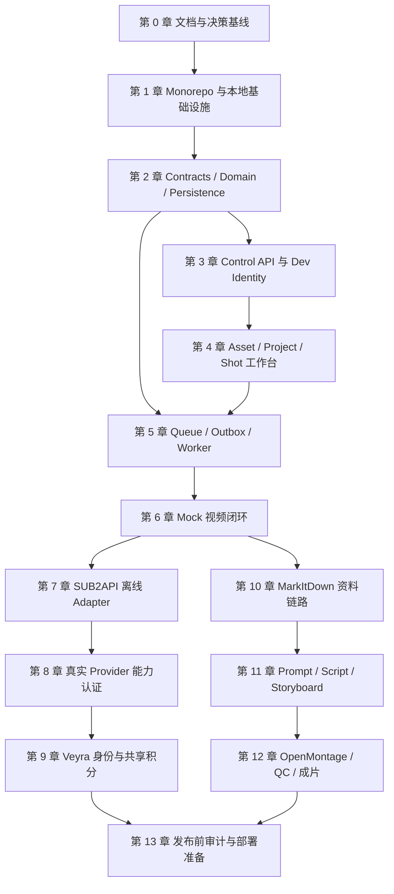

# AI 企业内容生产平台：正式开发总控文档

## 0. 文档状态

| 项目 | 内容 |
| --- | --- |
| 文档性质 | 开发基线、阶段门禁和审计总控文档 |
| 当前版本 | `0.1.0-local-baseline` |
| 当前阶段 | 开发前准备完成，等待建立 monorepo |
| 当前允许范围 | 本地 MVP、Mock Provider、离线契约测试 |
| 当前禁止范围 | 真实视频调用、真实共享积分、VPS、域名、生产部署 |
| 唯一长期架构参考 | `AI企业内容生产平台_代码实现与仓库整合详细方案.md` |
| 当前阶段唯一执行参考 | `AI企业内容生产平台_本地MVP执行规格.md` |
| 契约唯一参考 | `AI企业内容生产平台_领域模型与API事件契约.md` |
| 审计记录 | `AI企业内容生产平台_章节审计记录.md` |

本文件把“系统要做什么”转化为“先做什么、做到什么算完成、凭什么允许进入下一章”。每次开发只能处于一个 `IN_PROGRESS` 章节；前一章节没有达到 Exit Gate，不得把后一章节标记为完成。

## 1. 使用方式和优先级

每个章节都使用相同的开发记录结构：

1. 目标与非目标。
2. 前置条件。
3. 涉及模块和文件。
4. API、事件和数据变更。
5. 实现步骤。
6. 测试要求。
7. 验收标准。
8. 审计证据。
9. Exit Gate。

文档优先级：

1. 用户最新明确要求。
2. 根目录 `AGENTS.md`。
3. 本文件的阶段顺序和门禁。
4. `AI企业内容生产平台_领域模型与API事件契约.md` 的公共契约。
5. 当前章节引用的专项文档。
6. 长期方案和源仓库原始实现。

发生冲突时，先在“开发决策记录”中写明选择和原因，再修改受影响文档；不能只改代码绕过冲突。

## 2. 总体目标和范围

平台长期目标是让企业用户通过网页完成：企业资料导入、品牌上下文整理、脚本与分镜创作、参考资产绑定、AI 视频镜头生成、媒体处理、质量检查、审阅、版本化导出和用量审计。

第一条可验证链路不是完整 Agent，而是：

```text
Dev Identity
  -> Workspace / Project
  -> Asset upload to MinIO
  -> Shot
  -> TaskRun
  -> BullMQ Worker
  -> MockVideoProvider
  -> validated MP4 Asset
  -> SSE + browser playback
```

长期能力分阶段加入：

| 阶段 | 能力 | 是否当前开工范围 |
| --- | --- | --- |
| A | 本地基础设施、契约、工作区、项目、资产 | 是 |
| B | TaskRun、Worker、Mock 视频闭环 | 是 |
| C | SUB2API 视频 adapter 离线契约 | A/B 通过后 |
| D | 真实 Grok/Seedance 能力认证 | 用户明确提供 Key 后 |
| E | Veyra 登录、账户、共享积分 | Provider 认证后 |
| F | MarkItDown 企业资料 Runtime | MVP 稳定后 |
| G | Seedance Prompt Package、脚本、分镜 | 资料链路稳定后 |
| H | OpenMontage 媒体 Runtime、QC、成片 | 单镜头稳定后 |
| I | VPS、域名、生产部署、Codex 入口 | 最后 |

## 3. 统一工程基线

### 3.1 规范目录

编码时采用以下目录名；旧文档中的 `apps/web`、`apps/api`、`apps/worker` 视为早期简称，正式实现统一使用下面的名称。

```text
apps/
  studio-web/                 Nuxt 3 前端
  control-api/                Hono Control API，唯一业务数据库写入口
workers/
  workflow-worker/            后续 Director/Script/Storyboard 状态机
  provider-worker/            视频 Provider 提交、轮询、下载和恢复
  prompt-worker/              后续 Prompt Compiler
  render-worker/              后续媒体渲染
  qc-worker/                  后续质量检查
services/
  document-runtime/           后续 Python + MarkItDown
  media-runtime/              后续 Python + OpenMontage 工具箱
packages/
  contracts/                  Zod、OpenAPI、JSON Schema、事件
  domain/                     纯领域模型、状态机、Ports
  persistence/                Drizzle、迁移、Repository
  provider-adapters/          Huobao/SUB2API 等 Provider adapter
  seedance-skill/             Seedance Skill 原文、manifest、compiler
  artifact-schemas/           OpenMontage Artifact 的平台 schema
  storage-client/             S3/MinIO、object key、签名 URL
  credit-veyra/               Veyra CreditPort，后续启用
  observability/              trace、日志、outbox、审计
  test-fixtures/              Mock、契约和媒体 fixtures
upstream/                     固定 commit 的源仓库快照或 subtree
infrastructure/
  compose/                    本地 Compose
  postgres/
  redis/
  minio/
contracts/                    导出的 OpenAPI、AsyncAPI、JSON Schema
tests/
  unit/
  contract/
  integration/
  e2e/
doc/                          开发基线、专项规范和审计记录
```

### 3.2 命名层次

为兼顾 Huobao/Sub2API 的变量复用和平台自己的模块边界，采用四层命名规则：

| 层 | 规则 | 示例 |
| --- | --- | --- |
| TypeScript 变量/类型 | `camelCase` / `PascalCase` | `taskRunId`, `VideoGenerationRecord` |
| 平台 HTTP/Event JSON | `snake_case` | `task_run_id`, `provider_request_id` |
| PostgreSQL 列名 | `snake_case` | `workspace_id`, `created_at` |
| 外部 Provider payload | 保留上游原名 | `model`, `prompt`, `request_id`, `user_id` |

平台边界必须有显式 serializer/mapper，不能依靠散落在路由中的隐式重命名。Huobao 的 `VideoGenerationRecord` 保留为内部 Provider-compatible 类型，Control API 的公开 DTO 仍遵守平台 JSON 契约。

### 3.3 唯一控制面和通信方式

- Web 和未来 Codex CLI 只能调用 `/api/v1/*`。
- 服务间只能使用受保护的 `/internal/v1/*`、队列命令和 outbox 事件。
- Web 不得直连数据库、Redis、MinIO 管理 API、Provider 或 Veyra。
- Provider adapter 只实现 `VideoProviderPort`，不导入业务数据库和页面代码。
- Credit adapter 只实现 `CreditPort`，不接触 prompt、对象 URL 和视频 API Key。
- 模块不得通过另一个模块的数据库表、Redis key、文件目录或进程内变量通信。
- Control API 在事务内写业务数据和 outbox；Worker 通过持久化命令推进任务。

### 3.4 本地硬性默认值

```dotenv
LOCAL_AUTH_MODE=dev
VIDEO_PROVIDER=mock
VEYRA_AUTH_ENABLED=false
```

本地 MVP 无真实视频 API Key、Veyra Token、域名或 VPS 依赖。真实开关缺失或不完整时，系统应失败关闭，不能隐式回退到外部服务。

## 4. 章节总览和依赖图



章节状态只允许：`PENDING`、`IN_PROGRESS`、`BLOCKED`、`READY_FOR_AUDIT`、`ACCEPTED`。状态变更写入 `AI企业内容生产平台_章节审计记录.md`。

## 5. 第 0 章：文档、决策和来源基线

### 5.1 目标与非目标

目标是让开发者无需再次猜测范围、目录、命名、来源、测试和密钥边界。非目标是写更多宏观愿景或提前部署。

### 5.2 前置条件

- 已阅读 `AGENTS.md` 和 `doc/` 下相关文档。
- 当前工作区中的文档已纳入本项目 `doc/`。
- 确认当前为学习/本地开发用途，不因许可证审查阻塞编码。

### 5.3 需要创建或确认的文件

- `AGENTS.md`
- `doc/AI企业内容生产平台_正式开发总控文档.md`
- `doc/AI企业内容生产平台_开发决策记录.md`
- `doc/AI企业内容生产平台_安全与密钥规则.md`
- `doc/AI企业内容生产平台_测试与验收策略.md`
- `doc/AI企业内容生产平台_第三方来源与复用登记.md`
- `doc/AI企业内容生产平台_章节审计记录.md`
- `.gitignore`、`.env.example`、`README.md`

### 5.4 实现步骤

1. 固定本总控文档为开发基线。
2. 确认目录、命名、事件和状态机约定。
3. 登记源仓库 commit、迁入文件、复用点和改动点。
4. 写下当前不做事项和真实调用门禁。

### 5.5 测试和验收

- 文档链接和引用文件全部存在。
- 目录名、事件名、状态名在文档中无未解释冲突。
- `AGENTS.md` 与本总控文档的硬规则一致。

### 5.6 审计证据和 Exit Gate

证据：决策记录、来源登记、文档检查输出、审计记录初始条目。全部存在后将第 0 章置为 `ACCEPTED`，才可创建源码目录。

## 6. 第 1 章：Monorepo 与本地基础设施

### 6.1 目标与非目标

目标是建立可重复启动的 pnpm monorepo 和 PostgreSQL、Redis、MinIO 本地依赖。非目标是接 Provider、Veyra、Python Runtime 或部署 VPS。

### 6.2 前置条件

- 第 0 章 `ACCEPTED`。
- Node.js、pnpm、Docker Desktop 可用。

### 6.3 涉及模块和文件

```text
package.json
pnpm-workspace.yaml
tsconfig.base.json
apps/studio-web/
apps/control-api/
packages/contracts/
packages/domain/
packages/persistence/
packages/storage-client/
infrastructure/compose/docker-compose.local.yml
.env.example
```

### 6.4 实现步骤

1. 创建 workspace 和最小 package。
2. 启动 PostgreSQL 16、Redis 7、MinIO。
3. 固定本地宿主端口：PostgreSQL `15432`、Redis `6380`、MinIO API `9002`、Console `9003`。Docker 容器内端口仍为 PostgreSQL `5432`、Redis `6379`、MinIO API `9000`、Console `9001`；依据 ADR-0012，API `3032` 与 Web `3031` 不变。
4. 创建健康检查和根 README 的启动命令。
5. 把本地凭据写入 `.env.example`，不写真实凭据。

### 6.5 测试和验收

- `pnpm install --frozen-lockfile` 成功。
- `docker compose -f infrastructure/compose/docker-compose.local.yml config` 成功。
- PostgreSQL、Redis、MinIO healthcheck 均通过。
- API/Web package 可以被 workspace 识别，但可以暂时只提供 health endpoint。

### 6.6 审计证据和 Exit Gate

证据：Compose 文件、锁文件、启动日志、`README.md`、健康检查输出。所有本地服务可重复启动/停止后，第 1 章进入 `ACCEPTED`。

## 7. 第 2 章：Contracts、Domain 和 Persistence

### 7.1 目标与非目标

目标是把领域对象、状态机、HTTP DTO、事件、错误码和数据库迁移落成代码。非目标是编写页面和真实 Provider。

### 7.2 前置条件

- 第 1 章 `ACCEPTED`。
- 以 `AI企业内容生产平台_领域模型与API事件契约.md` 为唯一契约来源。

### 7.3 必须落地的模型

`users`、`workspaces`、`workspace_members`、`projects`、`assets`、`shots`、`reference_bindings`、`task_runs`、`provider_attempts`、`usage_records`、`outbox_events`、`command_deduplications`。

### 7.4 实现步骤

1. 在 `packages/contracts` 创建 Zod schema、错误码和事件类型。
2. 在 `packages/domain` 实现状态转换和不变量。
3. 在 `packages/persistence` 创建 Drizzle schema 和按章节迁移。
4. 为所有 workspace 资源加授权查询条件。
5. 创建 OpenAPI、AsyncAPI、JSON Schema 导出命令。
6. 写纯领域和契约测试。

### 7.5 测试和验收

- 所有状态迁移和非法迁移有测试。
- 同一个幂等键同请求可回放，不同请求体返回冲突。
- 金额使用十进制字符串/`numeric(18,8)`。
- 数据库迁移可从空库执行，表和索引符合契约。
- 导出的契约与 Zod schema 无漂移。

### 7.6 审计证据和 Exit Gate

证据：schema 文件、迁移 SQL、契约导出物、单测报告、数据库结构快照。没有未决字段和状态冲突时，第 2 章 `ACCEPTED`。

## 8. 第 3 章：Control API 与 Dev Identity

### 8.1 目标与非目标

目标是提供唯一控制面、开发身份和工作区权限。非目标是 SSO、登录票据和 Veyra。

### 8.2 API 范围

```text
GET  /api/v1/health
GET  /api/v1/me
GET  /api/v1/workspaces
GET  /api/v1/projects
POST /api/v1/projects
GET  /api/v1/projects/:projectId
PATCH /api/v1/projects/:projectId
```

### 8.3 实现步骤

1. 实现 Hono app、统一 response/error middleware 和 `request_id`。
2. 实现 `DevIdentityAdapter`，固定 `usr_dev_owner` / `ws_dev_default`。
3. 实现 workspace member authorization。
4. 实现项目 CRUD、输入校验和命令幂等。
5. 给 Web 提供最小 API client。

### 8.4 测试和验收

- 未授权 workspace 资源返回 `WORKSPACE_FORBIDDEN`。
- 项目创建重复提交不会产生重复项目。
- 健康检查可区分 API 进程与依赖服务状态。
- API 不直接调用 Provider、Veyra 或 MinIO 管理接口。

### 8.5 审计证据和 Exit Gate

证据：路由清单、API contract test、授权测试、请求日志脱敏样例。网页可以稳定读取开发身份和项目后，第 3 章 `ACCEPTED`。

## 9. 第 4 章：Asset、Project、Shot 工作台

### 9.1 目标与非目标

目标是让用户通过 Web 上传资产、创建分镜、编辑生成参数。非目标是生成视频和文档解析。

### 9.2 API 范围

```text
POST /api/v1/projects/:projectId/assets/upload-requests
POST /api/v1/assets/:assetId/confirm-upload
GET  /api/v1/assets/:assetId/download-url
POST /api/v1/projects/:projectId/shots
PATCH /api/v1/shots/:shotId
```

### 9.3 实现步骤

1. 用服务端规则生成 object key 和 presigned URL。
2. 浏览器直传 MinIO，API 确认对象、MIME、大小和 hash。
3. 用 `Asset(kind=IMAGE|VIDEO|AUDIO|DOCUMENT, origin=USER_UPLOAD|GENERATED|DERIVED)` 统一媒体资产。
4. 创建 `Shot`、`ReferenceBinding` 和生成参数 snapshot。
5. 复用 Huobao 的媒体预览和工作台交互，但替换其业务模型和本地磁盘路径。

### 9.4 测试和验收

- 图片上传、刷新和预览闭环通过。
- 不能读取其他 workspace 的资产。
- 任意浏览器提交的对象 key 被忽略或拒绝。
- 分镜编辑不触发任务；修改后生成必须产生新的 `TaskRun` 输入 snapshot。

### 9.5 审计证据和 Exit Gate

证据：Playwright 上传/预览截图、对象 metadata、授权测试、Shot API contract test。用户能够创建项目、上传图片、创建分镜后，第 4 章 `ACCEPTED`。

## 10. 第 5 章：Outbox、Queue 和可恢复 Worker

### 10.1 目标与非目标

目标是把长任务从 HTTP 进程中移出，支持至少一次投递、去重、重试、死信和 Worker 重启恢复。非目标是 Provider 业务本身。

### 10.2 实现步骤

1. 在 Control API 的应用层实现事务创建 `TaskRun`、`CommandDeduplication` 和 `task_run.queued` outbox 的能力；不得在 C05 注册 TaskRun/generation 公开 HTTP 路由。
2. Relay 将 outbox 投递到 BullMQ。
3. Worker 领取 `task_run.queued`，在事务内持久化 `QUEUED -> RUNNING`、消费去重和 `task_run.started` outbox；重复消息为成功 no-op。
4. Relay 和 Worker 实现 retry/backoff、dead-letter 与 stale lease 恢复；Redis/BullMQ 仅是传递层，PostgreSQL 是 outbox/消费事实来源。
5. 任务消息携带 `event_id`、`workspace_id`、`task_run_id`、`attempt_no`、`correlation_id` 和输入 snapshot；Worker 以消息中的 `workspace_id` 约束 event、TaskRun 和消费记录的后续读取/更新。`event_consumptions` 必须持久化 `workspace_id`，以 `(workspace_id, event_id, consumer_name)` 作为账本身份，并以复合外键或可验证的同工作区事务完整性关联 outbox；不能把全局 `event_id` 唯一性作为工作区范围的替代。
6. ProviderAttempt、`provider_request_id`、提交、轮询和下载移至 C06；C05 不导入或调用任何 Provider。

### 10.3 测试和验收

- 队列重复投递只产生一次业务推进。
- Relay/Worker 在投递或消费中断后，过期 lease 可恢复且不会重复推进 TaskRun。
- 队列 transient 错误遵循 retry/backoff；到达上限时持久化 dead-letter，不把 Worker 故障伪装成业务成功。
- C05 不创建 ProviderAttempt、不会有 Provider request ID，也不会执行 submit；这些验证属于 C06。
- SSE 能从 outbox/事件记录恢复，不依赖页面内存。

### 10.4 审计证据和 Exit Gate

证据：PostgreSQL outbox/消费记录、Redis/BullMQ retry/dead-letter、Worker 重启恢复测试、TaskRun `QUEUED -> RUNNING` 时间线、SSE Last-Event-ID 回放和公开字段脱敏扫描。任务在无人打开网页时仍能由持久化 relay/Worker 正确推进后，第 5 章 `ACCEPTED`。

## 11. 第 6 章：Mock 视频生成闭环

### 11.1 目标与非目标

目标是无外部 Key 生成可播放 MP4，并验证整个 TaskRun/Asset/SSE 闭环。非目标是真实模型效果。

### 11.2 Provider 合约

```ts
interface VideoProviderPort {
  submit(input: VideoGenerationInput): Promise<ProviderSubmission>;
  getStatus(input: { providerRequestId: string }): Promise<ProviderStatus>;
  download(input: { providerRequestId: string }): Promise<ReadableStream>;
}
```

Mock 规则：submit 返回 `mock_{taskRunId}`；第一次状态查询为 `PROCESSING`，第二次为 `SUCCEEDED`；成功复制固定 MP4 fixture；`MOCK_VIDEO_OUTCOME=failed` 验证失败路径。

### 11.3 实现步骤

1. 实现 `MockVideoProvider`。
2. 实现 `POST /api/v1/shots/:shotId/generations`。
3. Worker 执行提交、轮询、下载、ffprobe、SHA-256 和 Asset 写入。
4. 发送 `provider_attempt.submitted`、`task_run.progressed`、`task_run.succeeded`/`task_run.failed`。
5. Web 展示任务状态、事件和 `<video>` 播放。

### 11.4 测试和验收

- 浏览器从上传到播放 MP4 全链路通过。
- 刷新页面、关闭 Web、重启 Worker 不影响任务。
- 失败可见且可显式 retry。
- 没有任何真实网络调用和真实 Key 读取。

### 11.5 审计证据和 Exit Gate

证据：E2E 视频、任务状态时间线、事件 snapshot、MP4 SHA-256、ffprobe 输出、无网络测试。Mock 闭环通过后，第 6 章 `ACCEPTED`，这是本地 MVP 的第一处主要里程碑。

## 12. 第 7 章：SUB2API 离线 Adapter

### 12.1 目标与非目标

目标是把 `sub2api-video-mcp` 的协议转换为平台 ProviderPort，并在无网络下完成契约测试。非目标是实测 API 和共享积分。

### 12.2 固定外部协议

```text
POST /videos/generations
GET  /videos/{id}
GET  /videos/{id}/content
```

保留 `model`、`prompt`、`duration`、`resolution`、`ratio`、`image.image_url` 等上游字段。`id`/`request_id` 和 `status`/`state` 在真实认证前只能由 mapper 兼容读取，不能把未验证字段写死为已认证能力。

### 12.3 实现步骤

1. 创建 `Sub2ApiVideoProvider` 和可注入的 HTTP transport。
2. 创建 request/response mapper 和错误归一化。
3. 迁入脱敏 fixtures，加入 `CONTRACT-001` 至 `CONTRACT-008`。
4. 确保 API Key 只由 Worker 读取。
5. 更新 capability registry，但默认 profile 为 disabled。

### 12.4 测试、审计和 Exit Gate

必须通过：提交、图生字段、处理中、成功下载、失败、非法响应、脱敏和 ffprobe 测试。证据是 fixtures、mapper 测试报告、capability snapshot 和凭据扫描。无网络 CI 通过后，第 7 章 `ACCEPTED`。

## 13. 第 8 章：真实 Provider 能力认证

### 13.1 进入条件

- 第 7 章 `ACCEPTED`。
- 用户明确指定 profile、允许的调用次数、额度上限和测试素材。
- Key 存于本地未提交环境，命令显式 `--live`。

### 13.2 实施步骤

1. 先用 Grok 最短文生视频验证提交/轮询/下载。
2. 再验证单图生视频。
3. 验证进程中止后的恢复查询。
4. 对 Seedance 先实测 model ID、字段、时长、比例和分辨率，禁止猜值。
5. 生成 capability snapshot 和脱敏认证报告。

### 13.3 Exit Gate

只有提交、轮询、下载、MIME、SHA-256 和 ffprobe 全通过，profile 才能标记 `CERTIFIED`。真实认证报告不能进入普通 CI，也不能把真实 request ID、Key、票据和签名 URL 提交到仓库。

## 14. 第 9 章：Veyra 身份和共享积分

### 14.1 进入条件

- 第 8 章目标 Provider 已认证。
- 已完成 fake server 契约测试。
- 用户明确允许真实 Veyra 账户和扣费测试。

### 14.2 固定原则

Sub2API 是余额和原子扣费的唯一权威；视频平台不复制账本。沿用：

```text
POST /api/veyra/internal/login-ticket/exchange
GET  /api/veyra/internal/users/{user_id}/account
POST /api/veyra/internal/billing/debit
Header: X-Veyra-Internal-Token
```

余额预检不是预授权。视频成功下载并验证后进入 `BILLING_PENDING`，以 `billing_rule_key + task_run_id` 扣费。`402` 为 `CREDIT_INSUFFICIENT`，`409` 为 `CREDIT_CONFLICT`；充值重试只能扣费，不能再次 submit 视频。

### 14.3 Exit Gate

通过一次成功扣费、同 key 回放、同 key 冲突、余额不足、Token 错误、服务暂时不可用、Worker 崩溃恢复和 usage 唯一性测试后，才能打开真实 Veyra feature flag。

## 15. 第 10 章：MarkItDown 企业资料链路

### 15.1 目标与边界

将 PDF、DOCX、PPTX、XLSX 等已上传资料转换为可追溯 Markdown Artifact。MarkItDown 只做格式转换，不做知识库、事实判断或品牌画像。

### 15.2 实现步骤

1. 创建 `document-runtime` Python/FastAPI 内部服务。
2. 只接收 Control API 传来的已授权对象流。
3. 调用 `MarkItDown(...).convert_stream(stream, stream_info=StreamInfo(...))`。
4. 保存转换结果、warnings、converter 和来源 Asset 引用。
5. 后续再实现切块、Embedding、事实引用和 BrandProfileRevision。

### 15.3 测试和 Exit Gate

PDF/DOCX/PPTX/XLSX fixture 转换通过；`convert_stream` 不允许任意网络访问；结果可追溯到原始 Asset；错误可重试且不污染源资产。证据齐全后第 10 章 `ACCEPTED`。

## 16. 第 11 章：Prompt、Script 和 Storyboard

### 16.1 目标和复用

复用 Seedance Skill、Huobao storyboard 拆分思路和 OpenMontage Artifact schema，但使用平台自己的 revision、引用和审批模型。

### 16.2 实现步骤

1. 将 Skill 原文、manifest、capability 和 compiler 放入 `packages/seedance-skill`。
2. 定义 `PromptPackage`、`ScriptArtifact`、`ScenePlanArtifact` 版本 schema。
3. 实现 Workflow Worker 的显式状态机，而不是自由 Agent 直接推进数据库。
4. 让每个 Prompt/Script/Storyboard revision 绑定事实引用、参考资产和审批状态。
5. 输出 `GenerateShotCommand`，由 Provider Worker 执行。

### 16.3 Exit Gate

用户可以确认脚本和分镜；分镜包含事实引用和 ReferenceBinding；PromptPackage 可被 schema 验证；单镜头调用能追溯画像、脚本、分镜和 prompt 版本。

## 17. 第 12 章：OpenMontage、QC 和成片

### 17.1 目标和边界

把 OpenMontage 作为受控 Media Runtime 工具箱，复用 `BaseTool`、`ToolResult`、`ToolRegistry`、媒体分析、拼接、字幕和 QC，不让自由 Agent 控制全局工程。

### 17.2 实现步骤

1. 迁移必要 Artifact schema 和工具。
2. 通过内部 API 接收明确工具名、输入 Asset 和参数。
3. 以 `ToolResult.artifacts` 转换为平台 Asset/Artifact DTO。
4. 实现视频抽帧、ffprobe、拼接、字幕和质量报告。
5. 支持 8-12 个镜头版本化合成，失败镜头可标记而不破坏全部工程。

### 17.3 Exit Gate

成片 MP4 具备完整来源链；工具执行可审计、可重试、无任意本地目录访问；QC 报告能关联到镜头和版本；成片播放和下载通过。

## 18. 第 13 章：发布前审计和部署准备

### 18.1 当前只准备，不执行部署

必须准备但当前不执行：VPS 资源、域名 DNS、反向代理、TLS、持久化卷、数据库备份/回滚、密钥注入、日志监控、限流、费用告警、Sub2API `video` intent 和权限配置。

### 18.2 发布前审计

- 依赖和第三方来源可追溯。
- 所有 secret scan、日志脱敏、workspace isolation 通过。
- 数据库迁移、回滚和备份恢复通过。
- Provider、Credit、Worker、Media Runtime 的失败和恢复路径通过。
- 真实 feature flags 默认关闭，域名不硬编码。

### 18.3 最终 Exit Gate

全部章节 `ACCEPTED`，审计记录完整，未关闭风险有责任人和处理计划，才可进入部署设计。域名和 VPS 工作另开部署任务，不能在本地开发任务中顺便执行。

## 19. 每章标准审计模板

每次章节完成必须在审计记录中填写：

```text
章节编号：Cxx
章节名称：
状态：IN_PROGRESS / READY_FOR_AUDIT / ACCEPTED / BLOCKED
实施日期：
实现提交或工作区快照：
修改文件：
新增 API / 事件 / 数据库变更：
测试命令：
测试结果：
验收证据路径：
未完成项：
风险与后续动作：
审计人：
Exit Gate 结论：
```

没有测试结果和证据路径的章节不得标记为 `ACCEPTED`。

## 20. 正式开工判定

本项目进入编码前必须满足：

- 文档基线和决策记录已落盘。
- 目录、命名、事件、状态机没有未解释冲突。
- `.gitignore`、`.env.example`、本地 Compose 和 README 已准备。
- 第 0 章和第 1 章的依赖工具可用。
- 真实 Provider、Veyra、VPS 和域名均保持关闭。

满足后，唯一允许的第一个编码任务是：**第 1 章 Monorepo 与本地基础设施**。不得从真实视频 API、共享积分或完整 Agent 开始。
