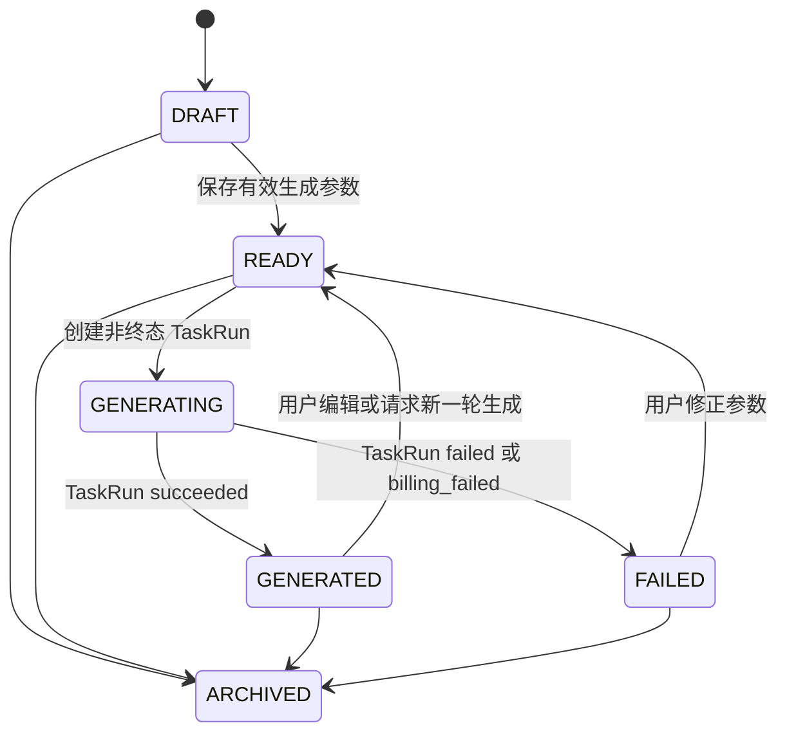
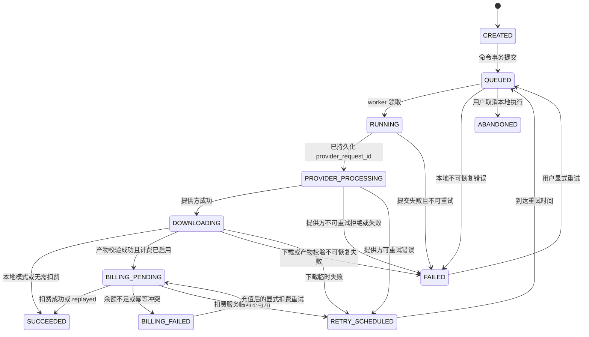

# AI企业内容生产平台：领域模型、API 与事件契约

## 1. 目的

本文件定义控制面的稳定边界。页面、worker、未来 Codex CLI、SUB2API 适配器及后续 Agent 只能通过本文件规定的 HTTP、队列消息和领域端口协作。任何模块不得通过读取另一模块的数据库表、Redis key 或文件路径交换数据。

第一版契约只覆盖本地 MVP；字段已为真实视频与共享积分预留，但不激活它们。长叙事和真实 Provider 的统一编排规则由 `AI企业内容生产平台_通用叙事点与生成片段编排规范.md` 与 ADR-0041 固化：`NarrativeBeat` 是故事层单元，`MotionBeat` 是私有动作执行层，`GenerationSegment` 才是一次真实视频 TaskRun 的执行单元。现有 `StoryboardShotSpec`/`production_segments.shot_spec_id` 保留为兼容字段；新 revision 和新公开 DTO 不得把逻辑叙事点数量直接解释为 Provider 调用数量。

当前音频输入口径（2026-09-01）：本契约保留通用 `Asset` 的 AUDIO、MUSIC、`NARRATION_SAMPLE` 和 `USER_SOURCE_AUDIO` 角色，以兼容既有资产和跨角色隔离；但自动旁白流程不要求用户上传音频。样音/正式旁白由服务端选择的 native Provider 或显式 TTS 生成，样音审批仍是事实门，正式 `NarrationAssetVersion` 与 `TimelinePlan` 仍按本契约校验。该口径不删除通用音乐、参考素材或资料上传能力，也不改变公开字段；具体 owner/路由以最新自动音频开发文档为准。

> **本机实际模式说明**：本轮授权的 Aiself Grok/Doubao 仅用于本地产物对照；不得把该授权解释为公开 API/契约新增、默认 Provider 切换或计费/Veyra 开启。

现行执行补充（2026-09-01）：本机实际视频模式由用户授权为 Aiself Grok native 优先，明确替换时使用 Doubao `seed-tts-2.0`/`zh_female_meilinvyou_uranus_bigtts`；样音和正式旁白均为服务端生成的 `AUDIO/GENERATED` 资产。当前不新增公开 `narration-audio` 路由，内部生成只通过既有 outbox/queue/Worker/Storage 端口承载；`VIDEO_PROVIDER=mock` 仍是仓库/CI 默认。若未来要改变公开契约，必须先新增 ADR 和版本化 schema。

## 2. 通用约定

### 2.1 ID、时间与金额

| 实体 | 前缀 | 示例 |
| --- | --- | --- |
| 用户 | `usr_` | `usr_dev_owner` |
| 工作区 | `ws_` | `ws_01J...` |
| 项目 | `prj_` | `prj_01J...` |
| 资产 | `ast_` | `ast_01J...` |
| 分镜 | `sht_` | `sht_01J...` |
| 任务运行 | `tsk_` | `tsk_01J...` |
| 提供方尝试 | `att_` | `att_01J...` |
| 使用记录 | `use_` | `use_01J...` |
| 创作简报修订 | `cbr_` | `cbr_01J...` |
| 资料知识修订 | `dkr_` | `dkr_01J...` |
| 资料知识段 | `dks_` | `dks_01J...` |
| 资料事实 | `dft_` | `dft_01J...` |
| 剧本修订 | `scr_` | `scr_01J...` |
| 分镜修订 | `sbr_` | `sbr_01J...` |
| 分镜规格 | `ssp_` | `ssp_01J...` |
| 叙事点 | `bt_` | `bt_01J...` |
| 生成片段 | `seg_` | `seg_01J...` |
| 提示词包 | `ppk_` | `ppk_01J...` |
| 制作批次 | `prd_` | `prd_01J...` |
| 事件 | `evt_` | `evt_01J...` |

ID 使用可排序的 ULID 字符串，数据库用 `text` 主键。时间一律为 UTC RFC 3339 毫秒字符串。积分和金额不得使用二进制浮点：内部以 `numeric(18, 8)` 保存，API 用十进制字符串，例如 `"0.25000000"`；这是对现有 Sub2API `float64` 边界的保护层。

`workspace_id` 是所有业务读取的必备条件，不能只按 `id` 查询后再检查所有权。

### 2.2 HTTP 统一封装

成功响应：

```json
{
  "data": {},
  "request_id": "req_01J..."
}
```

失败响应：

```json
{
  "error": {
    "code": "IDEMPOTENCY_CONFLICT",
    "message": "The idempotency key was already used for a different command.",
    "retryable": false,
    "details": {}
  },
  "request_id": "req_01J..."
}
```

命令接口必须接受 `Idempotency-Key`。同一个调用方、路径、键和请求体哈希组合只能执行一次；相同键但哈希不同返回 HTTP `409`。状态查询、列表和资产下载不要求该 Header。

## 3. 核心模型

### 3.0 C11 创作计划与制作确认（版本 1）

`CreativeBriefRevision -> ScriptRevision -> StoryboardRevision` 是长叙事的不可变
创作链。每次修改故事原文、目标总时长、目标清晰度、风格偏好、已选择素材或任一可见段落，均创建新的
下游 revision；`APPROVED` revision 不得原地编辑。规划状态使用
`DRAFT -> PLANNING -> READY_FOR_REVIEW -> APPROVED`，任一未批准 revision 可进入
`FAILED`，而已批准 revision 仅可因新 revision 出现而变为 `SUPERSEDED`。

一个 `StoryboardRevision` 按唯一 `sequence` 保存一至多个 `StoryboardShotSpec`。旧版本的规格仍可
只承载一个主要可见事件，记录叙事目的、开始/结束状态、时长建议、前序依赖、参考素材职责和连续性风险。
当前 E03 迁移切片对新正式分镜段沿用 Huobao `storyboard-breaker` 的 8–15 秒边界；无法形成该范围的
规划结果必须通过既有 `STORYBOARD_SPEC_INVALID` 路径阻断，不在契约层增加慢放、填充、余数重分配或裁剪语义。
新 revision 在不破坏上述字段的前提下，另外冻结私有 `MotionBeat` 时间轴：一个生成片段可承载多个
相互连续的叙事点和 2-4 个主要动作节拍。拆分依据是事件、人物状态、场景和节奏，绝不按字符数、字数
或浏览器计时切片。`PromptPackage` 由已批准的 ShotSpec、动作计划和能力快照确定性编译；它不覆盖用户
原文，也不向浏览器公开 prompt、模型、Provider 或内部参考路由。

### 3.0.1 C11.2 资料知识与事实引用（PENDING）

`DocumentConversion=SUCCEEDED` 只证明生成了可追溯 Markdown Artifact。C11.2 新增私有
`DocumentKnowledgeRevision -> DocumentKnowledgeSection -> DocumentFact` 链，所有行以
`workspace_id/project_id/document_id/conversion_id` 范围读取。KnowledgeRevision 冻结 Markdown
Asset ID、SHA-256、analyzer/version，并使用 `CREATED -> QUEUED -> RUNNING -> READY` 与
`QUEUED|RUNNING -> FAILED -> QUEUED` 状态机；成功结果不可覆盖。

DocumentFact 的类别限于 `BRAND | PRODUCT | LOCATION | AUDIENCE | SELLING_POINT | AMENITY |
STYLE | CTA | COMPLIANCE | NUMERIC_CLAIM | RISK`，且必须含短 statement、
`EXPLICIT|INFERRED|NEEDS_CONFIRMATION` 置信等级和同一 Conversion 的 section/页定位。资料原文、
chunk、对象 key、完整 hash、模型评分与选择理由都是私有数据。新建 CreativeBrief 时冻结
`CreativeBriefFactContext`；后续 Script、Storyboard、PromptPackage 只能引用其中的事实快照，不能
读取或拼接原始 Markdown。C11.1 历史 `creative_brief_document_contexts` 保留只读兼容，不能被重写。

公开 `DocumentConversion` 的可向后兼容投影可增加资料理解状态、质量级别和安全计数；已授权项目用户
可读取短事实和来源章节/页标签，但不得读取 Markdown、Prompt、对象 key、签名 URL、模型或内部检索
信息。新的 CreativeBrief 若选择 DOCUMENT Source Asset，必须要求相同 Conversion/SHA 的
KnowledgeRevision 为 `READY`，否则以 `DOCUMENT_KNOWLEDGE_NOT_READY` 或
`DOCUMENT_KNOWLEDGE_INVALID` 拒绝且不创建任何 outbox、TaskRun 或 ProviderAttempt。

### 3.0.2 C11.3 动作节拍与时间轴提示词（PROPOSED）

C11.3 在已存在的 `StoryboardShotSpec` 与 `GenerationSegment` 之间增加私有
`MotionBeat`/`GenerationSegmentMotionPlan`。它只补充执行层，不替换旧的 Storyboard、Shot、TaskRun
或 VideoVersion，也不要求迁移历史 `input_snapshot`。新 revision 的每个生成片段必须冻结动作计划版本、
哈希、场景/角色/道具连续性锁、起始/结束状态和不重叠的时间轴；旧 revision 没有动作计划时使用兼容编译器。

最小私有字段为：

- `sequence`、`start_seconds`、`end_seconds`；
- `action`、`subject_refs`、`start_pose`、`end_pose`；
- `shot_size`、`camera_movement`、`continuity_locks`、`prohibited_changes`；
- `source_narrative_beat_sequences`。

`GenerationSegmentMotionPlan` 还必须保存 `version`、`duration_seconds`、全局场景/人物/道具锁、
`motion_beats`、`opening_state`、`closing_state`、`transition_in/out` 和复杂度摘要。时间轴必须覆盖完整
片段、无重叠、动作可观察且有结束姿态；抽象情绪不能直接作为动作。`PromptPackage` 的时间轴属于私有
执行字段，公开 DTO/SSE/日志只投影安全状态和自然语言摘要。动作计划未通过结构校验时，不得创建视频
TaskRun；降级到旧 ShotSpec 编译必须记录兼容版本和原因。

`CreativeBriefRevision.target_resolution` 是用户明确选择的完整成片清晰度，当前受控值仅为
`480p` 或 `720p`，默认 `720p`。它与故事原文、时长、风格和素材一起不可变地冻结；C12
在创建每个分段 `TaskRun.input_snapshot` 时必须使用该 revision 的值，不能在调度器中另行
硬编码默认清晰度。

`ProductionRun` 在用户确认计划后固定 `StoryboardRevision`、总段数、总时长和预算 guard，
状态为 `DRAFT -> PLAN_READY -> CONFIRMED`。C11 的 `CONFIRMED` 只记录制作意图，**不得**
创建或提交 `TaskRun`、调用视频 Provider、扣费或访问媒体 Runtime；C12 的依赖调度器才可从
已确认的 ProductionRun 创建符合前序条件的 Shot/TaskRun。相同幂等键的规划、审批和确认必须
回放原结果，不能产生第二个 revision 或 ProductionRun。

浏览器可读取受控的 revision、段落摘要和 ProductionRun 进度，但不得读取原始规划输入、
`PromptPackage.prompt`、Provider/模型、内部依赖图、对象 key、签名 URL、队列、Veyra 或 trace
字段。规划命令在成功、失败和重试的任一路径中均为零次视频 Provider 调用。

### 3.0.1 C12 本地媒体制作、QC 与成片（版本 1）

C12 从一个已确认的 `ProductionRun` 开始。它新增 `ProductionSegment`、`AssetDerivation`、
`QcReport` 和 `VideoVersion`，但不改变既有 `Shot -> TaskRun -> Asset` 的不可变快照、幂等、
Provider request ID 恢复或媒体校验语义。`ProductionSegment` 是一个 StoryboardShotSpec 在某次
ProductionRun 中的调度事实；它私有地关联实际 `Shot`、`TaskRun`、交接帧和 QC，浏览器只得到
序号、标题、公共状态、可重试标记和安全摘要，不能得到这些内部 ID。

`ProductionSegment` 使用 `PENDING | WAITING | GENERATING | CHECKING | ACCEPTED | FAILED`：

- `PENDING` 仅能由 C12 Scheduler 创建；满足依赖后进入 `GENERATING`，并在同一事务内创建实际
  `Shot`、不可变视频 `TaskRun` 和 `task_run.queued` outbox 事实。
- 缺少前段可接受结果、交接帧或基础 QC 时为 `WAITING`；它不是 Provider 失败，也不能提交视频。
- 视频 TaskRun 成功后先进入 `CHECKING`。只有同项目、同工作区、已验证 VIDEO Asset 的基础 QC
  通过，且需要交接的段已形成 READY `HandoffAsset`，才可进入 `ACCEPTED`。
- 可恢复视频或媒体失败进入 `FAILED`；用户显式的段重试才可创建新的 TaskRun。重试不得修改旧
  TaskRun 快照、旧 HandoffAsset、旧 QcReport 或旧 VideoVersion。

`ProductionRun` 的完整状态转换为
`DRAFT -> PLAN_READY -> CONFIRMED -> GENERATING -> REVIEWING -> RENDERING -> SUCCEEDED`；
任意仍在等待前序或等待用户处理的批次可处于 `BLOCKED`，并只能返回 `GENERATING`、
`REVIEWING` 或进入 `FAILED`。单段失败默认把依赖它的后续段置为 `WAITING` 并把批次置为
`BLOCKED`，不得把已经接受的前段重做或把整个批次伪装为已失败。只有不可恢复的 Scheduler、
媒体 Runtime 或渲染失败才可使 ProductionRun 进入终态 `FAILED`。
`BLOCKED` 是可审计的历史/待处理状态，不是项目仍被占用的活动锁；用户在调整故事或参数后创建新的
不可变 `StoryboardRevision` 时，旧 `BLOCKED` 批次不得阻止新的 `ProductionRun`。数据库活动批次唯一索引
和 Repository 活动状态集合必须保持同一规则，仅排除 `SUCCEEDED`、`FAILED`、`BLOCKED` 后的历史记录。

`HandoffAsset` 不是独立二进制或文件系统真相：它是
`Asset(kind=IMAGE, origin=DERIVED, status=READY)` 加上 `AssetDerivation` 关系，关系冻结源 VIDEO
Asset、源 TaskRun、派生类型 `HANDOFF_FRAME`、验收时间和产生它的基础 QcReport。只能从同项目
已接受的视频段派生；跨工作区、未通过 QC、非 VIDEO 或缺少哈希/尺寸的来源一律拒绝。

本地 C12 的 QC 是确定性的技术质量门：视频必须通过已有的 MIME、字节数、SHA-256 与 `ffprobe`
校验；交接帧必须为可解码 IMAGE；最终成片必须可解码、总时长大于零且来源段顺序完整。若输入
片段含有音轨，合成后的最终成片必须保留可解码音轨，不能以静音输出替代。相邻段尚未通过语义级
首尾衔接验收时，Media Runtime 必须在合成时加入受限的画面与音频淡变转场；转场不构成对人物、
服装、场景或逐帧连续性的保证。`QcReport` 只保存安全摘要和
`PASS | NEEDS_ATTENTION | FAILED`，原始工具输出、临时路径和命令行不得进入数据库公开 DTO、
事件或日志。

当所有必需段都为 `ACCEPTED` 后，受控 Media Runtime 才能读取授权的 Asset bytes，按 approved
Storyboard sequence 合成一个新的 `Asset(kind=VIDEO, origin=DERIVED, status=READY)`，再创建
不可替换的 `VideoVersion`。`VideoVersion` 固定 ProductionRun、StoryboardRevision、最终 Asset、
总时长和最终 QcReport；重做任一段或重新合成一律创建新版本，绝不覆盖既有镜头结果或成片。
公开 `GET /projects/:projectId/video-versions` 只返回 `SUCCEEDED` 的完整成片版本；媒体或合成失败
由 `ProductionRunProgress` 的段落状态和安全摘要表达，不能伪造可播放的 Asset ID、时长或下载 URL。
成片播放和下载继续通过既有单资产短时 URL 路由按需获取，URL 不进入 VideoVersion、项目详情、
事件、日志或浏览器持久化状态。
本地运行时只接受固定工具名与 Asset ID 的受控命令，临时目录、媒体清单、工具输出和进程内队列
都不是平台事实来源。

### 3.0.2 C12.1 语义衔接质检与自动修复

C12.1 不改变 C12 已接受主片段的定义，而是在同一 `ProductionRun` 的相邻主片段之间新增私有
`HandoffReview` 与 `TransitionRepair`。`HandoffReview` 必须同时绑定同工作区、同项目、基础技术 QC
已通过的前段尾帧和后段首帧，结果为 `PASS | BLEND | BRIDGE_REQUIRED | UNAVAILABLE | FAILED`；保存的
仅是安全原因枚举、摘要、评估器版本和可重试标记，不能保存原始评估图、模型回答、向量、评分、Prompt、
Provider、对象 key、临时路径或命令行。

`TransitionRepair` 以 `(workspace_id, production_run_id, boundary_sequence)` 唯一，策略为
`BLEND | BRIDGE`，状态为 `PENDING | GENERATING | CHECKING | ACCEPTED | FAILED`。一个边界最多一个
自动 `BRIDGE` 修复；C12.1 的 `BRIDGE` 是本地 Media Runtime 生成或编排的受控转场，不创建 Provider
TaskRun，也不是新的 `ProductionSegment`、`NarrativeBeat` 或用户可见的主片段。`ProductionRun` 冻结 `max_auto_repair_count`，并以
`continuity_status=NOT_CHECKED | CHECKING | GOOD | AUTO_REPAIRING | NEEDS_ATTENTION`、主片段数和已用
修复数作安全公开投影。浏览器不得得到评估器、边界内部 ID、私有修复实现、分数或原始原因。

`PASS` 使用计划化直接合成，`BLEND` 使用既有受限画面/音频淡变，`BRIDGE_REQUIRED` 只允许一次 1 至
3 秒本地转场生成或编排并记录修复计划，`UNAVAILABLE` 或 `FAILED` 必须直切且保持 `NEEDS_ATTENTION`，不能伪造为
语义通过或创建没有语义依据的修复。桥接、重叠和裁切必须在 `composition_plan` 中固定，并将最终时长限制在目标时长容差内；
无法满足时长守卫时不能发布 `VideoVersion=SUCCEEDED`。

### C12 内部 Media Runtime 协议

Media Runtime 在本地默认是仅绑定 loopback 的内部 HTTP 服务。VPS Compose 部署可在
Compose 私网内使用固定的 `media-runtime` 或 `control-media-runtime` 服务名加 `3433` 端口；
这两个服务不发布 host/public port，客户端只允许 loopback 或该固定 allowlist。该部署传输适配不改变
工具语义、状态、事件、工作区边界、token 安全语义或公开 DTO。Runtime 只接受 `INSPECT_VIDEO`、
`EXTRACT_HANDOFF_FRAME`、`EXTRACT_BOUNDARY_FRAMES`、`COMPOSE_VIDEO` 四种固定工具请求，并以 `mop_` operation ID 关联一次
受控调用。Production Worker 在完成工作区、项目、TaskRun 和 Asset 范围校验后，从对象存储读取
字节并发送给 Runtime；Runtime 不接收对象 key、URL、路径、Provider 名称、浏览器身份、prompt、
数据库连接或任意命令行参数。

- 单视频检查和交接帧提取请求为受限的 `video/mp4` 字节流，并携带预期 SHA-256；Runtime 返回安全
  元数据或单张 PNG 字节流。
- 边界帧提取只能从同一受控视频字节流返回首帧和尾帧的有界 PNG/JPEG 字节及安全元数据；它不承担
  语义判断，也不能读取路径、URL、对象 key 或 Provider 字段。
- 合成请求为固定二进制 envelope，最多 12 个有序 MP4 段；长度字段在累计上限内验证，Runtime 自行
  分配临时文件名并在响应前清理。C12.1 的 `composition_plan` 只声明主片段、已接受自动转场、重叠/
  裁切与受限转场，不接受任意 ffmpeg 参数。对 `BLEND` 或 `UNAVAILABLE` 边界，Runtime 使用固定时长的
  淡变，并以末帧/末段延展保持规划总时长；若来源含音轨，同时执行音频淡变。它不解释客户端提供的
  文件名或目录。
- Runtime 只可使用部署时明确配置的 ffmpeg/ffprobe 可执行文件；工具原始输出、临时路径、输入媒体
  和命令行不得进入数据库、outbox、SSE、公开 DTO 或日志。
- `production_segment.qc_requested` 是 TaskRun 成功后的持久化交接；`handoff_asset.accepted` 唤醒
  依赖调度；全部镜头验收后由 `video_version.composition_requested` 触发版本化合成。三者均为内部事件，
  不向浏览器公开。

视觉输入必须遵守冻结的 StoryboardShotSpec `reference_policy`：`REFERENCE_SET` 只可使用同项目
已确认的 1 至 7 张用户上传图片参考；派生的 `HANDOFF_FRAME`、缩略图、海报和既往生成图不得回流
为新的用户来源素材。`HANDOFF_FIRST_FRAME` 必须以已接受的前序 HandoffAsset 作为第 0 位视觉输入；
当本地已认证 profile 需要同时稳定交接画面和用户参考图时，C12 生产调度器使用有序 `REFERENCE_SET`
表达“第 0 位 HandoffAsset + 最多 6 张 USER_UPLOAD 参考图”，并由 PromptPackage 明示首图是交接首帧。
`TEXT_TRANSITION` 不传图片。`REFERENCE_SET` 的内部 `visual_input.references` 可带可选语义 `role`（`SUBJECT`、`SCENE`、`STYLE`、`HANDOFF`），用于 Provider 无关的排序和提示词约束；该字段不进入公开 TaskRun DTO，也不改变数据库绑定枚举。固定位置规则不再是角色来源。除 `HANDOFF` 首帧外，参考图角色解析优先级为：用户故事/想法中的图片职责说明 > 显式主体绑定 > 视觉分析单元；三者都无法确定时不得猜测，任务只能写安全的
`WAITING/BLOCKED` 建议。C12 本地默认仍为 Mock；真实 Provider、Veyra、外部网络或付费调用只能在
明确授权的受控本机真实模式中执行，部署继续后置。

C12 Relay 仅投递已持久化的 `production_run.confirmed`、`task_run.succeeded` 与
`task_run.failed`。内部队列消息是严格的判别联合，只携带事件、工作区、项目、关联 ID 与
correlation ID；它不携带 prompt、Provider 字段、对象 key、签名 URL、媒体字节或本地路径。消费端
必须回读并验证同一 outbox envelope 后才推进调度状态。

### 3.1 C10 DocumentConversion（版本 1）

企业资料转换不复用 `TaskRun`。`Document` 绑定同项目、同工作区内一个已确认的
`Asset(kind=DOCUMENT, origin=USER_UPLOAD, status=READY)`；`DocumentConversion` 冻结该源
Asset 的 ID、SHA-256、MIME、文件名和字节数，并产生一个不可替换的
`Asset(kind=DOCUMENT, origin=DERIVED)` Markdown 结果。转换状态为
`CREATED -> QUEUED -> RUNNING -> SUCCEEDED`，`QUEUED|RUNNING -> FAILED`，且只有用户显式
重试可以使 `FAILED -> QUEUED`。每个 Document 最多一个非终态转换。

浏览器只可使用以下公开资源：

- `POST /projects/:projectId/documents/:sourceAssetId/conversions`（空对象命令、幂等）
- `GET /projects/:projectId/documents`
- `GET /document-conversions/:conversionId`
- `POST /document-conversions/:conversionId/retry`（空对象命令、幂等）

`DocumentConversion` 公开 DTO 只含转换 ID、源 Asset ID、状态、可重试标志、Markdown Asset
ID、warnings 摘要和时间。不得公开 object key、Runtime 地址或 token、原始异常、转换器堆栈
或内部请求头。内部事件 `document_conversion.queued|started|succeeded|failed` 使用既有内部
envelope；SSE 投影只含 conversion/source/Markdown Asset ID、状态和 retryable。

### 3.2 C11.1 DocumentContextReference（版本 1）

`CreativeBriefRevision` 继续接受 `source_asset_ids`，其中原始 `USER_UPLOAD/DOCUMENT` Asset 表示用户明确选择资料。创建命令必须把每一个 Document Asset 解析为同 workspace/project 的唯一 `DocumentConversion(status=SUCCEEDED)` 和同一项目 `Asset(kind=DOCUMENT, origin=DERIVED, status=READY, mime_type=text/markdown)` 结果。失败时返回 `DOCUMENT_CONTEXT_INVALID`（HTTP 422，`retryable=false`），不写 CreativeBriefRevision、outbox 或任何视频任务。

持久化 `creative_brief_document_contexts` 冻结 `creative_brief_revision_id`、`document_id`、`conversion_id`、`source_asset_id`、`markdown_asset_id`、`markdown_sha256` 与 `max_content_characters`。这些关系只可随新的 CreativeBriefRevision 创建，不能更新或由后续重新转换覆盖。所有查询使用 workspace/project 条件；同一 brief/source document 至多一条引用。

公开 `CreativeBriefRevision.document_contexts` 是受控投影：`document_id`、`conversion_id`、`source_asset_id`、`markdown_asset_id`、`max_content_characters`。它不包含 Markdown 正文、Markdown SHA-256、object key、签名 URL、Runtime、转换器信息或私有 PromptPackage。`max_content_characters` 范围为 1 至 5,000；每个 brief 最多 4 份资料，规划读取总量最多 18,000 字符。

`creative_brief.planning_requested` 的内部 envelope 只继续携带 CreativeBriefRevision ID，不复制资料正文、对象路径或哈希。Workflow Worker 从持久化私有引用读取精确 Markdown Asset，先校验 MIME、对象大小和冻结的 SHA-256，再按冻结预算将正文仅传给内部 PlanningModelPort 和 StoryboardCompilerPort。资料读取或约束校验失败使用既有 `creative_brief.planning_failed` 路径；公开事件只投影 revision ID、规范化状态和安全错误码。

### 3.1 表与所有权

| 表 | 核心字段 | 责任 |
| --- | --- | --- |
| `users` | `id`, `display_name`, `status` | 本地身份适配；未来映射外部用户 |
| `workspaces` | `id`, `name`, `created_by` | 数据隔离根 |
| `workspace_members` | `workspace_id`, `user_id`, `role` | 成员与权限 |
| `projects` | `id`, `workspace_id`, `name`, `status` | 内容生产项目 |
| `creative_brief_revisions` | `id`, `workspace_id`, `project_id`, `revision`, `source_text`, `target_duration_seconds`, `target_resolution`, `style_preferences`, `source_asset_ids`, `status` | 不可变故事输入、成片清晰度与可追溯素材选择 |
| `script_revisions` | `id`, `workspace_id`, `project_id`, `creative_brief_revision_id`, `revision`, `beats`, `status` | 受 schema 校验的叙事 beats |
| `storyboard_revisions` | `id`, `workspace_id`, `project_id`, `script_revision_id`, `revision`, `total_duration_seconds`, `continuity_level`, `status` | 可审阅、可批准的故事计划 |
| `storyboard_shot_specs` | `id`, `workspace_id`, `project_id`, `storyboard_revision_id`, `sequence`, `duration_seconds`, `start_state`, `end_state`, `reference_policy`, `depends_on_sequence` | 有序、不可变的可见段落规格 |
| `prompt_packages` | `id`, `workspace_id`, `project_id`, `shot_spec_id`, `compiler_version`, `capability_snapshot`, `prompt` | 内部编译产物；prompt 不公开 |
| `production_runs` | `id`, `workspace_id`, `project_id`, `storyboard_revision_id`, `status`, `total_shot_count`, `accepted_shot_count`, `budget_guard`, `max_auto_repair_count` | 已确认的整体制作意图，不替代 TaskRun |
| `production_segments` | `id`, `workspace_id`, `project_id`, `production_run_id`, `shot_spec_id`, `sequence`, `status`, `shot_id`, `task_run_id`, `handoff_asset_id`, `qc_report_id` | C12 每段调度与依赖完成事实；实际任务关联不向浏览器公开 |
| `asset_derivations` | `id`, `workspace_id`, `project_id`, `derived_asset_id`, `source_asset_id`, `source_task_run_id`, `derivation_type`, `qc_report_id`, `accepted_at` | 派生交接帧及未来受控媒体派生的不可变来源关系 |
| `qc_reports` | `id`, `workspace_id`, `project_id`, `subject_type`, `subject_id`, `kind`, `status`, `safe_summary` | 段和成片的安全、可追溯质量结论 |
| `handoff_reviews` | `id`, `workspace_id`, `project_id`, `production_run_id`, `from_sequence`, `to_sequence`, `result`, `reason_codes`, `safe_summary`, `evaluator_version`, `retryable` | 相邻主片段的私有语义衔接结论；原始评估数据不持久化 |
| `transition_repairs` | `id`, `workspace_id`, `project_id`, `production_run_id`, `boundary_sequence`, `strategy`, `status`, `task_run_id?`, `asset_id?`, `duration_ms`, `attempt_count` | 有界本地自动淡变/转场修复事实；C12.1 不写 `task_run_id`，转场不计为主片段 |
| `video_versions` | `id`, `workspace_id`, `project_id`, `production_run_id`, `storyboard_revision_id`, `asset_id`, `status`, `duration_ms`, `qc_report_id` | 不可替换的完整成片版本，不等同于单段 TaskRun 结果 |
| `assets` | `id`, `workspace_id`, `project_id`, `kind`, `origin`, `status`, `object_key`, `sha256`, `metadata` | 上传、生成及派生的不可变媒体版本 |
| `shots` | `id`, `workspace_id`, `project_id`, `position`, `prompt`, `model`, `generation_settings`, `status`, `selected_asset_id` | 用户可编辑的分镜意图 |
| `reference_bindings` | `shot_id`, `asset_id`, `role`, `position` | 分镜与参考资产关系 |
| `task_runs` | `id`, `workspace_id`, `project_id`, `shot_id`, `kind`, `status`, `input_snapshot`, `result_asset_id`, `error` | 一个可恢复的领域任务 |
| `provider_attempts` | `id`, `task_run_id`, `provider`, `model`, `provider_request_id`, `status`, `request_payload`, `response_payload` | 提供方一次提交与轮询审计 |
| `usage_records` | `id`, `task_run_id`, `external_user_id`, `amount`, `source`, `reference_id`, `idempotency_key`, `balance_after`, `replayed` | 已完成的外部扣费镜像，不是账本 |
| `outbox_events` | `id`, `aggregate_type`, `aggregate_id`, `event_type`, `payload`, `published_at` | 数据库事务内写入、事务外发布 |
| `command_deduplications` | `scope`, `idempotency_key`, `request_hash`, `response_snapshot` | 命令幂等回放 |

`Asset.kind` 采用 `IMAGE | VIDEO | AUDIO | DOCUMENT | POSTER | THUMBNAIL`；`Asset.origin` 采用 `USER_UPLOAD | GENERATED | DERIVED`。生成视频必须写为 `Asset(kind=VIDEO, origin=GENERATED)`，海报/缩略图写为 `origin=DERIVED`，用户上传文件写为 `origin=USER_UPLOAD`。

`assets.object_key` 由服务端生成，格式为 `workspace_id/project_id/asset_id/variant.ext`，例如用户原文件使用 `original.ext`、生成视频使用 `generated.mp4`、派生海报使用 `poster.jpg`。数据库不存二进制；已授权浏览器只能从 Control API 的单次响应得到短时、单对象、单操作预签名 URL，且不得将该 URL 的 query 写入状态持久化。`request_payload` 和 `response_payload` 在写入前必须去掉授权 Header、密钥和签名 URL query。

音乐只来自当前工作区内已授权且 `READY` 的 `AUDIO` 资产（`metadata.audio_role=MUSIC`）；Control API/Worker 必须在服务端按 workspace 条件查询并校验对象范围，不能直连第三方目录或要求外部曲库密钥。没有可用曲目时，AUTO/MANUAL 选择返回可审计的不可用/阻断结果，只有显式 OFF 才允许无 BGM。现有 `GET /projects/:projectId/audio-capabilities` 的受控响应可返回同一工作区的只读 `music_assets` 列表，供 Studio 的 MANUAL 指定曲目选择；该列表不暴露 `object_key`，也不改变 `MusicPlan` 字段形状。

### 3.2 状态机

`Shot` 与 `TaskRun` 是两个不同聚合，使用不同状态机。页面只编辑 `Shot`；Worker 只推进 `TaskRun`。





`Shot.status` 采用 `DRAFT | READY | GENERATING | GENERATED | FAILED | ARCHIVED`。`TaskRun.status` 采用 `CREATED | QUEUED | RUNNING | PROVIDER_PROCESSING | DOWNLOADING | BILLING_PENDING | SUCCEEDED | BILLING_FAILED | FAILED | RETRY_SCHEDULED | ABANDONED`。`ProviderAttempt.status` 使用 `CREATED | SUBMITTED | PROCESSING | SUCCEEDED | FAILED | DOWNLOAD_FAILED | ABANDONED`。

ADR-0014 将本图确定为 TaskRun 迁移的唯一完整规则；根目录 `AGENTS.md` 5.2 是同步的执行摘要，不得省略本地 Mock 的 `DOWNLOADING -> SUCCEEDED`、用户显式 `FAILED -> QUEUED` 或取消 `QUEUED -> ABANDONED`。持久化的部分唯一索引只允许 `SUCCEEDED`、`FAILED`、`ABANDONED` 作为可与同 Shot 后续运行并存的终态；`BILLING_FAILED` 仍可恢复，因此不得排除在活动运行之外。

关键不变量：

- 只有 `Shot.status=READY|GENERATED|FAILED` 可创建新的 `TaskRun`；创建后 `Shot` 立即进入 `GENERATING`。同一分镜允许历史任务并存，但最多一个处于非终态。
- `TaskRun.input_snapshot` 创建后不可更新，重试同一运行时只复用该快照；用户改分镜后须新建运行。新
  revision 的快照还需固定 `motion_plan_version`、动作时间轴哈希和动作计划来源叙事点序号；旧 revision
  缺少这些字段时按兼容版本解释，不能回填或改写历史快照。
- `provider_request_id` 一旦存在，worker 只能查询、下载或恢复，禁止再次 `submit`。
- Worker ready 后由受控后台进程执行一次全局恢复扫描，只选择 `VIDEO_GENERATION` 且为 `RUNNING`、`PROVIDER_PROCESSING`、`DOWNLOADING` 的 TaskRun；`QUEUED`、其他 kind 和终态不得被该扫描执行。C06 先让 BullMQ 连接 ready 但不启动 processor，完成每项最多三次的扫描恢复后才领取历史 queue job，避免同一实例双 submit。三次短暂错误都耗尽时，Worker 必须按该 TaskRun 的 `workspace_id + task_run_id` 写入可公开读取、可显式 retry 的失败终态，不能依赖已完成 C05 consumer lease。该全局发现不属于浏览器或公开 API，扫描返回每个 TaskRun 后的所有读取和更新都必须使用其 `workspace_id` 范围；多 Worker 扩容必须先增加持久化 execution lease/claim。
- BullMQ 重复 delivery 不能因为 C05 的消费账本已完成而跳过执行器：`DUPLICATE` delivery 仍须按其 `workspace_id` 调用执行器，使消费事务后发生的执行器中断可在同一进程重试恢复。已 `SUCCEEDED` 的 TaskRun 必须成为无副作用 no-op，因此重复 delivery 不得产生第二次 submit 或替换结果对象。
- 已持久化 `provider_request_id` 的下载、ffprobe 或结果资产写入失败，Attempt 必须保留为 `DOWNLOAD_FAILED`；可重试的传输/对象存储错误保持 TaskRun `DOWNLOADING` 并交给 BullMQ 或启动扫描恢复，终态媒体/协议错误则由用户显式 `FAILED -> QUEUED` 重试恢复查询/下载。同一 TaskRun 不得因此再次 `submit` 或替换已成功写入的结果对象。
- 已持久化 `provider_request_id` 后，轮询得到可重试的 Provider 失败（例如 `429`、`503` 映射的 `PROVIDER_UNAVAILABLE`）由当前 BullMQ delivery 或启动扫描的有限重试接管：TaskRun 保持 `PROVIDER_PROCESSING`，Attempt 保持已提交/处理中，且不发布 `task_run.failed`。这不是未实现调度器的 `RETRY_SCHEDULED` 旁路；delivery 耗尽后才由既有 C06 终态收敛写入公开可见、可显式 retry 的 `FAILED`。未来 C08 若持久化 `next_poll_at` 并重新入队，才使用 `PROVIDER_PROCESSING -> RETRY_SCHEDULED -> QUEUED` 的延迟调度分支。
- 成功前不写 `result_asset_id`；成功后 `result_asset_id` 不可替换。用户选择新版时更新 `Shot.selected_asset_id`。
- `BILLING_PENDING` 表示视频已成功验证并已保存或待发布；余额不足进入 `BILLING_FAILED`，充值后的显式重试只回到 `BILLING_PENDING`，不得再次提交提供方任务。
- `usage_records` 仅在扣费调用返回成功时创建；`replayed=true` 仍记录一次本地审计，但 `idempotency_key` 设唯一约束。

### 3.3 内部 VideoProviderPort 下载与失败边界

`VideoProviderPort` 是 Worker 与视频适配器之间的内部端口，不是公开 HTTP DTO。`download()` 返回 `{ stream, mimeType, contentLength? }`：`mimeType` 必须来自下载响应的实际 `Content-Type`，`contentLength` 仅在上游给出可解析的 `Content-Length` 时返回。Worker 在写入对象存储前必须使用该 MIME 校验字节、SHA-256、声明/实际大小和 `ffprobe`；缺失 MIME、非 `video/mp4`、非法长度或长度不匹配均是不可重试的 `DOWNLOAD_INVALID`，不得假定为 `video/mp4`。

适配器可以抛出内部 `VideoProviderFailure`，其字段为稳定应用错误 `code`、`retryable` 和阶段 `PROVIDER | DOWNLOAD`。查询也可用 `ProviderStatus.FAILED` 表达归一化失败：`429`、`503` 必须是 `PROVIDER_UNAVAILABLE/retryable=true`，拒绝是 `PROVIDER_REJECTED/retryable=false`。Worker 必须按该类型和状态保留拒绝、暂不可用和下载无效的语义，且只把安全摘要写入 TaskRun；不得泄露 Provider payload、对象 key、签名 URL 或凭据。结构非法继续使用 `VideoProviderProtocolError`：提交/查询阶段映射 `PROVIDER_PROTOCOL_INVALID`，下载阶段映射 `DOWNLOAD_INVALID`。本边界不改变任何 `/api/v1` 请求、响应或公开事件 schema。

## 4. HTTP 资源契约

以下均以 `/api/v1` 为前缀。第一版会生成 `contracts/openapi.yaml`，Zod 定义是唯一源码，OpenAPI 由它导出。

| 方法与路径 | 命令/查询 | MVP 结果 |
| --- | --- | --- |
| `GET /health` | 健康检查 | `ok`、依赖状态、构建版本 |
| `GET /me` | 当前身份 | 本地返回 `usr_dev_owner` |
| `GET /workspaces` | 工作区列表 | 当前可访问工作区 |
| `GET /projects` | 项目列表 | 当前工作区中的 `Project[]` |
| `POST /projects` | 创建项目 | `201` + `Project` |
| `GET /projects/:projectId` | 项目详情 | 项目、分镜、资产摘要和该项目的公开 `TaskRun` 摘要；不含 ProviderAttempt 内部字段 |
| `PATCH /projects/:projectId` | 重命名/归档 | 更新的 `Project` |
| `DELETE /projects/:projectId` | 软删除项目 | `200` + `Project(DELETED)`；活动任务/制作批次返回 `409 PROJECT_IN_USE`，命令必须幂等 |
| `POST /projects/:projectId/creative-brief-revisions` | 保存故事输入 | `201` + `CreativeBriefRevision`；仅接受原文、总时长、`480p/720p` 成片清晰度、风格和同项目已确认的用户上传素材 ID；派生交接帧不能作为新的创作参考 |
| `POST /creative-brief-revisions/:creativeBriefRevisionId/plan` | 请求故事规划 | `202` + `CreativeBriefRevision`；只进入规划队列，零次视频提交 |
| `GET /projects/:projectId/storyboard-revisions` | 获取故事计划 | 公开 revision、段落摘要、连续性提示和审批状态 |
| `POST /storyboard-revisions/:storyboardRevisionId/approve` | 批准故事计划 | `202` + `StoryboardRevision`；批准后不可原地修改 |
| `POST /production-runs` | 确认完整制作 | `202` + `ProductionRun`；C11 只写确认事实，不创建视频 TaskRun |
| `GET /projects/:projectId/production-runs` | 获取制作批次及受控段落进度 | 返回 `ProductionRunProgress[]`；公开制作批次、段落标题/序号/状态和安全进度；不含 Shot、TaskRun、Provider 或对象内部字段 |
| `POST /production-runs/:productionRunId/segments/:sequence/retry` | 显式重试失败段 | `202` + `ProductionRunProgress`；只允许该批次的 FAILED 段，创建新的 TaskRun 而不修改旧快照 |
| `GET /projects/:projectId/video-versions` | 获取完整成片版本 | 只返回 C12 `SUCCEEDED` VideoVersion 的公开元数据、最终 Asset ID、时长和 QC 摘要；播放仍经既有单 Asset 短时 URL |
| `POST /projects/:projectId/assets/upload-requests` | 申请上传 | `asset_id`、短时 `upload_url`、`headers`、`expires_at`；相同幂等键只回放同一 Asset，READY 后 URL 为 `null` |
| `POST /assets/:assetId/confirm-upload` | 确认上传 | 校验对象存在，置 `READY` |
| `DELETE /assets/:assetId` | 删除用户来源素材 | 软删除；若仍被活动 TaskRun、活动 ProductionRun、活动文档转换或可重试失败段引用，返回 `409 ASSET_IN_USE`，不得破坏不可变任务快照 |
| `GET /assets/:assetId/download-url` | 获取播放/下载 URL | 只返回授权资产的短时 URL |
| `POST /projects/:projectId/shots` | 创建分镜 | `201` + `Shot` |
| `PATCH /shots/:shotId` | 编辑分镜 | 更新的 `Shot`，非法参数保留 `DRAFT` |
| `POST /shots/:shotId/generations` | 创建 `TaskRun` | `202` + `TaskRun` |
| `GET /task-runs/:taskRunId` | 任务详情 | 运行、attempt、产物、错误 |
| `POST /task-runs/:taskRunId/retry` | 显式重试 | `202` + 新/复用的任务说明 |
| `GET /events?workspace_id=...` | SSE | 只推送该工作区事件 |

`POST /shots/:shotId/generations` 的公开命令为严格的空对象 `{}`：用户的提示词和图片意图先保存到 `Shot` 及其 `reference_bindings`，生成时由 Control API 读取同一工作区、同一项目的已保存事实形成不可变 `TaskRun.input_snapshot`。浏览器不得提交或获知 provider、model、duration、resolution、ratio、base URL、密钥、Provider request ID、对象 key、relay URL 或 token。公开 `TaskRun`、项目详情、任务详情和 SSE 均不得返回 `input_snapshot`。

图片绑定的公开 Shot 生成语义为：无绑定是 `TEXT`；恰好一个 `FIRST_FRAME` 是 `FIRST_FRAME`；一至七个按 `position` 排序的 `STYLE` / `SUBJECT` 是 `REFERENCE_SET`。浏览器直接编辑的 `FIRST_FRAME` 不得与其他绑定混用；`LAST_FRAME` 当前不受支持。C12 生产调度器为多段连续成片创建的内部 Shot 可保存 `FIRST_FRAME + STYLE` 绑定，用来审计“第 0 位交接帧 + 后续用户参考图”的自动连续性输入；该内部组合不成为新的公开手工编辑模式。每个图片必须归属同一工作区和项目、处于 `READY`、为 JPEG/PNG/WebP、具有 SHA-256，且单张不超过 8 MiB。Control API 将模式、资产 ID、SHA-256、MIME 和顺序写入内部 `visual_input` 快照，不写入对象 key 或临时 URL；异常绑定在创建 TaskRun 前返回应用验证错误，不能静默降级。

同一 `project_id` 的 `Shot.position` 必须唯一。创建或编辑到已被其他分镜占用的位置返回 `409 SHOT_POSITION_CONFLICT`，该结果与 `NOT_FOUND`、`INVALID_REFERENCE` 一样写入命令去重终态：同 key/同 body 必须重放原结果，同 key/异 body 返回 `409 IDEMPOTENCY_CONFLICT`。`POST /assets/:assetId/confirm-upload` 对不存在资产也必须先写入可回放的 `404 NOT_FOUND`，避免资源后来出现时改变首次命令结果。

创建生成命令的最小请求：

```json
{}
```

`Shot` 的已保存提示词、generation settings 与 reference bindings 才是生成输入。Worker 只在提交瞬间把该内部快照解析成 `TEXT`、单张首帧或一至七张参考图；真实图片经专用短时 HTTPS relay 提供给 Provider，浏览器绝不直接把外部 `image_url`、对象存储 URL 或预签名 URL 交给 Provider。

## 5. 内部事件契约

所有事件使用同一 envelope；持久化的 outbox payload 就是队列与 SSE 的来源。

```ts
type InternalEvent<T extends string, D> = {
  contract_version: "1.0";
  message_id: string;
  event_id: string;
  event_type: T;
  occurred_at: string;
  correlation_id: string;
  causation_id?: string;
  idempotency_key: string;
  producer: string;
  workspace_id: string;
  project_id?: string;
  aggregate: { type: "project" | "shot" | "task_run" | "asset" | "creative_brief_revision" | "script_revision" | "storyboard_revision" | "production_run" | "production_segment" | "asset_derivation" | "qc_report" | "video_version"; id: string };
  data: D;
  version: 1;
};
```

内部队列与 outbox 使用上述 `InternalEvent`，可包含 `provider_attempt.submitted` 所需的 `provider_request_id`、`provider` 和 `model`，但不得保存密钥、签名 URL 或完整 Provider payload。浏览器 SSE 是公开投影，不得直接返回内部 envelope；`GET /api/v1/events` 只返回 `PublicWorkspaceEventEnvelope`，其中只允许安全的项目、资产、分镜和 TaskRun 状态数据。公开投影将内部 `PROVIDER_PROCESSING` 归一为 `PROCESSING`，不携带 Provider 身份或传输字段。Control API 在 C05 的 outbox relay/SSE 实现中负责映射；未知或仅内部事件（包括 `provider_attempt.submitted`、`usage.debited`）不得推送给浏览器。

| 事件 | 生产者 | 必备 `data` | 消费者 |
| --- | --- | --- | --- |
| `asset.upload.confirmed` | API | `asset_id`, `project_id`, `kind`, `sha256` | UI、后续文档解析 |
| `shot.updated` | API | `shot_id`, `status`, `revision` | UI、智能体 |
| `task_run.queued` | API | `task_run_id`, `kind`, `input_snapshot` | worker |
| `task_run.started` | worker | `task_run_id`, `attempt_no` | UI |
| `provider_attempt.submitted` | worker | `task_run_id`, `provider_attempt_id`, `provider_request_id`, `provider`, `model` | 内部队列、审计 |
| `task_run.progressed` | worker | `task_run_id`, `status`, `progress`, `message` | UI |
| `task_run.succeeded` | worker | `task_run_id`, `result_asset_id`, `sha256` | UI、后续编排 |
| `task_run.failed` | worker | `task_run_id`, `error_code`, `retryable`, `provider_attempt_id` | UI、告警 |
| `usage.debited` | billing adapter | `usage_record_id`, `task_run_id`, `amount`, `source`, `replayed` | 内部审计、未来用量页 |
| `document_knowledge.queued` | Document Worker | `knowledge_revision_id`, `conversion_id`, `document_id` | Document Knowledge Worker |
| `document_knowledge.started` | Document Knowledge Worker | `knowledge_revision_id`, `conversion_id` | UI、审计 |
| `document_knowledge.succeeded` | Document Knowledge Worker | `knowledge_revision_id`, `conversion_id`, `analysis_quality` | UI、C11 Workflow |
| `document_knowledge.failed` | Document Knowledge Worker | `knowledge_revision_id`, `conversion_id`, `error_code`, `retryable` | UI、审计 |
| `creative_brief.planning_requested` | API | `creative_brief_revision_id` | Workflow Worker |
| `creative_brief.planning_failed` | Workflow Worker | `creative_brief_revision_id`, `error_code` | UI |
| `storyboard_revision.ready_for_review` | Workflow Worker | `storyboard_revision_id`, `shot_count`, `total_duration_seconds`, `continuity_level` | UI |
| `storyboard_revision.approved` | API | `storyboard_revision_id` | UI、后续制作编排 |
| `production_run.confirmed` | API | `production_run_id`, `storyboard_revision_id`, `total_shot_count` | UI、C12 Scheduler |
| `production_run.progressed` | C12 Scheduler | `production_run_id`, `status`, `accepted_shot_count`, `total_shot_count`, `current_sequence` | UI、审计 |
| `production_run.blocked` | C12 Scheduler | `production_run_id`, `sequence`, `reason_code`, `retryable` | UI、审计 |
| `production_segment.qc_requested` | C12 Scheduler | `production_run_id`, `production_segment_id`, `task_run_id` | C12 Media Runtime |
| `handoff_asset.accepted` | C12 Media Runtime | `production_run_id`, `sequence`, `handoff_asset_id`, `qc_report_id` | C12 Scheduler、审计 |
| `qc_report.completed` | C12 Media Runtime | `qc_report_id`, `subject_type`, `subject_id`, `status` | C12 Scheduler、UI 安全投影 |
| `handoff_review.requested` | C12.1 Scheduler | `production_run_id`, `from_sequence`, `to_sequence` | C12.1 Production Worker |
| `handoff_review.completed` | C12.1 Production Worker | `production_run_id`, `from_sequence`, `to_sequence`, `result`, `retryable` | C12.1 Scheduler、UI 安全投影 |
| `transition_repair.requested` | C12.1 Scheduler | `production_run_id`, `boundary_sequence`, `strategy` | C12.1 Production Worker |
| `transition_repair.succeeded` | C12.1 Production Worker | `production_run_id`, `boundary_sequence`, `strategy` | C12.1 Scheduler、UI 安全投影 |
| `transition_repair.failed` | C12.1 Production Worker | `production_run_id`, `boundary_sequence`, `error_code`, `retryable` | C12.1 Scheduler、UI 安全投影 |
| `video_version.composition_requested` | C12 Media Runtime | `production_run_id` | C12 Media Runtime |
| `video_version.succeeded` | C12 Media Runtime | `video_version_id`, `production_run_id`, `asset_id`, `duration_ms`, `qc_report_id` | UI、审计 |
| `video_version.failed` | C12 Media Runtime | `production_run_id`, `error_code`, `retryable` | UI、审计 |

队列至少一次投递；`event_id` 是事件事实 ID。消费账本必须把去重和 lease 身份持久化为 `(workspace_id, event_id, consumer_name)`，并以复合外键或等价的事务完整性证明它与同工作区 outbox 行一致；不得只依赖全局 `event_id` 唯一性。Worker 以队列消息的 `workspace_id` 作为 outbox、TaskRun 与消费账本的唯一数据库范围，错误工作区不得读取、领取、回收、完成或死信其他工作区的账本记录。SSE 使用 `event_id` 作为 `id`，客户端使用 `Last-Event-ID` 重连。事件版本不就地破坏：新增字段可直接加，语义变化或删字段创建 `version=2` 事件。

每个 outbox relay 只可 lease 它明确拥有的事件类型。一个 relay 不得因为无法生成自己的队列消息而把另一个消费者的事件标记 `published`；C12 的 Scheduler 消费 `production_run.confirmed` 与生产段 TaskRun 的安全终态，Task Worker 只消费 `task_run.queued`，C11 Planning Worker 只消费 `creative_brief.planning_requested`。同一事件如需多个持久消费者，必须先写出各自可独立确认的派生事件或 fan-out ledger，不得依赖抢占顺序。

## 6. 端口（Ports）与适配器

```ts
interface VideoProviderPort {
  submit(input: VideoGenerationInput): Promise<ProviderSubmission>;
  getStatus(input: { providerRequestId: string }): Promise<ProviderStatus>;
  download(input: { providerRequestId: string }): Promise<ProviderDownload>;
}

interface PlanningModelPort {
  plan(input: PlanningInput): Promise<StoryboardDraft>;
}

interface MotionPlanningPort {
  plan(input: MotionPlanningInput): Promise<MotionPlanDraft>;
}

interface StoryboardCompilerPort {
  compile(input: ApprovedShotSpec & {
    stylePreferences: string;
    motionPlan?: MotionPlanDraft;
  }): Promise<PromptPackage>;
}

interface MediaRuntimePort {
  extractHandoffFrame(input: { sourceAssetId: string }): Promise<{ derivedAssetId: string; qc: "PASS" | "NEEDS_ATTENTION" | "FAILED" }>;
  inspectVideo(input: { assetId: string; expectedDurationMs?: number }): Promise<{ status: "PASS" | "NEEDS_ATTENTION" | "FAILED"; safeSummary: string }>;
  compose(input: { orderedAssetIds: string[] }): Promise<{ assetId: string; durationMs: number; qc: "PASS" | "NEEDS_ATTENTION" | "FAILED" }>;
}

type ProviderDownload = {
  stream: ReadableStream<Uint8Array>;
  mimeType: string;
  contentLength?: number;
};

`stylePreferences` 是已冻结 CreativeBriefRevision 的内部编译输入。编译器必须把它与该段已经批准的
开始/结束状态、参考策略和连续性说明一起写入 PromptPackage；至少形成身份、服装、场景、角色数、
自然人体结构和相邻段承接的可审计约束。它不新增浏览器字段，也不得让 Provider、模型或原始 prompt
进入公开 DTO。

interface IdentityPort {
  resolve(request: Request): Promise<Identity>;
}

type CreditAccount = {
  externalUserId: number;
  email: string;
  role: string;
  balance: string;
  status: string;
  concurrency: number;
};

type CreditDebitInput = {
  externalUserId: number;
  amount: string;
  idempotencyKey: string;
  source: string;
  referenceId: string;
};

type CreditDebitResult = {
  externalUserId: number;
  amount: string;
  balanceAfter: string;
  idempotencyKey: string;
  replayed: boolean;
};

interface CreditPort {
  getAccount(input: { externalUserId: number }): Promise<CreditAccount>;
  debit(input: CreditDebitInput): Promise<CreditDebitResult>;
}
```

本地实现为 `DevIdentityAdapter`、`NoopCreditAdapter` 和 `MockVideoProvider`。未来实现为 `VeyraIdentityAdapter`、`VeyraSub2ApiCreditAdapter` 和 `Sub2ApiVideoProvider`。端口返回的错误必须归一化为 `AUTH_UNAVAILABLE`、`AUTH_FORBIDDEN`、`CREDIT_INSUFFICIENT`、`CREDIT_CONFLICT`、`CREDIT_UNAVAILABLE`、`CREDIT_REJECTED`、`PROVIDER_UNAVAILABLE`、`PROVIDER_REJECTED`、`DOWNLOAD_INVALID` 等应用错误码，页面不认识 HTTP 上游细节。

C09-A 固定 Veyra HTTP 归一化：`402 -> CREDIT_INSUFFICIENT`、`409 -> CREDIT_CONFLICT`、`401/403 -> AUTH_FORBIDDEN`、网络或 `5xx -> CREDIT_UNAVAILABLE`、其余 `4xx -> CREDIT_REJECTED`。`401/403` 是否进行受限重试和如何推进 TaskRun 只属于后续扣费执行流程；本子阶段没有 Worker 装配或状态推进。

## 7. 数据库事务与恢复规则

1. API 在一个事务内创建 `TaskRun`、`command_deduplications` 和 `task_run.queued` outbox 事件。
2. outbox relay 事务外投递 BullMQ；投递失败可安全重试，消费者幂等。
3. worker 在提交前创建 `ProviderAttempt(CREATED)`；提交成功后立即写 `provider_request_id`、状态和事件。
4. 下载到本地临时文件后检查 MIME、非空尺寸、`ffprobe` 可读性和 SHA-256；全部通过才上传对象存储并事务性置成功。
5. 积分扣费仅位于 `BILLING_PENDING`，且 idempotency key 只由 `billing_rule_key + task_run_id` 构成；详见共享积分规范。
6. 扣费成功事件、usage record 和最终状态必须在同一数据库事务内写出，确保重放不会重复扣费。
7. C05 消费事务完成但执行器尚未来得及运行时，C06 Worker 在 ready 后扫描持久化的可恢复视频 TaskRun，并逐项等待完成；预期执行失败应写入 TaskRun 失败事实，意外恢复错误必须以脱敏的结构化 worker 日志记录，供下一次受控扫描继续恢复。
8. C12 Scheduler 在一个事务内创建或推进 `ProductionSegment`、实际 Shot/TaskRun、状态和对应 outbox 事件；同一个 ProductionRun/sequence 的重复事件不得创建第二个活动 TaskRun。媒体 Runtime 的外部工具执行前后都通过持久化 `QcReport`、`AssetDerivation`、VideoVersion 草案和状态比较恢复，不能把临时文件、已执行命令或进程内记忆当成恢复依据。

## 8. 合约测试

每个端口至少有 mock 契约测试、离线夹具测试和一个集成测试。必须覆盖：

- `Idempotency-Key` 正常回放与冲突。
- 所有非法状态迁移均被拒绝。
- 同一 `task_run_id` 重启 worker 后不重复 `submit`。
- 上游字段 `request_id` 与内部 `provider_request_id` 的映射。
- 输入/输出 payload 脱敏，日志与事件中没有密钥、Bearer token、预签名 URL query。
- `402`、`409`、`401/403` 分别映射为 `CREDIT_INSUFFICIENT`、`CREDIT_CONFLICT`、`AUTH_FORBIDDEN`。
- C11 `PlanningModelPort` 仅能在 Workflow Worker 内由持久化规划事件调用，使用确定性 local fixture；规划、审批或制作确认不得调用 `VideoProviderPort`。
- C12 确认后只调度依赖满足的段；第 N 段失败只阻塞其依赖后续段，N 之前已接受段不重做，段重试不重提已有 provider_request_id。
- C12 HandoffAsset、基础 QC 和最终 VideoVersion 都必须同工作区、同项目且可追溯；篡改来源、跨项目 Asset、对象 key/路径泄露和无法解码的媒体均被拒绝。
- C12 多段合成必须保留存在于全部来源段的音轨，并在未通过语义衔接验收的边界生成受限画面/音频淡变；回归必须证明合成成片具有可解码音轨、规划时长不因转场缩短，且 Runtime 不公开命令行或临时路径。
- C12.1 HandoffReview 只能评估同项目、已通过技术 QC 的相邻主片段；PASS、BLEND、BRIDGE_REQUIRED、UNAVAILABLE 与失败均需持久化安全结论。一个边界最多一次自动 BRIDGE，重复事件/重启不得重复创建本地修复或增加 Provider 提交；修复失败不得删除已接受片段或历史 VideoVersion。
- C12.1 的 composition plan 必须显式记录自动转场/重叠/裁切并满足目标时长容差；自动转场不改变公开主片段数。公开 ProductionRun/SSE 只可投影连续性阶段、修复次数和安全中文摘要。
- 新 CreativeBriefRevision 的来源资格必须拒绝 `DERIVED` handoff/poster/thumbnail 等派生图；Studio 重新载入历史 brief 时也必须剔除这类资产，不能把旧交接帧重新提交给 Provider。
- C12 的公开 ProductionRun、VideoVersion、SSE 与 Studio 检查不含 Prompt、Provider、模型、TaskRun/Shot 内部 ID、对象 key、签名 query、Veyra、原始工具输出或本地路径。

在开始实现前，以上 schema 应落为 `packages/contracts/src/*.ts`，由 CI 校验 OpenAPI、JSON Schema 与 fixture 三者一致。
