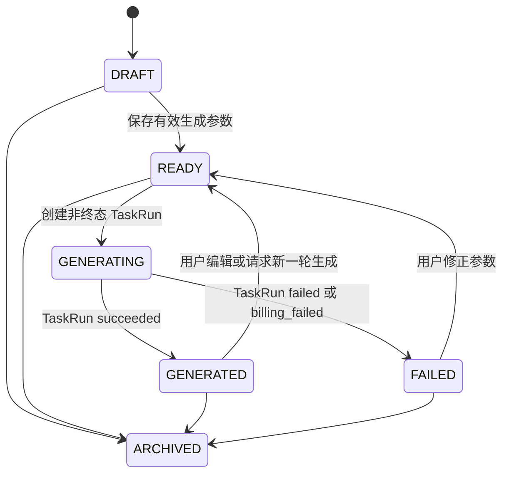
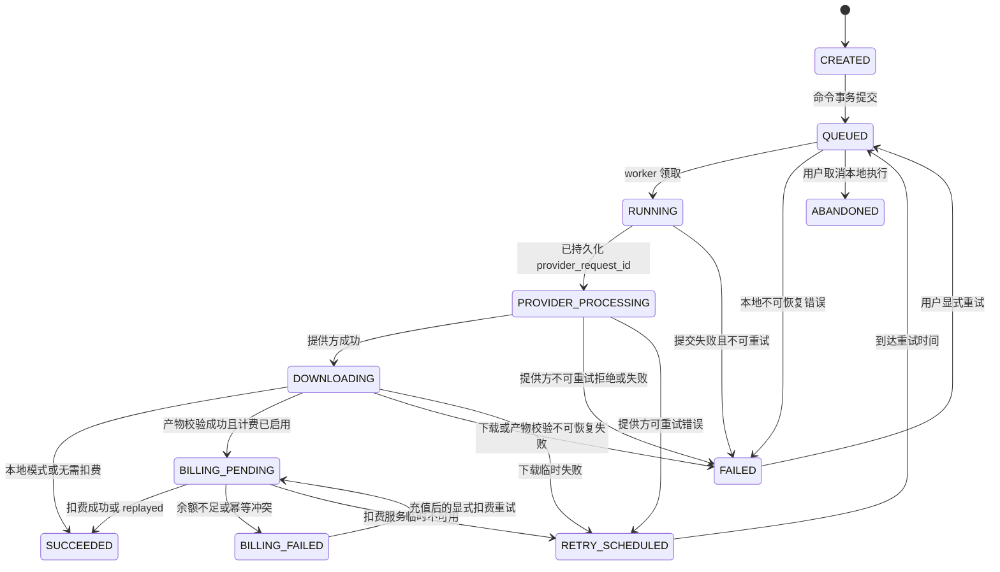

# AI企业内容生产平台：领域模型、API 与事件契约

## 1. 目的

本文件定义控制面的稳定边界。页面、worker、未来 Codex CLI、SUB2API 适配器及后续 Agent 只能通过本文件规定的 HTTP、队列消息和领域端口协作。任何模块不得通过读取另一模块的数据库表、Redis key 或文件路径交换数据。

第一版契约只覆盖本地 MVP；字段已为真实视频与共享积分预留，但不激活它们。

## 2. 通用约定

### 2.1 ID、时间与金额

| 实体 | 前缀 | 示例 |
| --- | --- | --- |
| 用户 | `usr_` | `usr_dev_owner` |
| 工作区 | `ws_` | `ws_01J...` |
| 项目 | `prj_` | `prj_01J...` |
| 资产 | `ast_` | `ast_01J...` |
| 分镜 | `sht_` | `sht_01J...` |
| 任务运行 | `tsk_` | `tsk_01J...` |
| 提供方尝试 | `att_` | `att_01J...` |
| 使用记录 | `use_` | `use_01J...` |
| 事件 | `evt_` | `evt_01J...` |

ID 使用可排序的 ULID 字符串，数据库用 `text` 主键。时间一律为 UTC RFC 3339 毫秒字符串。积分和金额不得使用二进制浮点：内部以 `numeric(18, 8)` 保存，API 用十进制字符串，例如 `"0.25000000"`；这是对现有 Sub2API `float64` 边界的保护层。

`workspace_id` 是所有业务读取的必备条件，不能只按 `id` 查询后再检查所有权。

### 2.2 HTTP 统一封装

成功响应：

```json
{
  "data": {},
  "request_id": "req_01J..."
}
```

失败响应：

```json
{
  "error": {
    "code": "IDEMPOTENCY_CONFLICT",
    "message": "The idempotency key was already used for a different command.",
    "retryable": false,
    "details": {}
  },
  "request_id": "req_01J..."
}
```

命令接口必须接受 `Idempotency-Key`。同一个调用方、路径、键和请求体哈希组合只能执行一次；相同键但哈希不同返回 HTTP `409`。状态查询、列表和资产下载不要求该 Header。

## 3. 核心模型

### 3.1 表与所有权

| 表 | 核心字段 | 责任 |
| --- | --- | --- |
| `users` | `id`, `display_name`, `status` | 本地身份适配；未来映射外部用户 |
| `workspaces` | `id`, `name`, `created_by` | 数据隔离根 |
| `workspace_members` | `workspace_id`, `user_id`, `role` | 成员与权限 |
| `projects` | `id`, `workspace_id`, `name`, `status` | 内容生产项目 |
| `assets` | `id`, `workspace_id`, `project_id`, `kind`, `origin`, `status`, `object_key`, `sha256`, `metadata` | 上传、生成及派生的不可变媒体版本 |
| `shots` | `id`, `workspace_id`, `project_id`, `position`, `prompt`, `model`, `generation_settings`, `status`, `selected_asset_id` | 用户可编辑的分镜意图 |
| `reference_bindings` | `shot_id`, `asset_id`, `role`, `position` | 分镜与参考资产关系 |
| `task_runs` | `id`, `workspace_id`, `project_id`, `shot_id`, `kind`, `status`, `input_snapshot`, `result_asset_id`, `error` | 一个可恢复的领域任务 |
| `provider_attempts` | `id`, `task_run_id`, `provider`, `model`, `provider_request_id`, `status`, `request_payload`, `response_payload` | 提供方一次提交与轮询审计 |
| `usage_records` | `id`, `task_run_id`, `external_user_id`, `amount`, `source`, `reference_id`, `idempotency_key`, `balance_after`, `replayed` | 已完成的外部扣费镜像，不是账本 |
| `outbox_events` | `id`, `aggregate_type`, `aggregate_id`, `event_type`, `payload`, `published_at` | 数据库事务内写入、事务外发布 |
| `command_deduplications` | `scope`, `idempotency_key`, `request_hash`, `response_snapshot` | 命令幂等回放 |

`Asset.kind` 采用 `IMAGE | VIDEO | AUDIO | DOCUMENT | POSTER | THUMBNAIL`；`Asset.origin` 采用 `USER_UPLOAD | GENERATED | DERIVED`。生成视频必须写为 `Asset(kind=VIDEO, origin=GENERATED)`，海报/缩略图写为 `origin=DERIVED`，用户上传文件写为 `origin=USER_UPLOAD`。

`assets.object_key` 由服务端生成，格式为 `workspace_id/project_id/asset_id/variant.ext`，例如用户原文件使用 `original.ext`、生成视频使用 `generated.mp4`、派生海报使用 `poster.jpg`。数据库不存二进制；浏览器只能得到短时预签名 URL。`request_payload` 和 `response_payload` 在写入前必须去掉授权 Header、密钥和签名 URL query。

### 3.2 状态机

`Shot` 与 `TaskRun` 是两个不同聚合，使用不同状态机。页面只编辑 `Shot`；Worker 只推进 `TaskRun`。





`Shot.status` 采用 `DRAFT | READY | GENERATING | GENERATED | FAILED | ARCHIVED`。`TaskRun.status` 采用 `CREATED | QUEUED | RUNNING | PROVIDER_PROCESSING | DOWNLOADING | BILLING_PENDING | SUCCEEDED | BILLING_FAILED | FAILED | RETRY_SCHEDULED | ABANDONED`。`ProviderAttempt.status` 使用 `CREATED | SUBMITTED | PROCESSING | SUCCEEDED | FAILED | DOWNLOAD_FAILED | ABANDONED`。

ADR-0014 将本图确定为 TaskRun 迁移的唯一完整规则；根目录 `AGENTS.md` 5.2 是同步的执行摘要，不得省略本地 Mock 的 `DOWNLOADING -> SUCCEEDED`、用户显式 `FAILED -> QUEUED` 或取消 `QUEUED -> ABANDONED`。持久化的部分唯一索引只允许 `SUCCEEDED`、`FAILED`、`ABANDONED` 作为可与同 Shot 后续运行并存的终态；`BILLING_FAILED` 仍可恢复，因此不得排除在活动运行之外。

关键不变量：

- 只有 `Shot.status=READY|GENERATED|FAILED` 可创建新的 `TaskRun`；创建后 `Shot` 立即进入 `GENERATING`。同一分镜允许历史任务并存，但最多一个处于非终态。
- `TaskRun.input_snapshot` 创建后不可更新，重试同一运行时只复用该快照；用户改分镜后须新建运行。
- `provider_request_id` 一旦存在，worker 只能查询、下载或恢复，禁止再次 `submit`。
- 成功前不写 `result_asset_id`；成功后 `result_asset_id` 不可替换。用户选择新版时更新 `Shot.selected_asset_id`。
- `BILLING_PENDING` 表示视频已成功验证并已保存或待发布；余额不足进入 `BILLING_FAILED`，充值后的显式重试只回到 `BILLING_PENDING`，不得再次提交提供方任务。
- `usage_records` 仅在扣费调用返回成功时创建；`replayed=true` 仍记录一次本地审计，但 `idempotency_key` 设唯一约束。

## 4. HTTP 资源契约

以下均以 `/api/v1` 为前缀。第一版会生成 `contracts/openapi.yaml`，Zod 定义是唯一源码，OpenAPI 由它导出。

| 方法与路径 | 命令/查询 | MVP 结果 |
| --- | --- | --- |
| `GET /health` | 健康检查 | `ok`、依赖状态、构建版本 |
| `GET /me` | 当前身份 | 本地返回 `usr_dev_owner` |
| `GET /workspaces` | 工作区列表 | 当前可访问工作区 |
| `GET /projects` | 项目列表 | 当前工作区中的 `Project[]` |
| `POST /projects` | 创建项目 | `201` + `Project` |
| `GET /projects/:projectId` | 项目详情 | 项目、分镜、资产摘要 |
| `PATCH /projects/:projectId` | 重命名/归档 | 更新的 `Project` |
| `POST /projects/:projectId/assets/upload-requests` | 申请上传 | `asset_id`、`upload_url`、`headers` |
| `POST /assets/:assetId/confirm-upload` | 确认上传 | 校验对象存在，置 `READY` |
| `GET /assets/:assetId/download-url` | 获取播放/下载 URL | 只返回授权资产的短时 URL |
| `POST /projects/:projectId/shots` | 创建分镜 | `201` + `Shot` |
| `PATCH /shots/:shotId` | 编辑分镜 | 更新的 `Shot`，非法参数保留 `DRAFT` |
| `POST /shots/:shotId/generations` | 创建 `TaskRun` | `202` + `TaskRun` |
| `GET /task-runs/:taskRunId` | 任务详情 | 运行、attempt、产物、错误 |
| `POST /task-runs/:taskRunId/retry` | 显式重试 | `202` + 新/复用的任务说明 |
| `GET /events?workspace_id=...` | SSE | 只推送该工作区事件 |

创建生成命令的最小请求：

```json
{
  "model": "mock-video-v1",
  "prompt": "A close-up product shot with slow camera movement.",
  "duration": 5,
  "resolution": "720p",
  "ratio": "16:9",
  "reference_asset_ids": ["ast_01J..."]
}
```

字段沿用 SUB2API 视频 MCP 的外部命名，以降低 adapter 的字段转换；`reference_asset_ids` 由控制面解析成对象临时 URL，浏览器绝不直接把外部 `image_url` 交给提供方。

## 5. 内部事件契约

所有事件使用同一 envelope；持久化的 outbox payload 就是队列与 SSE 的来源。

```ts
type InternalEvent<T extends string, D> = {
  contract_version: "1.0";
  message_id: string;
  event_id: string;
  event_type: T;
  occurred_at: string;
  correlation_id: string;
  causation_id?: string;
  idempotency_key: string;
  producer: string;
  workspace_id: string;
  project_id?: string;
  aggregate: { type: "project" | "shot" | "task_run" | "asset"; id: string };
  data: D;
  version: 1;
};
```

内部队列与 outbox 使用上述 `InternalEvent`，可包含 `provider_attempt.submitted` 所需的 `provider_request_id`、`provider` 和 `model`，但不得保存密钥、签名 URL 或完整 Provider payload。浏览器 SSE 是公开投影，不得直接返回内部 envelope；`GET /api/v1/events` 只返回 `PublicWorkspaceEventEnvelope`，其中只允许安全的项目、资产、分镜和 TaskRun 状态数据。公开投影将内部 `PROVIDER_PROCESSING` 归一为 `PROCESSING`，不携带 Provider 身份或传输字段。Control API 在 C05 的 outbox relay/SSE 实现中负责映射；未知或仅内部事件（包括 `provider_attempt.submitted`、`usage.debited`）不得推送给浏览器。

| 事件 | 生产者 | 必备 `data` | 消费者 |
| --- | --- | --- | --- |
| `asset.upload.confirmed` | API | `asset_id`, `project_id`, `kind`, `sha256` | UI、后续文档解析 |
| `shot.updated` | API | `shot_id`, `status`, `revision` | UI、智能体 |
| `task_run.queued` | API | `task_run_id`, `kind`, `input_snapshot` | worker |
| `task_run.started` | worker | `task_run_id`, `attempt_no` | UI |
| `provider_attempt.submitted` | worker | `task_run_id`, `provider_attempt_id`, `provider_request_id`, `provider`, `model` | 内部队列、审计 |
| `task_run.progressed` | worker | `task_run_id`, `status`, `progress`, `message` | UI |
| `task_run.succeeded` | worker | `task_run_id`, `result_asset_id`, `sha256` | UI、后续编排 |
| `task_run.failed` | worker | `task_run_id`, `error_code`, `retryable`, `provider_attempt_id` | UI、告警 |
| `usage.debited` | billing adapter | `usage_record_id`, `task_run_id`, `amount`, `source`, `replayed` | 内部审计、未来用量页 |

队列至少一次投递；消费端以 `event_id` 去重。SSE 使用 `event_id` 作为 `id`，客户端使用 `Last-Event-ID` 重连。事件版本不就地破坏：新增字段可直接加，语义变化或删字段创建 `version=2` 事件。

## 6. 端口（Ports）与适配器

```ts
interface VideoProviderPort {
  submit(input: VideoGenerationInput): Promise<ProviderSubmission>;
  getStatus(input: { providerRequestId: string }): Promise<ProviderStatus>;
  download(input: { providerRequestId: string }): Promise<ReadableStream>;
}

interface IdentityPort {
  resolve(request: Request): Promise<Identity>;
}

interface CreditPort {
  getAccount(input: { externalUserId: number }): Promise<CreditAccount>;
  debit(input: CreditDebitInput): Promise<CreditDebitResult>;
}
```

本地实现为 `DevIdentityAdapter`、`NoopCreditAdapter` 和 `MockVideoProvider`。未来实现为 `VeyraIdentityAdapter`、`VeyraSub2ApiCreditAdapter` 和 `Sub2ApiVideoProvider`。端口返回的错误必须归一化为 `AUTH_UNAVAILABLE`、`AUTH_FORBIDDEN`、`CREDIT_INSUFFICIENT`、`CREDIT_CONFLICT`、`PROVIDER_UNAVAILABLE`、`PROVIDER_REJECTED`、`DOWNLOAD_INVALID` 等应用错误码，页面不认识 HTTP 上游细节。

## 7. 数据库事务与恢复规则

1. API 在一个事务内创建 `TaskRun`、`command_deduplications` 和 `task_run.queued` outbox 事件。
2. outbox relay 事务外投递 BullMQ；投递失败可安全重试，消费者幂等。
3. worker 在提交前创建 `ProviderAttempt(CREATED)`；提交成功后立即写 `provider_request_id`、状态和事件。
4. 下载到本地临时文件后检查 MIME、非空尺寸、`ffprobe` 可读性和 SHA-256；全部通过才上传对象存储并事务性置成功。
5. 积分扣费仅位于 `BILLING_PENDING`，且 idempotency key 只由 `billing_rule_key + task_run_id` 构成；详见共享积分规范。
6. 扣费成功事件、usage record 和最终状态必须在同一数据库事务内写出，确保重放不会重复扣费。

## 8. 合约测试

每个端口至少有 mock 契约测试、离线夹具测试和一个集成测试。必须覆盖：

- `Idempotency-Key` 正常回放与冲突。
- 所有非法状态迁移均被拒绝。
- 同一 `task_run_id` 重启 worker 后不重复 `submit`。
- 上游字段 `request_id` 与内部 `provider_request_id` 的映射。
- 输入/输出 payload 脱敏，日志与事件中没有密钥、Bearer token、预签名 URL query。
- `402`、`409`、`401/403` 分别映射为 `CREDIT_INSUFFICIENT`、`CREDIT_CONFLICT`、`AUTH_FORBIDDEN`。

在开始实现前，以上 schema 应落为 `packages/contracts/src/*.ts`，由 CI 校验 OpenAPI、JSON Schema 与 fixture 三者一致。
